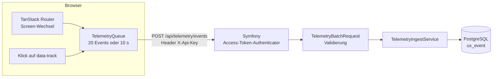

## Was

Am Anfang standen sechs leere GitHub-Repositories und ein leeres Verzeichnis. Am Ende dieses Schritts
läuft die Plattform als Skelett: Drei installierbare React-Apps zeigen einen Contest-Countdown und ein
Startmenü, ein Symfony-Backend beantwortet zwei Endpunkte, eine zweite Symfony-App zeigt diese
Dokumentation im Browser, und ein Docker-Compose-Stack startet die Datenbank.

Wichtiger als die Menge ist die **eine Funktion, die durch alle Schichten geht**: UX-Telemetrie. Wenn du
in einer der Apps auf eine Karte tippst, entsteht im Browser ein Event, es wird gepuffert, als Stapel an
das Backend geschickt, dort geprüft und landet als Zeile in PostgreSQL. Das ist bewusst die erste
Funktion – sie berührt Routing, Zustand, HTTP, Authentifizierung, Validierung, Datenbank und Tests,
also genau die Bausteine, aus denen später jedes Feature besteht.



Was noch **nicht** existiert: Trick-Tree, Sessions, Ernährung, Habits, KI-Auswertungen. Die Startseiten
sind Platzhalter. Das ist Absicht – erst die Strecke, dann die Züge.

## Warum

### Warum eine Telemetrie-Funktion als Erstes und nicht der Trick-Tree?

Weil ein Skelett, das nur aus Konfiguration besteht, nicht beweist, dass die Teile zusammenpassen. Die
Telemetrie ist fachlich anspruchslos, technisch aber vollständig: Sie erzwingt einen echten API-Vertrag,
echte Authentifizierung, echte Validierung, eine echte Migration und Tests auf beiden Seiten. Jedes
spätere Feature ist eine Variation davon.

### Warum sechs Repos und kein Monorepo?

Die Mehr-Repo-Struktur war vorgegeben, hat aber einen belastbaren Grund: Jeder Dienst wird auf Railway
einzeln gebaut und deployt. Der Preis dafür ist, dass Backend und Frontends keinen Code teilen können.
Deshalb ist der **Vertrag** das verbindende Element, nicht eine gemeinsame Bibliothek: Das Backend
veröffentlicht eine OpenAPI-Beschreibung, die Frontends erzeugen daraus ihre TypeScript-Typen. Details
in [ADR-001](../adr/ADR-001-multi-repo-workspace.md).

### Warum explizite Controller statt API Platform?

API Platform würde diese beiden Endpunkte in wenigen Zeilen erzeugen – und dabei Routing, Serialisierung
und Validierung hinter Attributen verstecken. Du sollst Symfony aber lernen, nicht nur benutzen. Also
gibt es sichtbare Controller, sichtbare DTOs und einen sichtbaren Fehler-Listener. Boilerplate ist kein
Engpass, wenn Agenten den Code schreiben; Verständnis ist einer.
Begründung und Alternativen in [ADR-002](../adr/ADR-002-backend-stack.md).

### Warum ein API-Key, obwohl es keine Benutzerverwaltung gibt?

Weil "kein Login" nicht "keine Absicherung" heißt. Die API ist auf Railway öffentlich erreichbar, und
spätere KI-Endpunkte kosten pro Aufruf Geld. Ein statischer Schlüssel im Header `X-Api-Key` ist die
kleinste Maßnahme, die diese Rechnung schützt. Dass der Schlüssel im Frontend-Bundle sichtbar ist, ist
ein bewusst akzeptiertes Restrisiko für eine Ein-Personen-App – nachzulesen samt Alternativen in
[ADR-006](../adr/ADR-006-api-zugriff-sicherheit.md).

## Datenbank

Eine Tabelle, entstanden aus `doctrine:migrations:diff` und danach von Hand gelesen und gekürzt:

```sql
-- sk8-backend/migrations/Version20260907093709.php
CREATE TABLE ux_event (
    id UUID NOT NULL,                                  -- UUID v7: zeitlich sortierbar, ohne zentralen Zähler
    app TEXT NOT NULL,                                 -- skate | nutrition | habits
    session_id UUID NOT NULL,                          -- eine ID pro Browser-Tab
    type TEXT NOT NULL,                                -- screen_view | time_on_screen | interaction | navigation
    screen TEXT NOT NULL,
    target TEXT DEFAULT NULL,                          -- bei Interaktionen der data-track-Wert
    meta JSONB NOT NULL,                               -- je Typ unterschiedliche Nutzlast
    occurred_at TIMESTAMP(0) WITH TIME ZONE NOT NULL,  -- Uhr des Browsers
    received_at TIMESTAMP(0) WITH TIME ZONE NOT NULL,  -- Uhr des Servers
    PRIMARY KEY (id)
);
CREATE INDEX idx_ux_event_app_occurred_at ON ux_event (app, occurred_at);
CREATE INDEX idx_ux_event_type ON ux_event (type);
```

Drei Entscheidungen, die du wiedererkennen wirst:

**`meta` als JSONB statt vieler Spalten.** Ein `screen_view` trägt `{from}`, ein `time_on_screen` trägt
`{ms}`, eine `interaction` trägt `{via, tag}`. Vier Typen mit je eigenen Spalten würden eine Tabelle mit
vielen `NULL`-Feldern ergeben. PostgreSQL kann JSONB indizieren und abfragen, das reicht hier vollkommen.

**Zwei Zeitstempel.** `occurred_at` kommt vom Browser und kann falsch gehen oder verzögert eintreffen
(der Stapel wird bis zu zehn Sekunden gepuffert). `received_at` setzt der Server. Nur mit beiden kannst
du später zwischen "der Nutzer war lange auf dem Screen" und "das Netz war langsam" unterscheiden.

**`TIMESTAMP WITH TIME ZONE`.** Immer. Eine Zeit ohne Zone ist eine Zeit, über die man später streitet.

## API

| Methode | Pfad | Auth | Antwort |
|---|---|---|---|
| GET | `/api/health` | – | `200 {"status":"ok","time":"2026-09-07T13:04:52+00:00"}` |
| POST | `/api/telemetry/events` | `X-Api-Key` | `202 {"accepted":4}` |

Fehler haben überall dieselbe Form, erzeugt von **einer** Klasse:

```json
{"error":"unauthorized"}
{"error":"validation_failed","violations":[
  {"field":"events[0].type","message":"Unbekannter Event-Typ. Erlaubt sind: screen_view, time_on_screen, interaction, navigation."}
]}
```

Die maschinenlesbare Beschreibung liegt unter `/api/doc.json`, die Bedienoberfläche unter `/api/doc`.

## Wie

### Der Weg einer Anfrage durch Symfony

Wenn du aus Nuxt kommst: Ein Symfony-Controller entspricht einer Server-Route, ein DTO dem, was du dort
mit einem Zod-Schema prüfen würdest, und der Service der Geschäftslogik, die du in ein Composable
auslagern würdest.

```php
// sk8-backend/src/Controller/Api/TelemetryController.php (gekürzt)
final class TelemetryController
{
    public function __construct(
        // Konstruktor-Injektion: Symfony erkennt den Typ und übergibt den Service.
        // Kein Container-Zugriff, kein "new" – das macht die Klasse testbar.
        private readonly TelemetryIngestService $ingestService,
    ) {
    }

    #[Route('/api/telemetry/events', name: 'api_telemetry_events', methods: ['POST'])]
    public function __invoke(#[MapRequestPayload] TelemetryBatchRequest $batch): JsonResponse
    {
        // MapRequestPayload macht drei Dinge, bevor diese Zeile läuft:
        // JSON einlesen, in das DTO umwandeln, das DTO validieren.
        // Schlägt die Validierung fehl, kommt der Controller nie zum Zug – es gibt 422.
        $accepted = $this->ingestService->ingest($batch);

        return new JsonResponse(new TelemetryAcceptedResponse($accepted), Response::HTTP_ACCEPTED);
    }
}
```

Der Controller ist bewusst vier Zeilen lang. Die Regeln stehen nicht in ihm, sondern als Attribute am DTO:

```php
// sk8-backend/src/Dto/Telemetry/TelemetryEventInput.php (gekürzt)
final readonly class TelemetryEventInput
{
    public function __construct(
        #[Assert\NotBlank(message: 'telemetry.event.type.blank')]
        // Der Übersetzungsschlüssel statt des Textes: die deutsche Meldung steht in
        // translations/validators.de.yaml und ist damit an einer Stelle pflegbar.
        #[Assert\Choice(callback: [UxEventType::class, 'values'], message: 'telemetry.event.type.invalid')]
        public string $type,

        #[Assert\NotBlank(message: 'telemetry.event.screen.blank')]
        #[Assert\Length(max: 200, maxMessage: 'telemetry.event.screen.too_long')]
        public string $screen,

        // Symfony wandelt den ISO-8601-String des Browsers selbst in ein Datumsobjekt um.
        public \DateTimeImmutable $occurredAt,

        public ?string $target = null,

        // additionalProperties: true ist kein Detail, sondern der Grund, warum die
        // erzeugten Frontend-Typen beliebige Schlüssel in meta erlauben. Ohne diese
        // Angabe entsteht ein Typ, der nur ein leeres Objekt zulässt.
        public ?array $meta = null,
    ) {
    }
}
```

`readonly` und Konstruktor-Promotion sind moderne PHP-Mittel: Die Eigenschaften werden in der
Parameterliste deklariert und sind nach dem Erzeugen unveränderlich. Das ersetzt Getter und Setter.

Alle Fehler unter `/api` gehen durch **einen** Listener. Statt in jedem Controller `try/catch` zu
schreiben, hört eine Klasse auf das Ereignis "Ausnahme" und formt die Antwort:

```php
// sk8-backend/src/EventListener/ApiExceptionListener.php (gekürzt)
#[AsEventListener(event: KernelEvents::EXCEPTION, priority: -32)]
final readonly class ApiExceptionListener
{
    public function __invoke(ExceptionEvent $event): void
    {
        // Nur die API bekommt JSON. Die Docs-App darf weiterhin HTML-Fehlerseiten zeigen.
        if (!str_starts_with($event->getRequest()->getPathInfo(), '/api')) {
            return;
        }
        // ... Statuscode bestimmen, Fehlercode nachschlagen, Verstöße anhängen
        $event->setResponse(new JsonResponse($body, $statusCode, $headers));
    }
}
```

Die Priorität `-32` ist kein Zufall: Sie liegt hinter dem Security-Listener (der aus fehlenden
Zugangsdaten erst einen 401 macht) und vor dem Standard-Renderer, der sonst HTML ausliefern würde.

### Die Gegenseite im Browser

Jeder Klick sofort zu senden wäre verschwenderisch. Die Warteschlange sammelt und schickt gebündelt:

```ts
// sk8-skate/src/lib/telemetry/queue.ts (gekürzt)
export class TelemetryQueue {
  push(event: TelemetryEventInput): void {
    // Der Zeitstempel entsteht beim Auftreten, nicht beim Senden – sonst hätten
    // alle Events eines Stapels dieselbe Zeit.
    this.events.push({ ...event, occurredAt: event.occurredAt ?? this.now().toISOString() });

    if (this.events.length >= this.maxEvents) {
      void this.flush();   // 20 Events erreicht: sofort senden
      return;
    }
    // sonst: Timer starten, spätestens nach 10 s senden
  }
}
```

Beim Verlassen der Seite muss der Rest noch raus. Der klassische Weg dafür ist
`navigator.sendBeacon` – hier nicht verwendbar, weil ein Beacon keine eigenen Header setzen kann und
der Vertrag `X-Api-Key` verlangt. Stattdessen ein `fetch` mit `keepalive`, das das Schließen des Tabs
überlebt. [ADR-009](../adr/ADR-009-ux-telemetrie.md) wurde nach diesem Befund korrigiert.

### Der Vertrag, in beide Richtungen geprüft

Die Frontends wurden zuerst gegen ein handgeschriebenes Typschema gebaut, weil das Backend parallel
entstand. Sobald es lief, kam die Probe: Typen aus der echten Beschreibung erzeugen und die Apps dagegen
kompilieren. Drei echte Lücken kamen heraus, alle im Backend:

| Befund | Wirkung | Behebung |
|---|---|---|
| 401 und 422 ohne Schema | Erzeugter Typ war `{}`; `error` und `violations` nicht lesbar | Benannte Schemas `ErrorResponse`, `ValidationErrorResponse`, `Violation` |
| `meta` ohne `additionalProperties` | Erzeugter Typ erlaubte **keine** Schlüssel | `additionalProperties: true` |
| 404 und 405 nicht dokumentiert | Beschreibung wich vom Verhalten ab | Antworten ergänzt |

Das ist der Sinn eines maschinenlesbaren Vertrags: Der Compiler findet Lücken, die beim Lesen nicht
auffallen. Nach der Behebung wurde das handgeschriebene Schema durch das erzeugte ersetzt. Die
Frontends leiten seitdem **alle** Telemetrie-Typen daraus ab, statt sie erneut zu deklarieren:

```ts
// sk8-skate/src/lib/telemetry/types.ts (gekürzt)
import type { components } from "@/lib/api/schema";

export type TelemetryBatchRequest = components["schemas"]["TelemetryBatchRequest"];
export type TelemetryEventRequest = components["schemas"]["TelemetryEventInput"];
// Die erlaubten Werte stehen nicht doppelt im Code, sondern werden aus dem
// Vertrag herausgelesen. Kommt im Backend ein Event-Typ hinzu, wandert er beim
// nächsten `pnpm gen:api` automatisch hierher.
export type TelemetryApp = TelemetryBatchRequest["app"];
export type TelemetryEventType = TelemetryEventRequest["type"];
```

Dass das wirkt, wurde nicht angenommen, sondern ausprobiert: Ein testweise umbenannter Event-Typ in der
Beschreibung erzeugte vier Kompilierfehler an genau den Stellen, die ihn verwenden. Der Generator läuft
über `pnpm gen:api`.

### Der Umweg über Docker

Auf dem Entwicklungsrechner ließ sich PHP nicht installieren – Homebrew fand kein passendes Paket und
der Bau aus dem Quellcode scheitert an veralteten Xcode-Kommandozeilenwerkzeugen. Statt das System
umzubauen, laufen alle PHP-Werkzeuge im Container. Jedes PHP-Repo hat ein `Makefile`, dessen Ziele
lokales PHP bevorzugen und sonst in den Container ausweichen:

```makefile
# sinngemäß in sk8-backend/Makefile und sk8-docs/Makefile
check:   ## PHPStan, Code-Stil und Tests
	$(PHP_RUN) composer check
```

`make check` funktioniert damit heute über Docker und morgen unverändert mit lokalem PHP.

## Tests

Alle Tests wurden **vor** dem jeweiligen Produktionscode geschrieben. Das ist keine Formalie: Wenn
Agenten den Code schreiben, sind die Tests die einzige Beschreibung dessen, was gelten soll.

| Repo | Prüfung | Ergebnis |
|---|---|---|
| sk8-backend | PHPStan (höchste Stufe), Code-Stil, PHPUnit | 32 Tests, 378 Zusicherungen, alles grün |
| sk8-docs | PHPStan (höchste Stufe), Code-Stil, PHPUnit | 135 Tests, 392 Zusicherungen, alles grün |
| sk8-skate / -nutrition / -habits | Biome, Typprüfung, Vitest, Build | je 59 Tests in 9 Dateien, alles grün |
| sk8-infrastructure | Compose-Prüfung, Shell-Syntax, shellcheck | alles grün |

Was die wichtigsten Tests beweisen:

| Datei | Beweist |
|---|---|
| `tests/Functional/Api/TelemetryEventsTest.php` | Ein gültiger Stapel liefert 202 und erzeugt Zeilen in `ux_event`; ohne oder mit falschem Schlüssel kommt 401; ungültige Typen, fehlende Session-ID und leere Listen liefern 422 mit den erwarteten Feldpfaden |
| `tests/Functional/Api/ApiDocTest.php` | Die veröffentlichte Beschreibung enthält die Fehler-Schemas und verweist bei 401 und 422 darauf – genau der Test, der die oben genannte Vertragslücke künftig verhindert |
| `tests/Unit/Security/ApiKeyAccessTokenHandlerTest.php` | Richtiger Schlüssel ergibt einen Zugriff, falscher eine Ausnahme |
| `src/lib/telemetry/queue.test.ts` | Senden bei genau 20 Events und genau 10 Sekunden, kein leerer Stapel, Fehler im Transport werden verschluckt |
| `src/lib/telemetry/transport.test.ts` | Die tatsächlich gesendete Nutzlast: fehlende `target`/`meta` werden zu `null`, keine überzähligen Schlüssel, `keepalive` wird weitergegeben |
| `src/routes/__root.test.tsx` | Ein Klick in der unteren Navigation erzeugt die Folge `screen_view`, `navigation`, `time_on_screen`, `screen_view` mit korrekten Feldern |
| `tests/Functional/Command/DocsImportCommandTest.php` | Der Import über die echten Inhalte läuft fehlerfrei, ist wiederholbar und löscht Zeilen zu verschwundenen Dateien |

Ausführen:

```
cd sk8-backend && make check          # ebenso in sk8-docs
cd sk8-skate  && pnpm lint && pnpm typecheck && pnpm test && pnpm build
```

Die Backend-Tests brauchen die laufende Datenbank (`make -C sk8-infrastructure up`) und benutzen eine
eigene Datenbank `sk8_backend_test`. Jeder Test läuft dort in einer Transaktion, die danach
zurückgerollt wird – deshalb können Tests in beliebiger Reihenfolge laufen, ohne sich zu beeinflussen.

## Lernpunkte

1. **Dependency Injection ohne Magie.** Der Controller bekommt seinen Service über den Konstruktor,
   weil Symfony den Typ liest und den passenden Dienst übergibt. Nachzulesen in
   `sk8-backend/src/Controller/Api/TelemetryController.php`.
   [Symfony: Service Container](https://symfony.com/doc/current/service_container.html)
2. **Validierung gehört an die Daten, nicht in den Controller.** Die Regeln stehen als Attribute am DTO
   (`src/Dto/Telemetry/TelemetryEventInput.php`), Symfony wendet sie vor dem Controller an. Das ist
   dieselbe Idee wie ein Zod-Schema am Rand deiner Nuxt-Server-Route – nur deklarativ.
   [Symfony: Validation](https://symfony.com/doc/current/validation.html)
3. **Ein Ereignis-Listener ersetzt viele `try/catch`.** Das Fehlerformat entsteht an einer Stelle
   (`src/EventListener/ApiExceptionListener.php`). Die Priorität entscheidet, wer vor wem antwortet.
   [Symfony: Events und Listener](https://symfony.com/doc/current/event_dispatcher.html)
4. **Migrationen sind Code, den man liest.** `doctrine:migrations:diff` erzeugt einen Vorschlag; die
   Verantwortung für `up()` und `down()` bleibt bei dir. Die generierte Datei enthielt zwei Tabellen und
   wurde bewusst in zwei Migrationen getrennt.
   [Doctrine Migrations](https://www.doctrine-project.org/projects/doctrine-migrations/en/current/index.html)
5. **JSONB ist der richtige Kompromiss für ungleichförmige Daten**, nicht eine Ausrede für fehlendes
   Datenmodell. Die vier Event-Typen unterscheiden sich nur in der Nutzlast – Struktur außen, Freiheit innen.
   [PostgreSQL: JSON-Typen](https://www.postgresql.org/docs/16/datatype-json.html)
6. **Ein Vertrag nützt nur, wenn er vollständig ist – und Werkzeugversionen gehören zur Architektur.**
   Eine Beschreibung, die Fehlerantworten auslässt, erzeugt Typen, mit denen sich Fehler nicht behandeln
   lassen; deshalb prüft jetzt ein Test die Beschreibung selbst (`tests/Functional/Api/ApiDocTest.php`).
   Und als der Typgenerator TypeScript 5 verlangte, die Apps aber TypeScript 7 nutzen, war die Lösung
   nicht ein Downgrade, sondern das Werkzeug in einer eigenen Umgebung zu betreiben – siehe
   `sk8-skate/scripts/gen-api.sh`.
7. **Dein Vue-Wissen überträgt sich fast eins zu eins.** Composition API entspricht Hooks,
   Pinia entspricht TanStack Query (für Serverdaten) plus Zustand (für Oberflächenzustand), das
   Verzeichnis `pages/` in Nuxt entspricht `src/routes/`. Neu ist vor allem, dass TypeScript die
   Routenparameter kennt und Fehler beim Kompilieren findet.
   [TanStack Router](https://tanstack.com/router/latest) · [TanStack Query](https://tanstack.com/query/latest)
