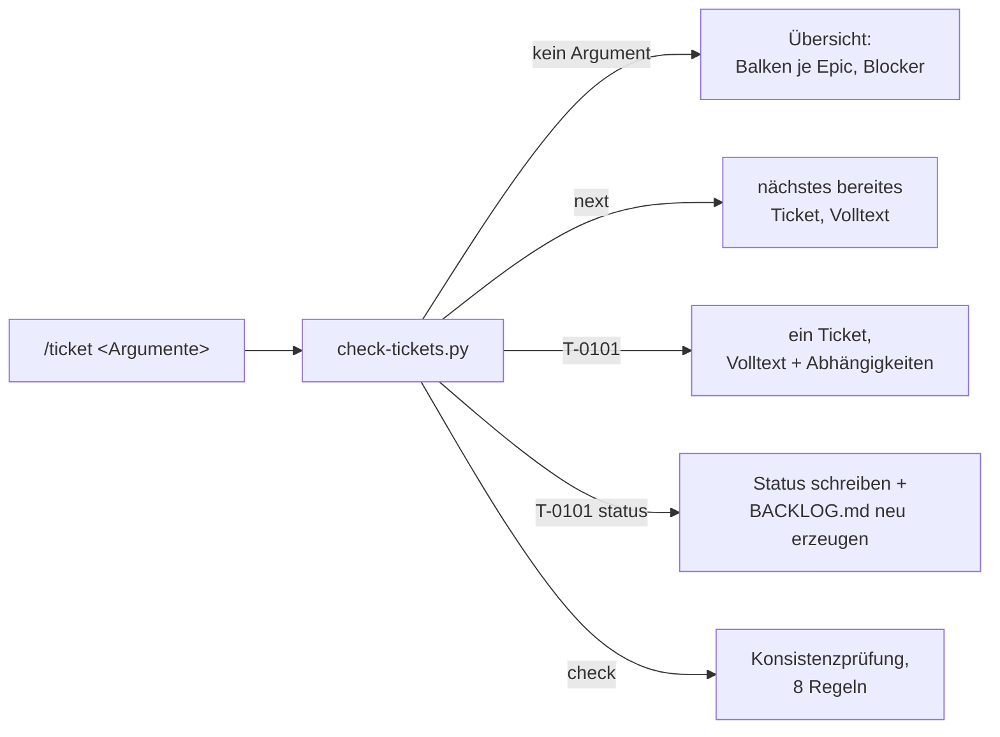

## Was

Vor jeder Arbeitseinheit stehen drei Fragen: Was ist der Stand, was ist als Nächstes dran, was
blockiert gerade? Bisher ließ sich das nur beantworten, indem man durch die Ticket-Dateien in
`.claude/specs/` blättert. `/ticket` beantwortet sie jetzt mit einem Aufruf – als Übersicht mit
Fortschrittsbalken je Epic, als Volltextanzeige eines einzelnen Tickets samt Abhängigkeits-Status,
oder als Statuswechsel, der die Ticket-Datei **und** das abgeleitete `BACKLOG.md` in einem Schritt
aktualisiert.



Diese Ausgabe entsteht bei `/ticket` (gekürzt, echte Daten):

```
SK8-Tickets                                  Stand: 8. September 2026

EPIC-00 Agentische Grundlage vervollständigen [......]  0/7 erledigt
  T-0001 Ticketsystem-Werkzeug /ticket            bereit
  T-0003 Dokumentation als verpflichtender Ablaufschritt offen  wartet auf T-0002, T-0007
  ...
Naechstes bereites Ticket: T-0001 (Ticketsystem-Werkzeug /ticket, workspace, Umfang M)
Blockiert: T-0501 (wartet auf R-05)
```

## Warum

### Warum kein separat gepflegtes "Register" mehr, obwohl das Ticket es verlangt?

Das Ticket beschreibt Ticket-Dateien und `BACKLOG.md` als zwei unabhängige Quellen, die
auseinanderlaufen können (Regel 1: Ticket ohne Registereintrag; Regel 2: abweichender Status). Die
bestehende Implementierung hatte das bereits anders gelöst, bevor dieses Feature begann:
`BACKLOG.md` wird aus den Ticket-Dateien **generiert** (`write_backlog`), nicht von Hand parallel
gepflegt. Damit können Datei und Register nicht auseinanderlaufen – nicht weil eine Prüfung es
verhindert, sondern weil es nur eine Quelle gibt, aus der die andere jedes Mal neu entsteht. Das
deckt den Zweck der Regeln 1 und 2 stärker ab, als eine Prüfung es könnte, weicht aber vom
Ticket-Text ab. Deshalb hier benannt statt still gebaut: `check-tickets.py` behandelt Regel 1/2 als
strukturell erledigt, nicht als Testfall.

### Warum Text-Ersetzung statt einer YAML-Bibliothek für den Statuswechsel?

`set_ticket_status` (siehe unten) ersetzt nur die Zeile `status: ...` per regulärem Ausdruck und
lässt den Rest der Datei byte-identisch. Eine echte YAML-Bibliothek müsste das gesamte Frontmatter
parsen und neu serialisieren – mit dem Risiko, Kommentare, Kommentierungsstil oder Zeilenumbrüche zu
verändern, die in den Ticket-Dateien von Hand geschrieben sind. Die schmalere Lösung passt außerdem
zur bestehenden `parse_front_matter`-Funktion, die absichtlich nur eine Minimal-Untermenge von YAML
versteht (Projektvorgabe: „ohne Fremdbibliotheken", damit das Werkzeug auf jedem Rechner läuft).

### Warum ist das kein Feature in einem der sechs Repos?

Weil es Entwicklungsumgebung ist, kein Produkt. Dieselbe Regel wie für Docker-Compose und
`.env.local`: Werkzeugspuren gehören nicht in versionierte Repos. `.claude/specs/check-tickets.py`
und `.claude/skills/ticket/` liegen deshalb nur im Workspace-Root, den es außerhalb dieses
Rechners nicht gibt – konsistent mit `HANDOVER.md`.

## Wie

Der Statuswechsel ist der einzige Pfad, der eine Datei tatsächlich verändert, deshalb hier
vollständig:

```python
# .claude/specs/check-tickets.py:419-432
def set_ticket_status(path: Path, new_status: str) -> None:
    text = path.read_text()
    if not text.startswith("---"):
        raise ValueError(f"{path.name}: kein Frontmatter")
    end = text.find("\n---", 3)                        # Ende des Frontmatter-Blocks
    if end == -1:
        raise ValueError(f"{path.name}: Frontmatter nicht geschlossen")
    front, rest = text[:end], text[end:]                # Rest bleibt unangetastet
    new_front, count = re.subn(
        r"(?m)^status:.*$", f"status: {new_status}", front, count=1
    )
    if count == 0:
        raise ValueError(f"{path.name}: kein 'status:'-Feld im Frontmatter")
    path.write_text(new_front + rest)
```

Aufgerufen wird das nur, nachdem der neue Status gegen die erlaubte Liste geprüft wurde – ungültige
Werte schreiben nie:

```python
# .claude/specs/check-tickets.py:451-465 (main(), Ausschnitt)
if args.set:
    ticket_id, new_status = args.set
    if new_status not in STATUSES:
        print(f"Unbekannter Status '{new_status}', erlaubt: {', '.join(STATUSES)}")
        return 1                                        # kein Schreibzugriff
    epics, tickets, errors = check(specs_dir)
    if ticket_id not in tickets:
        print(f"Ticket '{ticket_id}' nicht gefunden.")
        return 1
    set_ticket_status(tickets[ticket_id].path, new_status)
    epics, tickets, errors = check(specs_dir)            # Datei neu einlesen
    write_backlog(specs_dir, epics, tickets)              # BACKLOG.md sofort nachziehen
    return 0
```

Die Übersicht (`print_overview`) trennt bewusst von der alten, schlichten Zusammenfassung
(`print_classic_summary`, jetzt hinter `--check` erreichbar): Sie sortiert offene Tickets nach
Status-Priorität (`ORDER`), berechnet je Ticket seine noch offenen Abhängigkeiten
(`unmet_dependencies` – löst auch Abhängigkeiten auf ein ganzes Epic auf) und baut daraus die
Blockiert-Liste am Ende. Der Fortschrittsbalken selbst ist eine reine Rundungsfunktion:

```python
# .claude/specs/check-tickets.py:319-322
def progress_bar(done: int, total: int, width: int = 6) -> str:
    filled = round(width * done / total) if total else 0
    filled = max(0, min(width, filled))
    return "#" * filled + "." * (width - filled)
```

`.claude/skills/ticket/SKILL.md` bildet die fünf Aufrufformen aus dem Ticket-Text auf die passenden
CLI-Flags ab (`--check`, `--next`, `--show`, `--set`) – der Skill selbst enthält keine Logik, nur die
Zuordnung Aufruf → Befehl, wie bei den übrigen Skills im Workspace.

## Tests

Der Test-Runner `.claude/specs/testdaten/run_tests.py` prüft zehn Fälle gegen präparierte
Mini-Ticketverzeichnisse und meldet für jeden Fall Erfolg oder den genauen Grund des Scheiterns:

| Fixture / Fall | Beweist |
|---|---|
| `vollstaendig-konsistent/` | Erfolgsfall, Rückgabewert 0 (AK1, AK7) |
| `depends-on-unbekannte-id/` | Regel 3 – unbekannte `depends_on`-ID wird gemeldet (AK6) |
| `zyklus-a-b-a/` | Regel 5 – Abhängigkeitszyklus wird erkannt (AK6) |
| `bereit-trotz-offener-abhaengigkeit/` | Regel 6 – `bereit` trotz offener Abhängigkeit (AK6) |
| `fehlender-pflichtabschnitt/` | Regel 7 – fehlender Pflichtabschnitt (AK6) |
| echtes `.claude/specs` | Das reale Ticketverzeichnis ist fehlerfrei (AK7) |
| `status-setzen-rot/` (in temporäre Kopie ausgeführt) | `--set T-0101 erledigt` setzt Status in Datei **und** `BACKLOG.md` (AK4) |
| `status-unbekannt-ablehnen-rot/` (in temporäre Kopie ausgeführt) | Unbekannter Status wird abgelehnt, alle erlaubten Werte werden genannt, Datei bleibt unverändert (AK5) |
| Regel 1 (Ticket ohne Registereintrag) | bewusst nicht als Fixture geprüft – durch generiertes `BACKLOG.md` strukturell ausgeschlossen |
| Regel 2 (abweichender Status) | aus demselben Grund bewusst nicht als Fixture geprüft |

Ausführen: `python3 .claude/specs/testdaten/run_tests.py`. Zusätzlich manuell gegen das echte
Verzeichnis verifiziert: `--show T-0001`, `--next`, `--check` (7 Epics, 46 Tickets, fehlerfrei).

## Lernpunkte

1. **Text-Ersetzung statt Parser-Rundreise** – wenn nur ein Feld einer strukturierten Datei
   geändert werden soll, ist ein gezielter regulärer Ausdruck auf einen abgegrenzten Textblock oft
   robuster als parsen → Objekt ändern → neu serialisieren, weil Formatierung und Kommentare
   erhalten bleiben. Vergleichbar mit einem gezielten String-Replace in einer Vue-SFC-Template-Datei
   statt eines vollständigen AST-Rewrites. [`re.subn`-Doku](https://docs.python.org/3/library/re.html#re.subn).
2. **Abgeleiteter Zustand statt zweier Quellen der Wahrheit** – `BACKLOG.md` wird aus den
   Ticket-Dateien erzeugt statt parallel gepflegt, damit beide nicht auseinanderlaufen können. Das
   ist dasselbe Prinzip wie ein `computed` in Vue oder ein abgeleiteter Selector in einem Store:
   lieber einmal berechnen als zwei Zustände synchron halten.
3. **CLI-Argumente mit `argparse`** – `--set TICKET_ID STATUS` über `nargs=2` nimmt zwei positionale
   Werte hinter einem Flag entgegen. Ähnliches Muster wie ein Befehl mit zwei Pflichtparametern in
   einem Node-CLI-Tool (`commander`, `yargs`), nur aus der Python-Standardbibliothek.
   [`argparse`-Doku](https://docs.python.org/3/library/argparse.html#nargs).
4. **Fixtures statt gemockter Objekte** – die zehn Testfälle sind vollständige Mini-Verzeichnisse
   mit echten Markdown-Dateien, keine gemockten Python-Objekte. Das Skript wird dadurch genauso
   aufgerufen wie in der Realität, ähnlich wie ein MSW-Handler in den Frontend-Tests eine echte
   HTTP-Antwort simuliert statt die Fetch-Funktion zu mocken.
5. **Temporäre Testverzeichnisse für wiederholbare Läufe** – `tempfile.TemporaryDirectory` +
   `shutil.copytree` kopieren eine Fixture vor jedem Lauf, damit ein Test, der eine Datei verändert,
   bei jedem erneuten Lauf denselben Ausgangszustand vorfindet. Entspricht `beforeEach` mit frischer
   Fixture in Vitest, nur ohne Test-Framework-Unterstützung, weil hier reines Python ohne
   Fremdbibliotheken vorgegeben ist.
