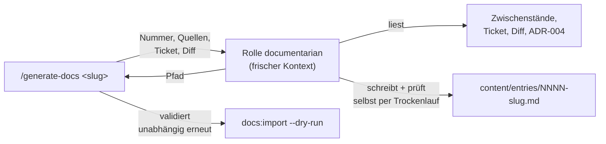

## Was

Bisher schrieb `/generate-docs` den Lern-Doku-Eintrag selbst, im selben Gesprächskontext, der gerade
noch implementiert hatte. Ein Eintrag, der aus dieser Perspektive entsteht, erklärt tendenziell zu
wenig – was für den, der den Code gerade geschrieben hat, selbstverständlich ist, bleibt unerklärt.
Ab jetzt beauftragt `/generate-docs` dafür eine eigene Rolle, `documentarian`, die den Code nicht aus
eigener Arbeit kennt, sondern ihn wie ein Leser zum ersten Mal liest: Ticket, Zwischenstände und Diff
als einzige Quellen, ein frischer Kontext ohne Vorwissen aus der Implementierung. Der Eintrag, den du
gerade liest, ist kein Testlauf – er ist das erste reguläre Ergebnis dieser neuen Rolle, geschrieben
über ihr eigenes Entstehen.



## Warum

### Warum eine eigene Rolle statt einer besseren Anweisung im bestehenden Ablauf

Eine Anweisung innerhalb von `/generate-docs` ändert nichts an der Perspektive: Ein Ablauf, der im
selben Gespräch läuft wie die Implementierung, sieht immer noch dieselbe Historie, dieselben
Annahmen, denselben blinden Fleck. Die einzige Möglichkeit, tatsächlich mit den Augen eines Lesers zu
lesen, ist ein Kontext, der diese Historie gar nicht erst geerbt hat. Das ist keine Stilfrage,
sondern eine strukturelle: eine Rolle mit eigener Auftragsdatei bekommt genau die Quellen, die sie
selbst einliest (Ticket, Zwischenstände, Diff), und nichts sonst.

### Warum keine Alternative mit einem Prüf-Schritt statt einer eigenen Rolle

Denkbar wäre gewesen, `/generate-docs` weiter selbst schreiben zu lassen und nur eine zusätzliche
Prüfung „ist das Wie erklärend genug" nachzuschalten. Verworfen, weil eine nachträgliche Prüfung im
selben Kontext denselben blinden Fleck hat wie das Schreiben selbst – wer nicht bemerkt, dass er
Vorwissen voraussetzt, bemerkt das auch beim Nachprüfen nicht. Die Distanz muss beim Schreiben
entstehen, nicht erst bei der Kontrolle.

### Warum das Schema aus [ADR-004](../adr/ADR-004-docs-plattform.md) unverändert bleibt

Die neue Rolle ändert, **wer** den Eintrag schreibt und **mit welchem Kontext**, nicht **was** ein
gültiger Eintrag ist. Frontmatter-Felder, Pflicht-Abschnitte und der Importer-Trockenlauf als
Abnahmekriterium bleiben exakt die aus ADR-004 – deshalb braucht dieses Feature kein eigenes ADR,
nur eine neue Zeile in der erlaubten Rollenliste (siehe Wie).

## Wie

### Die Rolle selbst: eine Auftragsdatei mit eigenem Werkzeugsatz

`documentarian` existiert als gewöhnliche Rollen-Definition, genau wie `architect` oder `tester`
daneben:

```markdown
<!-- .claude/agents/documentarian.md:1-6 -->
---
name: documentarian
# description entscheidet, WANN /generate-docs diese Rolle statt einer anderen wählt
description: Dokumentations-Agent für SK8. Schreibt den chronologischen Lern-Doku-Eintrag
  (WAS/WARUM/WIE/Tests/Lernpunkte) für ein abgeschlossenes Feature, mit frischem Kontext statt
  aus der Sicht dessen, der implementiert hat. Einsetzen am Ende jedes Features, aufgerufen
  von `/generate-docs`.
tools: Read, Grep, Glob, Bash, Write, Edit, WebFetch   # bewusst kein "Agent": darf nicht weiter delegieren
model: inherit   # kein eigenes Modell festnageln, folgt dem Aufrufer
---
```

`tools` ist bewusst eng: Lesen, Suchen, Schreiben, Bash für den Importer-Trockenlauf, `WebFetch` für
die Quellen der Lernpunkte – kein `Agent`-Werkzeug, die Rolle beauftragt niemanden weiter. Die
`description` ist der Text, an dem `/generate-docs` erkennt, wann diese Rolle zuständig ist. Genau
dieser Aufbau – ein eigenes System-Prompt statt des Standard-Prompts, ein eigener Werkzeugsatz, kein
Zugriff auf die aufrufende Unterhaltung – ist der Mechanismus, der die im „Warum" beschriebene Distanz
überhaupt herstellt (mehr dazu unter Lernpunkte).

### Der Ablauf delegiert, statt selbst zu schreiben

`/generate-docs` bestimmt weiterhin die nächste Nummer, gibt der Rolle aber die Quellen mit, statt den
Body selbst zu formulieren:

```markdown
<!-- .claude/skills/generate-docs/SKILL.md:12-19 (gekürzt) -->
2. Die `documentarian`-Rolle beauftragen: Kontext sind die Quellen aus Zeile 8 (Zwischenstände,
   `research`-Dokument), die Ticket-Datei des Features und der Diff aller berührten Repos. Die
   Rolle liefert den fertigen Eintrag – sie schreibt Frontmatter und Body selbst und validiert das
   Ergebnis vorab selbst mit dem Importer-Trockenlauf, inklusive ihrer eigenen Selbstprüfung.
3. Ergebnis entgegennehmen: Pfad des erzeugten Eintrags.
4. Unabhängig davon selbst validieren – zweite, eigenständige Prüfung zusätzlich zur
   Selbstprüfung der Rolle: `bin/console docs:import --dry-run` über das Ergebnis laufen lassen.
```

Zwei Prüfungen bleiben absichtlich getrennt: die Selbstprüfung der Rolle (sieht den eigenen Text) und
der unabhängige Trockenlauf danach (sieht nur die Datei, kein Vertrauen in die Selbstauskunft). Bei
einem Fehler bessert die Rolle nach – der Ablauf selbst schreibt nie im Doku-Text herum.

### Die eine Zeile, die den Kreis schließt

Damit ein Eintrag `documentarian` überhaupt im Frontmatter-Feld `agents` nennen darf, musste die
erlaubte Rollenliste im Importer erweitert werden – sonst hätte der eigene Trockenlauf dieser Rolle
ihren eigenen Beitrag als Fehler gemeldet:

```php
// sk8-docs/src/Content/ContentValidator.php:22
public const array KNOWN_AGENTS = ['architect', 'tester', 'implementer', 'uiux',
    'documentarian', 'researcher', 'agentic-engineer'];   // + documentarian
```

Ohne diese Zeile hätte der Trockenlauf über den Eintrag, den du gerade liest, mit „documentarian ist
keine bekannte Agenten-Rolle" abgebrochen (`ContentValidator::checkAgents()`, Zeile 292). Die Zeile ist
die einzige Änderung an bestehendem Code in diesem Feature – alles andere sind neue Dateien.

### Der Trockenlauf, der den Mechanismus beweist

Die Rolle wurde vor diesem Eintrag bereits einmal beauftragt, aber in ein Vergleichsverzeichnis
außerhalb von `content/`, um den echten Eintrag 0001 nicht zu berühren: `/generate-docs` erneut über
das bereits abgeschlossene Feature `project-bootstrap` laufen lassen. Das Ergebnis liegt unter
`.claude/state/features/documentarian-role/dry-run-content/entries/0001-project-bootstrap-dryrun.md`
– eigenständig aus `brief.md`/`impl.md` formuliert, nicht vom echten Eintrag abgeschrieben, und mit
demselben Aufbau (Mermaid-Grafik, kommentierte Snippets, Lernpunkte mit Quelle) wie hier. Der
Importer-Trockenlauf über dieses Vergleichsverzeichnis meldete „Alle Dateien sind gültig (1 Einträge,
10 ADRs)", Rückgabewert 0 – der Beweis, dass die Rolle einen schema-gültigen Eintrag erzeugt, bevor
sie an einem echten Feature arbeitet.

## Tests

Ein Prozessschritt lässt sich nicht mit einer Testsuite prüfen; Beleg ist ein nachvollziehbarer
Trockenlauf plus die reale Validierung dieses Eintrags:

| Prüfung | Ergebnis |
|---|---|
| Rollen-Datei `documentarian.md` hat gültiges Frontmatter, erscheint in der Rollenliste | Bestätigt – gültiges YAML, `tools`/`model` korrekt gesetzt |
| `/generate-docs` über `project-bootstrap` in ein Vergleichsverzeichnis | Erzeugt schema-gültigen Eintrag, eigenständig formuliert (siehe Wie) |
| Importer-Trockenlauf über das Vergleichsverzeichnis | „Alle Dateien sind gültig (1 Einträge, 10 ADRs)", Rückgabewert 0 |
| Importer-Trockenlauf über das echte `content/`-Verzeichnis, **vor** diesem Eintrag | „Alle Dateien sind gültig (2 Einträge, 10 ADRs)" |
| Importer-Trockenlauf über das echte `content/`-Verzeichnis, **mit** diesem Eintrag | „Alle Dateien sind gültig (3 Einträge, 10 ADRs)", Rückgabewert 0 |

Ausführen: `cd sk8-docs && php bin/console docs:import --dry-run`.

## Lernpunkte

1. **Ein Subagent bekommt einen komplett frischen Kontext, keine geerbte Historie.** Die eigentliche
   Wirkung von `documentarian.md` (`.claude/agents/documentarian.md:1-6`) ist nicht der Text im Body,
   sondern dass eine Rolle mit eigener `description` beim Aufruf ein neues System-Prompt und eine neue
   Unterhaltung bekommt statt der Historie des Aufrufers – nur die Delegationsnachricht plus die
   Projektdateien (`CLAUDE.md`, Git-Status) laden mit. Vergleichbar mit einer Vue-Komponente, die nur
   explizite `props` empfängt statt automatisch auf den `reactive`-State der Eltern-Komponente
   zuzugreifen: Was nicht ausdrücklich übergeben wird, ist nicht da.
   [Claude Code: Subagents – Context isolation](https://code.claude.com/docs/en/sub-agents)
2. **`tools` als Positivliste begrenzt, was eine Rolle darf.** `tools: Read, Grep, Glob, Bash, Write,
   Edit, WebFetch` in derselben Datei lässt bewusst kein `Agent`-Werkzeug zu – die Rolle kann nicht
   selbst weiter delegieren. Ohne das Feld würde die Rolle jedes verfügbare Werkzeug erben. Ähnlich
   einem Pinia-Store, der nur ausgewählte Actions exportiert statt seinen kompletten internen State
   nach außen zu reichen: Was nicht in der Liste steht, ist von außen nicht erreichbar.
   [Claude Code: Subagents – Frontmatter fields](https://code.claude.com/docs/en/sub-agents)
3. **Typisierte Klassenkonstanten seit PHP 8.3.** `public const array KNOWN_AGENTS = [...]`
   (`sk8-docs/src/Content/ContentValidator.php:22`) deklariert den Typ der Konstante selbst – PHP
   verweigert eine Zuweisung, die kein Array ist, schon beim Parsen der Klasse. Das ist derselbe
   Gedanke wie `export const KNOWN_AGENTS = [...] as const satisfies readonly string[]` in
   TypeScript: die Werteliste ist unveränderlich und ihr Typ ist Teil der Deklaration, nicht nur eine
   Konvention.
   [PHP Manual: Class Constants](https://www.php.net/manual/en/language.oop5.constants.php)
4. **Eine Positivliste statt eines offenen Strings validiert eine geschlossene Menge.**
   `ContentValidator::checkAgents()` (`sk8-docs/src/Content/ContentValidator.php:281-296`) prüft jeden
   Eintrag in `agents` gegen `KNOWN_AGENTS` und sammelt für jeden unbekannten Wert einen eigenen
   Fehler statt beim ersten abzubrechen. Vergleichbar mit einem Zod-`z.enum([...])` oder einem
   TypeScript-Union-Typ für ein Formularfeld: neue gültige Werte brauchen eine bewusste
   Code-Änderung, nicht nur eine neue Zeichenkette irgendwo im Text.
   Ähnlich der Symfony-`#[Assert\Choice(choices: [...])]`-Validierungsregel, nur von Hand statt über
   den Validator ausgeführt, weil `ContentValidator` außerhalb des Symfony-Request-Zyklus läuft.
   [Symfony: Choice Constraint](https://symfony.com/doc/current/reference/constraints/Choice.html)
5. **Benannte Exit-Code-Konstanten statt roher Zahlen.** `DocsImportCommand::execute()` gibt bei Erfolg
   `Command::SUCCESS` zurück (`sk8-docs/src/Command/DocsImportCommand.php:86`), bei Fehlern
   `Command::FAILURE` (Zeilen 55, 65, 78) – genau der Rückgabewert 0, den der Trockenlauf oben für
   diesen Eintrag lieferte. Die Konstanten machen den Code lesbar, ohne dass man sich merken muss,
   dass 0 „ok" und 1 „Fehler" bedeutet – vergleichbar mit einem benannten `process.exitCode`-Wert
   statt einer rohen Zahl in einem Node-CLI-Skript.
   [Symfony: Console – Command Exit Codes](https://symfony.com/doc/current/console.html)
