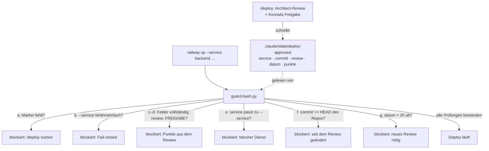

## Was

Bisher reichte eine leere Datei `.claude/state/deploy-approved`, um jeden `railway up`-Befehl
freizuschalten – wer sie anlegte (mit oder ohne echtes Review), konnte deployen. Railway kostet Geld
und macht die API öffentlich erreichbar; das war kein Schutz, sondern eine Formalie. Jetzt ist der
Marker eine Datei mit Inhalt (Dienst, Environment, Commit-SHA, Review-Ergebnis, Datum, Prüfpunkte),
und `guard-bash.py` prüft vor jedem Deploy-Befehl fünf Bedingungen statt nur Existenz. Der Skill
`/deploy` erzeugt den Marker automatisch aus dem Architect-Review und entfernt ihn danach wieder. Beim
Architect-Review dieses Features stellte sich heraus, dass der bisherige Erkennungsmechanismus selbst
umgehbar war – dazu mehr unter „Warum".



## Warum

### Warum ein Marker mit Inhalt statt einer leeren Datei

Ein Deploy ist im Projekt die einzige Aktion mit echten, nach außen wirkenden Folgen: Railway kostet
Geld, und eine fehlerhafte Migration trifft echte Daten. Eine leere Marker-Datei beweist nur, dass
*irgendjemand* sie angelegt hat – nicht, dass ein Review stattfand, dass es sich auf den aktuellen
Code bezog oder dass es eine Freigabe war. Der neue Marker macht das Review selbst zur Voraussetzung:
ohne `review: FREIGABE`, ohne passenden `commit`, ohne aktuelles `datum` gibt es keinen Deploy.

### Der Wendepunkt: ein Erkennungs-Regex, der sich umgehen ließ

Die erste, im TDD-Rot-Grün-Durchlauf grün gewordene Fassung des Erkennungs-Regex sah so aus:

```python
# vorher – erkennt railway-Befehle nur mit einem konkreten Trennzeichen davor
RAILWAY_DEPLOY = re.compile(r"(^|[;&|]\s*|\s)railway\s+(up|deploy|redeploy)\b")
```

Der Regex verlangte *vor* `railway` ausdrücklich einen Zeilenanfang, `;`/`&`/`|` oder ein einzelnes
Leerzeichen. Das ist eine Trennzeichen-**Liste** – und jede Liste möglicher Trennzeichen ist
unvollständig, sobald ein Zeichen fehlt, das den Befehl trotzdem gültig macht. Genau das fand das
Architect-Review vor der Freigabe: Drei Befehle liefen live reproduziert **ganz ohne Marker** durch
(Rückgabewert 0 statt der erwarteten Blockierung mit Rückgabewert 2), weil vor `railway` jeweils ein
Zeichen stand, das in keiner der drei Kategorien der Liste vorkam:

```
bash -c "railway up --service backend --environment development"   # Anführungszeichen davor
$(railway up --service backend --environment development)          # öffnende Klammer davor
\railway up --service backend --environment development            # Backslash davor
```

Der Fix ersetzt die Trennzeichen-Liste durch eine Wortgrenzen-Prüfung:

```python
# nachher – prüft nicht mehr, WAS vor railway steht, sondern OB railway als
# eigenständiges Wort auftaucht, unabhängig vom Kontext davor
RAILWAY_DEPLOY = re.compile(r"\brailway\s+(up|deploy|redeploy)\b")
```

`\b` ist in Pythons `re`-Modul die Grenze zwischen einem Wortzeichen (`\w`, z. B. Buchstaben) und
einem Nicht-Wortzeichen (`\W`, z. B. Anführungszeichen, Klammer, Backslash) oder dem Stringrand. Die
offizielle Doku illustriert das mit `r'\bat\b'`, das `'at'`, `'at.'` und `'(at)'` matcht, aber nicht
`'attempt'` – dieselbe Eigenschaft, die hier `railway` in `bash -c "railway up …"` erkennt, aber
`railway upload` (kein `\b` zwischen „up" und „load") weiterhin nicht als Deploy-Befehl fehlinterpretiert.
Der neue Regex fragt also nicht mehr „welches Zeichen steht davor", sondern „ist das ein eigenständiges
Wort" – und macht damit die ganze Aufzählung möglicher Trennzeichen überflüssig, statt sie zu
verlängern.

**Bewusster Kompromiss:** Der wortgrenzen-basierte Regex blockiert jetzt auch Befehle, die die
Zeichenfolge „railway up" zufällig in einem String oder Kommentar enthalten, z. B.
`echo "todo: railway up later"`. Für einen Mechanismus, der Geld kostende Deploys verhindern soll, ist
ein zu Unrecht blockierter `echo`-Befehl (klare Fehlermeldung, Befehl lässt sich umformulieren) ein
deutlich kleinerer Schaden als ein durchgelassener, ungeprüfter Deploy – *fail closed* statt
*fail open*. Dasselbe Prinzip trägt zwei weitere Entscheidungen in diesem Feature: Fehlt `--service`
im Befehl, wird abgelehnt statt zu raten, welcher Dienst gemeint ist; steht `--service` doppelt im
Befehl, wird ebenfalls abgelehnt statt anzunehmen, welcher Wert für die Railway-CLI zählt. OWASP
beschreibt dasselbe Prinzip unter „Fail Securely": eine Prüfung soll bei einer Ausnahme oder
Unklarheit denselben Pfad nehmen wie eine explizite Ablehnung, nicht den einer stillschweigenden
Erlaubnis.

### Warum kein eigenes ADR

Das Marker-Format und die Prüfkette sind in
[T-0004](../../.claude/specs/workspace/T-0004-deploy-review-erzwingen.md) und `.claude/state/README.md`
vollständig beschrieben; es handelt sich um einen internen Workspace-Mechanismus, nicht um eine
Architekturentscheidung, die ein Produkt-Repo betrifft (vgl. ADR-004, das nur die Doku-Plattform
selbst regelt).

## Wie

### Die Prüfkette in `guard-bash.py`

Jeder erkannte Deploy-Befehl durchläuft eine feste Reihenfolge von Prüfungen, jede mit eigener,
deutschsprachiger Ablehnungsmeldung. Ausschnitt für die Marker-Vollständigkeit und die
Freigabe-Prüfung:

```python
# .claude/hooks/guard-bash.py:100-113
fields = parse_marker(marker.read_text())
missing = [key for key in MARKER_REQUIRED_FIELDS if not fields.get(key, "").strip()]
if missing:
    block(                                    # unvollständiger Marker -> kein Deploy
        "Blockiert: Die Marker-Datei .claude/state/deploy-approved ist unvollständig (fehlende Felder: "
        f"{', '.join(missing)}). Review über /deploy erneut durchführen, damit ein vollständiger Marker "
        "entsteht."
    )

if fields["review"] != "FREIGABE":
    block(                                    # explizite Ablehnung durch den Architect-Review
        f"Blockiert: Das Architect-Review hat keine Freigabe erteilt (review: {fields['review']}). "
        f"Punkte aus dem Review:\n{fields['punkte']}"
    )
```

Commit- und Alters-Prüfung nutzen den bereits vorhandenen `git()`-Helfer aus `_common.py`
(5-Sekunden-Timeout, leerer String statt Exception bei Fehlern) und eine explizite Zeitzonen-Prüfung:

```python
# .claude/hooks/guard-bash.py:131-139
try:
    marker_dt = datetime.fromisoformat(fields["datum"])
    if marker_dt.tzinfo is None:              # naive Zeit lässt sich nicht sicher vergleichen
        raise ValueError("datum ohne Zeitzone")
except ValueError:
    block(
        f"Blockiert: Das Feld datum im Marker ({fields['datum']}) lässt sich nicht als ISO-8601-Zeitstempel "
        "mit Zeitzone lesen. Bitte ein neues Review über /deploy anfordern."
    )
```

Der explizite `tzinfo is None`-Check ist kein Stilentscheid: `datetime.now(timezone.utc) - marker_dt`
weiter unten würde bei einer *naiven* (zeitzonenlosen) `marker_dt` mit `TypeError` abstürzen statt mit
einer verständlichen Ablehnungsmeldung zu enden – Python erlaubt Vergleiche/Subtraktion zwischen
„aware" und „naive" `datetime`-Objekten laut offizieller Doku grundsätzlich nicht.

### Der Marker-Parser, ohne Fremdbibliothek

`parse_marker` liest `key: value`-Zeilen sowie einen `punkte: |`-Blockskalar für mehrzeilige
Review-Punkte, im selben zeilenweisen Stil wie der bereits vorhandene `parse_front_matter` in
`check-tickets.py` – bewusst ohne PyYAML, weil Hooks laut Projektkonvention deterministisch und ohne
zusätzliche Abhängigkeit laufen müssen:

```python
# .claude/hooks/guard-bash.py:26-52 (gekürzt um die Zeilenzählung)
def parse_marker(text: str) -> dict:
    fields: dict = {}
    lines = text.splitlines()
    i = 0
    while i < len(lines):
        line = lines[i]
        if not line.strip() or ":" not in line:
            i += 1
            continue
        key, _, value = line.partition(":")
        key, value = key.strip(), value.strip()
        if value == "|":                       # Blockskalar: folgende eingerückte Zeilen sammeln
            block_lines = []
            i += 1
            while i < len(lines) and (lines[i][:1] in (" ", "\t") or not lines[i].strip()):
                block_lines.append(lines[i].strip())
                i += 1
            fields[key] = "\n".join(l for l in block_lines if l)
            continue
        fields[key] = value
        i += 1
    return fields
```

### `--service` als einzig verlässliche Quelle für den Zieldienst

Der Marker nennt `service`, aber der Bash-Befehl selbst kennt keinen Dienstnamen außer im
`--service`-Flag. `re.findall` statt `re.search` erkennt dabei auch den Fall, dass das Flag
mehrfach vorkommt:

```python
# .claude/hooks/guard-bash.py:85-97
service_matches = re.findall(r"--service[= ]+(\S+)", cmd)
if not service_matches:
    block("Blockiert: … Fail-closed …")        # kein Dienst nennbar -> nicht verifizierbar
if len(service_matches) > 1:
    block(                                     # zwei Werte -> welcher gilt fuer die Railway-CLI?
        "Blockiert: Der Befehl enthält --service mehrfach ("
        f"{', '.join(service_matches)}). Nicht verifizierbar, welcher Wert für die Railway-CLI zählt "
        "(Fail-closed, keine Annahme über first-wins/last-wins). Befehl mit genau einem --service <dienst> "
        "erneut ausführen."
    )
```

### `/deploy` erzeugt den Marker statt eines leeren `touch`

`.claude/skills/deploy/SKILL.md` Schritt 3 schreibt den vollständigen Marker direkt aus dem
Architect-Review (Dienst, Environment, `HEAD` des Ziel-Repos, `review: FREIGABE`, ISO-8601-Datum mit
Zeitzone, die Prüfpunkte als eingerückter `punkte: |`-Block); Schritt 5 (`rm -f
.claude/state/deploy-approved`) blieb unverändert, da das Entfernen bereits vor diesem Feature korrekt
war.

## Tests

`.claude/hooks/testdaten/run_guard_tests.py` baut für jeden Fall ein eigenes temporäres
Fake-Workspace (nie das echte `.claude/state/`, nie ein echtes `sk8-*`-Repo) und prüft Rückgabewert
sowie eine erwartete Teilzeichenkette in `stderr` gegen die unveränderte `guard-bash.py`:

| Fall | Beweist |
|---|---|
| 1 – Kein Marker | AK1: abgelehnt, nennt `/deploy` |
| 2 – `review: NICHT FREIGEBEN` | AK2: abgelehnt, gibt die Review-Punkte aus |
| 3 – `commit` ≠ `HEAD` des Fake-Repos | AK3: abgelehnt, nennt Änderung seit dem Review |
| 4 – `datum` drei Stunden alt | AK4: abgelehnt, verlangt neues Review |
| 5 – Marker `backend`, Befehl `--service docs` | AK5: abgelehnt, nennt erwarteten Dienst |
| 6 – vollständiger, aktueller, gültiger Marker | AK6: durchgelassen |
| 7 – `railway logs …`, ohne Marker | AK7 (Teilaspekt): durchgelassen, kein Deploy-Befehl |
| 8 – `railway up` ohne `--service` | Fail-closed-Entscheidung aus `brief.md`, keine Ticket-AK |
| 9–11 – `bash -c "railway up …"`, `$(railway up …)`, `\railway up …`, je ohne Marker | Regression: die drei im Architect-Review gefundenen Bypässe sind jetzt blockiert |
| 12 – `--service` zweimal im Befehl | Regression: mehrdeutiger Zieldienst wird abgelehnt statt geraten |

Ausführen: `python3 .claude/hooks/testdaten/run_guard_tests.py`. Ergebnis laut `impl.md`: von 3/8 grün
in der TDD-Rot-Phase (vor jeder Feldprüfung) über 8/8 grün nach der ersten Implementierung bis
**12/12 grün** nach der Nachbesserung aus dem Architect-Review (die vier Regressionsfälle 9–12 kamen
dabei hinzu). Gemessene Hook-Laufzeit laut Ticket-Ergebnisnotiz: ~0,02–0,03s je Aufruf, deutlich unter
der 2-Sekunden-Vorgabe für Hooks. AK7 (Marker wird nach Deploy entfernt) wird bewusst nicht vom
Skript geprüft, da es `/deploy` Schritt 5 betrifft, keine Logik in `guard-bash.py` – verifiziert durch
Lesen von `SKILL.md`, nicht durch einen Testfall.

## Lernpunkte

1. **Wortgrenzen (`\b`) statt einer Trennzeichen-Liste erkennen ein eigenständiges Wort robuster.**
   Der Fix in `RAILWAY_DEPLOY` (`.claude/hooks/guard-bash.py:76`) ersetzt eine Aufzählung möglicher
   Zeichen vor `railway` durch die Frage „ist das ein Wortanfang", was jede Umgehung durch ein
   Zeichen außerhalb der Liste ausschließt. Dieselbe Eigenschaft gilt identisch in JavaScript/TypeScript
   -Regex (`/\brailway\b/`) – der Denkfehler „ich zähle alle Trennzeichen auf" statt „ich definiere,
   was ein Wort ist" betrifft also nicht nur Python.
   [Python-Doku: `re` – Wortgrenzen](https://docs.python.org/3/library/re.html#re.search)
2. **Fail closed: Bei Unklarheit denselben Pfad wie eine explizite Ablehnung nehmen.** Drei Stellen im
   Code wenden dasselbe Prinzip an: fehlendes `--service` (`guard-bash.py:86-90`), doppeltes
   `--service` (`guard-bash.py:91-97`) und ein `datum` ohne Zeitzone (`guard-bash.py:131-139`) führen
   alle zur Ablehnung statt zu einer Annahme. Vergleichbar mit einem Zod-Schema, das bei einer
   uneindeutigen Eingabe `.parse()` wirft statt einen Default zu erraten – Validierung an
   Systemgrenzen, nicht Best-Effort-Interpretation.
   [OWASP: Fail Securely](https://owasp.org/www-community/Fail_securely)
3. **„Aware" und „naive" `datetime`-Objekte lassen sich nicht automatisch vergleichen.** Der Marker
   speichert `datum` als ISO-8601 mit Zeitzone, und `guard-bash.py:133-134` prüft `tzinfo is None`
   ausdrücklich, bevor später `datetime.now(timezone.utc) - marker_dt` gerechnet wird – Python wirft
   sonst `TypeError`, wenn ein „aware" und ein „naive" `datetime` gemischt werden. In JavaScript/TS
   gibt es diese Unterscheidung nicht: ein `Date` ist immer ein UTC-Zeitstempel intern, egal wie er
   erzeugt wurde – ein Punkt, an dem Python bewusst strenger ist als das, was man aus Nuxt/TS kennt.
   [Python-Doku: `datetime` – aware vs. naive](https://docs.python.org/3/library/datetime.html#determining-if-an-object-is-aware-or-naive)
4. **`re.findall` statt `re.search`, wenn Mehrfachvorkommen selbst eine gültige Information sind.**
   `service_matches = re.findall(...)` (`guard-bash.py:85`) sammelt **alle** Treffer von `--service`
   im Befehl, nicht nur den ersten – erst dadurch lässt sich prüfen, ob das Flag mehrdeutig doppelt
   vorkommt. `re.search` hätte den zweiten Treffer stillschweigend verworfen. Vergleichbar mit
   `Array.prototype.matchAll` statt `String.prototype.match` in JS, wenn nicht nur der erste Treffer
   zählt.
   [Python-Doku: `re.findall`](https://docs.python.org/3/library/re.html#re.findall)
5. **Ein `PreToolUse`-Hook kommuniziert seine Entscheidung ausschließlich über Rückgabewert und
   stderr.** `block()` und `allow()` in `_common.py:80-86` sind nichts weiter als `sys.exit(2)` mit
   einer stderr-Meldung bzw. `sys.exit(0)` – Rückgabewert 2 blockiert den Bash-Aufruf immer, auch ohne
   JSON-Ausgabe, und stderr wird dabei zur angezeigten Begründung. Anders als eine Server-Middleware in
   Express/Nuxt, die innerhalb desselben Prozesses `next()` aufruft, läuft der Hook als eigener
   Subprozess – der Rückgabewert ist der einzige Kommunikationskanal zurück.
   [Claude Code: Hooks – PreToolUse-Entscheidungen](https://code.claude.com/docs/en/hooks)
