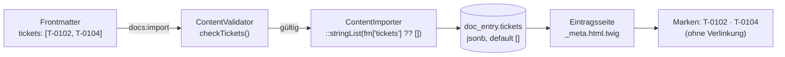
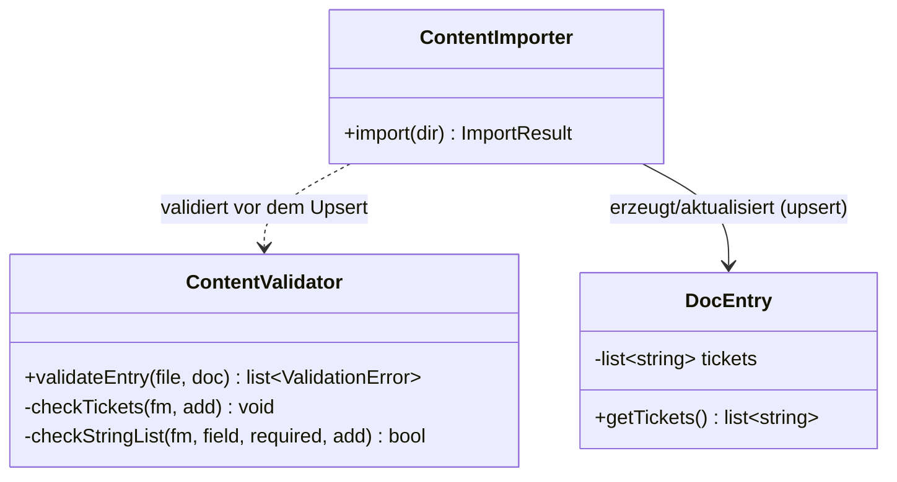

## Was

Bisher stand nirgends im Doku-Eintrag selbst, zu welchem Ticket er gehört – die Zuordnung war
Kopfsache. Ein Eintrag kann jetzt im Frontmatter `tickets: [T-0102, T-0104]` tragen, und diese
Kennungen erscheinen auf der Eintragsseite als eigene Marken neben Agenten, Repos und Tags. Das Feld
ist optional: Ein Eintrag ohne Tickets zeigt keinen leeren Bereich, keine Beschriftung ins Leere.
Dieser Eintrag hier ist der eingebaute Beweis, dass es funktioniert – er trägt selbst
`tickets: [T-0007]`, dem Ticket, aus dem er entstanden ist.



## Warum

Ohne dieses Feld bleibt die Verbindung zwischen Ticket und Doku-Eintrag Handarbeit im Kopf des
Lesers – bei zehn Einträgen noch machbar, bei fünfzig nicht mehr. [T-0003](../../.claude/specs/), die
geplante Abschlussprüfung, braucht außerdem eine maschinenlesbare Antwort auf „ist zu Ticket X schon
dokumentiert?", und die kann nur aus einem echten Feld kommen, nicht aus einer Vermutung anhand des
Titels.

Zwei Design-Entscheidungen aus dem Ticket sind bewusst eng gehalten:

- **Kein Fremdschlüssel auf eine `ticket`-Tabelle.** Tickets leben in `.claude/specs/` im
  Workspace-Root, nicht in diesem Repo (`sk8-docs` kennt seine eigene Ticket-Datei T-0007 nur als
  Text, nicht als Datensatz). Eine Relation würde eine Tabelle vortäuschen, die es nicht gibt. Eine
  Zeichenketten-Liste passt zur tatsächlichen Kopplung: lose, nur über die Kennung, nicht über eine
  Fremdschlüssel-Beziehung.
- **Keine Verlinkung im Template.** Andere Marken (`badge--adr`, `badge--repo`, `badge--tag`) sind
  `<a>`-Elemente, weil ihr Ziel innerhalb der App liegt. Ein Ticket-Link hätte ins Leere gezeigt, also
  ist die Ticket-Marke ein reines `<span>` – bewusst die einzige Marke im Kopfbereich ohne `href`.

Das Frontmatter-Schema selbst steht jetzt in [ADR-004](../adr/ADR-004-docs-plattform.md) (Zeile zur
`tickets`-Spalte in der Tabelle) und in `.claude/rules/docs-content.md` – beide wurden mit diesem
Feature aktualisiert, nicht neu geschrieben.

## Wie

**1. Das Feld im Validator zulassen und prüfen.** `ENTRY_FIELDS` bekommt `tickets` als erlaubten,
aber nicht in `ENTRY_REQUIRED` gelisteten Schlüssel – das allein macht das Feld optional. Die eigentliche
Prüfung folgt demselben Muster wie die bestehende `adrs`-Prüfung: erst die Form (Liste?), dann jedes
Element gegen ein Muster:

```php
// src/Content/ContentValidator.php:305-320
private function checkTickets(array $fm, callable $add): void
{
    if (!\array_key_exists('tickets', $fm)) {
        return; // Feld fehlt → optional, kein Fehler (AK2)
    }
    if (!$this->checkStringList($fm, 'tickets', false, $add)) {
        return; // meldet z. B. "muss eine Liste sein" selbst (AK4)
    }
    /** @var list<string> $tickets */
    $tickets = $fm['tickets'];
    foreach ($tickets as $ticket) {
        if (1 !== preg_match(self::TICKET_ID, $ticket)) {
            // deutsche Meldung nennt den falschen Wert (AK3)
            $add('tickets', \sprintf('"%s" hat nicht das Format T-NNXX oder R-NN (z. B. T-0102 oder R-04).', $ticket));
        }
    }
}
```

`checkStringList()` (unverändert, wird hier nur wiederverwendet) prüft mit
`array_is_list()`, ob die Werte wirklich eine Liste sind – nicht ein Objekt mit Schlüsseln. Der
zweite Parameter `false` heißt „darf leer sein, wenn vorhanden" (anders als bei `agents`, wo eine
leere Liste ein Fehler wäre). Das ist derselbe Helfer, den `checkAgents` schon nutzt – keine neue
Prüf-Logik, nur ein neues Muster (`TICKET_ID`) und eine neue Fehlermeldung.

**2. Die Spalte anlegen.** Die Migration fügt `tickets` mit einem konstanten Default hinzu:

```sql
-- migrations/Version20260908120321.php:24
-- Konstanter Default: Postgres schreibt ihn nur ins Katalog-Metadatum, nicht in jede
-- bestehende Zeile (siehe Lernpunkte) – deshalb reicht dieser eine ALTER-Schritt für AK7.
ALTER TABLE doc_entry ADD tickets JSONB NOT NULL DEFAULT '[]'
```

`NOT NULL DEFAULT '[]'` reicht als einziger Schritt, weil PostgreSQL einen konstanten Default beim
Hinzufügen einer Spalte nicht in jede bestehende Zeile schreibt, sondern nur im Katalog vermerkt (siehe
Lernpunkte) – deshalb braucht AK7 („bestehende Zeile bekommt eine leere Liste, Seite bleibt fehlerfrei")
keinen separaten Daten-Migrationsschritt. `down()` entfernt die Spalte wieder mit `DROP tickets`.

**3. Die Spalte durch die Anwendung reichen.** `DocEntry` bekommt ein `tickets`-Property, threaded
durch Konstruktor und `update()` (Upsert-Pfad) genau wie `adrs`:

```php
// src/Entity/DocEntry.php:54-56
/** @var list<string> */
#[ORM\Column(type: Types::JSON, options: ['jsonb' => true])] // gleiche Zuordnung wie agents/repos/adrs
private array $tickets;
```

`Types::JSON` mit `jsonb: true` ist derselbe Spaltentyp, den `agents`, `repos` und `adrs` schon
nutzen (siehe Lernpunkte) – Doctrine kennt die Spalte als PHP-Array, PostgreSQL speichert sie binär
durchsuchbar. `ContentImporter` übergibt beim Bauen des Entity-Aufrufs die Liste mit demselben
Default-Muster wie `adrs`:

```php
// src/Content/ContentImporter.php:237
self::stringList($fm['tickets'] ?? []), // fehlt das Feld, greift die leere Liste (AK2)
```

Fehlt das Feld im Frontmatter, liefert `?? []` eine leere Liste – exakt das, was AK2 verlangt, ohne
eine Sonderfall-Verzweigung im Importer.

**4. Anzeigen, aber nur wenn nötig.** Im Kopfbereich-Partial wird die Ticket-Gruppe nur gerendert,
wenn Tickets existieren und die kompakte Darstellung (Vorschau-Kacheln in Listen) nicht aktiv ist:

```twig
{# templates/_partials/_meta.html.twig:39-43 #}

    {# leere Liste → gar kein <span>, kein aria-label: AK6 #}
    <span class="meta__group" aria-label="Tickets">
        {# kein <a href>: Tickets liegen außerhalb des Repos, nichts zum Verlinken #}
        <span class="badge badge--ticket">{{ ticket }}</span>
    </span>

```

`compact|default(false)` behandelt eine Ansicht, die den Parameter gar nicht setzt, wie `compact:
false` – ohne dass jede aufrufende Stelle ihn explizit mitgeben muss. `item.tickets is not empty`
erfüllt AK6: Ist die Liste leer, entsteht kein `<span>`, kein `aria-label`, nichts.



## Tests

| Testdatei / Methode | Beweist |
|---|---|
| `tests/Unit/Content/ContentValidatorTest.php::testItAcceptsAnEntryWithValidTicketReferences` | Gültige Kennungen (`T-0102`, `R-04`) werden angenommen |
| `tests/Unit/Content/ContentValidatorTest.php::testItAcceptsAnEntryWithoutTheOptionalTicketsField` | Fehlendes Feld ist kein Fehler (Feld ist optional) |
| `tests/Unit/Content/ContentValidatorTest.php::testItReportsTheInvalidTicketReferenceByNameInGerman` | AK3 – falsches Format wird auf Deutsch gemeldet, nennt den Wert |
| `tests/Unit/Content/ContentValidatorTest.php::testItReportsThatASingleTicketMustBeGivenAsAList` | AK4 – einzelne Zeichenkette statt Liste wird auf Deutsch gemeldet |
| `tests/Functional/Command/DocsImportCommandTest.php::testImportStoresTicketReferencesFromFrontmatter` | AK1 – beide Kennungen landen in der Spalte |
| `tests/Functional/Command/DocsImportCommandTest.php::testImportSetsAnEmptyTicketListWhenTheFieldIsMissing` | AK2 – leere Liste, Import gelingt |
| `tests/Functional/Command/DocsImportCommandTest.php::testReimportingAnEntryWithoutTicketsKeepsAnEmptyListAndSucceeds` | AK7 – erneuter Import ohne Tickets bleibt stabil, keine Doppelung |
| `tests/Functional/Command/DocsImportCommandTest.php::testTheTicketsColumnDefaultsToAnEmptyListForRowsWrittenWithoutIt` | AK7 – Spalten-Default `[]` auf Schema-Ebene, ohne das Feld zu nennen |
| `tests/Functional/Controller/EntryPagesTest.php::testEntryDetailShowsAllTicketBadgesWhenTheEntryHasThem` | AK5 – beide Kennungen sind im Kopfbereich sichtbar |
| `tests/Functional/Controller/EntryPagesTest.php::testEntryDetailShowsNoTicketAreaWhenTheEntryHasNone` | AK6 – kein leerer Bereich, keine Beschriftung |

Ausführen: `make test` im Repo `sk8-docs`. Aktueller Stand der gesamten Suite (nicht nur der neuen
Fälle): **148 Tests, 428 Assertions, alle grün** (`vendor/bin/phpunit`, Laufzeit 3,3 s).

## Lernpunkte

1. **Listen-Prüfung mit `array_is_list()`** – `checkStringList()` (aufgerufen aus `checkTickets` in
   `src/Content/ContentValidator.php:310`) nutzt diese seit PHP 8.1 eingebaute Funktion, um `[T-0102,
   T-0104]` von `{0: T-0102, extra: T-0104}` zu unterscheiden – genau die Prüfung hinter AK4. Vom
   Prinzip her dasselbe wie `Array.isArray(value)` in TS, nur strenger: PHP-Arrays sind immer auch
   Maps, `array_is_list()` prüft zusätzlich lückenlose Ganzzahl-Schlüssel ab 0.
   [PHP-Handbuch zu `array_is_list()`](https://www.php.net/manual/en/function.array-is-list.php).
2. **`jsonb`-Spalte ohne Tabellen-Rewrite anlegen** – die Migration in
   `migrations/Version20260908120321.php:24` fügt `tickets` mit `NOT NULL DEFAULT '[]'` in einem
   Schritt hinzu. Laut PostgreSQL-Doku wird bei einem konstanten Default „der Wert nur im
   Tabellen-Katalog gespeichert […] und beim Zugriff auf vorhandene Zeilen zurückgegeben" – die Tabelle
   selbst wird dabei nicht neu geschrieben. Das erklärt, warum AK7 ohne separaten
   Daten-Migrationsschritt auskommt. Vergleichbar mit einer Prisma-Migration, die eine Spalte mit
   `@default` ergänzt, statt jede Zeile per `UPDATE` nachzuziehen.
   [PostgreSQL: `ALTER TABLE`, Abschnitt „Notes"](https://www.postgresql.org/docs/current/sql-altertable.html).
3. **Doctrine `Types::JSON` mit der `jsonb`-Plattform-Option** – `src/Entity/DocEntry.php:54-56`
   nutzt denselben Spaltentyp wie `agents`, `repos` und `adrs`: `Types::JSON` mit
   `options: ['jsonb' => true]`. Laut Doctrine-DBAL-Doku existiert dafür intern ein eigener
   `jsonb`-Typ, der „auf PostgreSQL auf den `JSONB`-Datentyp abgebildet wird, auf allen anderen
   Plattformen auf denselben Typ wie `json`" – PHP sieht in beiden Fällen ein normales Array. Ähnlich
   wie Prismas `Json`-Feldtyp oder TypeORMs `simple-json`-Spaltentyp: die Serialisierung ist für den
   Anwendungscode unsichtbar.
   [Doctrine DBAL: Mapping Matrix](https://www.doctrine-project.org/projects/doctrine-dbal/en/latest/reference/types.html).
4. **`default`-Filter statt manueller Existenzprüfung** – `templates/_partials/_meta.html.twig:39`
   schreibt `not compact|default(false)`, damit Aufrufer, die den optionalen `compact`-Parameter nicht
   setzen, ihn wie `false` behandelt sehen. Die Twig-Doku warnt dabei ausdrücklich: „Wird eine
   Boolean-Variable auf `false` gesetzt, behandelt der `default`-Filter sie als leer" – für einen
   bewusst gesetzten `false`-Wert wäre `??` nötig, hier ist das Standardverhalten aber genau
   erwünscht (kompakt ist ohnehin `false`, wenn niemand es setzt). Entspricht einem Vue-Prop mit
   `default: false` in der `defineProps`-Deklaration.
   [Twig: `default`-Filter](https://twig.symfony.com/doc/3.x/filters/default.html).

## Alternativen

Ein Fremdschlüssel auf eine eigene `ticket`-Tabelle wurde nicht gebaut, weil Tickets außerhalb dieses
Repos liegen (`.claude/specs/` im Workspace-Root) – `sk8-docs` hätte sie doppelt und veraltet
vorhalten müssen. Die Zeichenketten-Liste akzeptiert dafür bewusst, dass ein Tippfehler im Format
zwar vom Validator erkannt wird (AK3), eine falsch geschriebene, aber formal gültige Ticket-ID
(`T-9999` statt `T-0007`) dagegen nicht – das Feld prüft die Form, nicht die Existenz.
