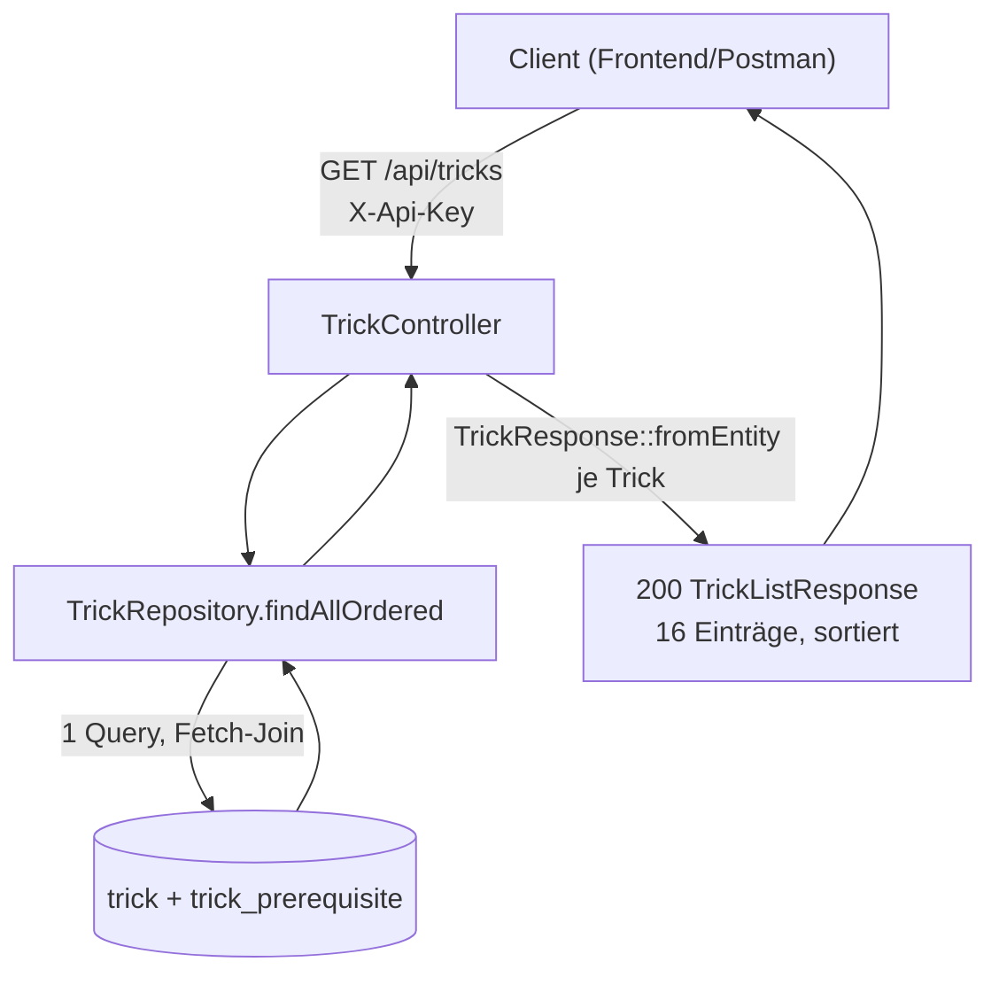
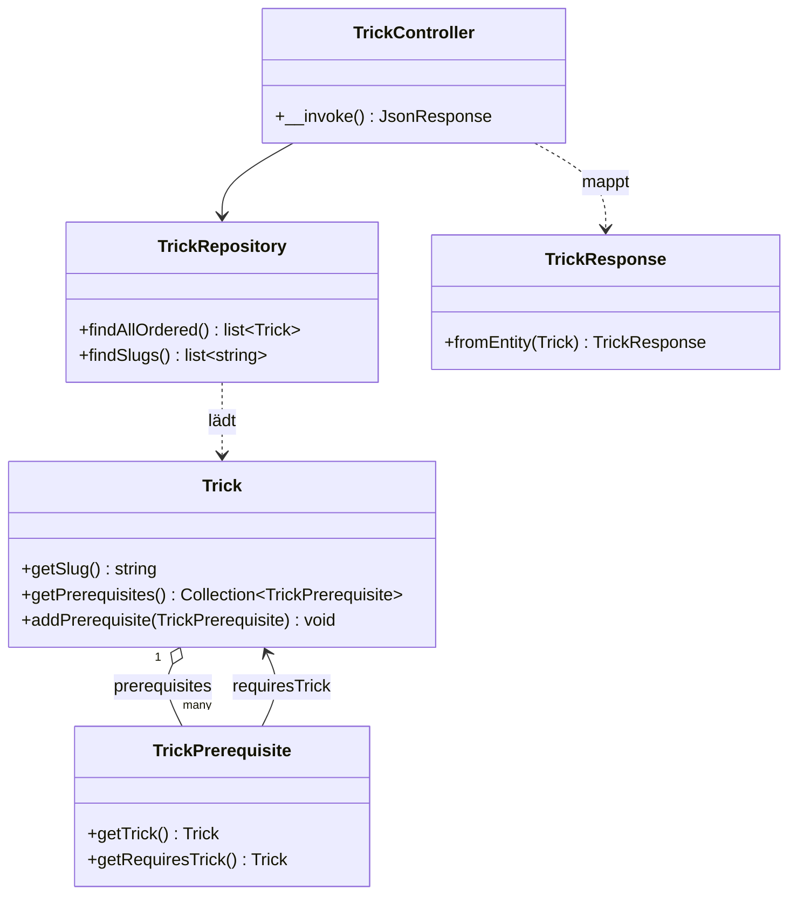

## Was

Bevor eine Trainingseinheit erfasst werden kann, muss die Oberfläche wissen, welche Tricks es
überhaupt gibt – und welcher Trick auf welchem aufbaut. Genau das liefert dieses Feature: 16 Tricks
(von „Sicher rollen" bis „Kickflip") liegen jetzt fest in der Datenbank, verbunden durch 18 Kanten, die
sagen „X setzt Y voraus". `GET /api/tricks` gibt den kompletten Katalog zurück, sortiert nach
Schwierigkeit und dann nach Name, jeder Trick mit seinen direkten Voraussetzungen als Liste von Slugs.
Es gibt in diesem Ticket bewusst **keinen** Schreibweg – der Katalog ändert sich nur über eine neue
Migration, nicht über die API. Sieben der 16 Tricks sind als Contest-Ziele markiert (`isGoal: true`,
`goalOrder: 1` bis `7`), die anderen neun sind Zwischenschritte auf dem Weg dahin.



## Warum

`PRODUCT-SPEC.md` gibt sieben Contest-Ziele in fester Reihenfolge vor, `DATENMODELL.md` verlangt dafür
einen Trick-Baum „mit Voraussetzungen". Ohne diesen Katalog wäre der in `session_trick` erfasste Trick
freier Text – jede spätere Auswertung („Wie oft habe ich den Pop Shove-it geübt?") würde zum
Textvergleich statt zur Abfrage. Der Trick-Tree aus EPIC-02 braucht außerdem eine Datengrundlage, bevor
er überhaupt gezeichnet werden kann; dieses Ticket liefert nur diese Grundlage.

Zwei Entscheidungen aus `design.md` grenzen den Umfang bewusst ein:

- **Migration statt Fixture.** Der Katalog ist Produktions-Stammdaten, kein Testfixture – er muss in
  jeder Umgebung (lokal, Railway development, Railway production) identisch vorhanden sein. Eine
  Doctrine-Migration macht Reihenfolge (Schema vor Daten) und Reversibilität explizit prüfbar; ein
  JSON-Fixture bräuchte beim Deploy trotzdem einen Lademechanismus und wäre damit nur eine Migration mit
  Umweg.
- **Kanten-Tabelle statt Array-Spalte.** Eine Alternative wäre `trick.prerequisite_ids: uuid[]` gewesen.
  Verworfen, weil ein Array referenzielle Integrität (Fremdschlüssel, `ON DELETE CASCADE`) unmöglich
  macht und keinen Index auf die Rückrichtung erlaubt („wer setzt X voraus", relevant für den späteren
  Trick-Tree). Bei 18 Kanten ist der zusätzliche Join kein Performance-Thema.

Kein `TrickService` zwischen Repository und Controller: Zwischen `findAllOrdered()` und der Antwort
liegt keine Logik. Eine Schicht, die nur durchreicht, wäre YAGNI. Bezug zu [ADR-002](../adr/ADR-002-backend-stack.md)
(Backend-Stack, Schichtung als Konvention für vorhandene Logik, nicht Pflicht-Boilerplate),
[ADR-005](../adr/ADR-005-datenbank-deployment.md) (Migrationen getrennt Schema/Daten) und
[ADR-006](../adr/ADR-006-api-zugriff-sicherheit.md) (`X-Api-Key`, zentrales Fehlerformat).

## Wie

**1. Der Katalog als zwei getrennte Migrationen.** Schema und Daten kommen laut Projektregel nie in
einem Schritt – eine Migration erzeugt Tabellen und Constraints, die nächste befüllt sie:

```sql
-- migrations/Version20260909100000.php:44-47
CREATE UNIQUE INDEX uniq_trick_goal_order ON trick (goal_order) WHERE (goal_order IS NOT NULL);
-- ^ partieller Index: nur Zeilen mit gesetztem goal_order müssen eindeutig sein,
--   beliebig viele Tricks mit goal_order = NULL sind erlaubt
ALTER TABLE trick ADD CONSTRAINT chk_trick_category CHECK (category IN ('flat', 'rotation', 'balance', 'slide', 'grind', 'air'));
ALTER TABLE trick ADD CONSTRAINT chk_trick_difficulty CHECK (difficulty BETWEEN 1 AND 10);
ALTER TABLE trick ADD CONSTRAINT chk_trick_goal CHECK ((is_goal AND goal_order BETWEEN 1 AND 7) OR (NOT is_goal AND goal_order IS NULL));
-- ^ chk_trick_goal erzwingt an der Datenbank, was sonst nur eine Anwendungsregel wäre:
--   ein Ziel-Trick hat immer eine Position 1-7, ein Nicht-Ziel-Trick nie eine
```

Die Tabellen, einfachen Indizes und Fremdschlüssel stammen wörtlich aus `doctrine:migrations:diff` gegen
die Entities; die drei `CHECK`-Constraints sind von Hand ergänzt, weil Doctrines Schema-Vergleich unter
PostgreSQL keine `CHECK`-Constraints introspiziert – sie blieben sonst bei jedem künftigen Diff
unsichtbar (weder als „fehlt" noch als „überflüssig" erkannt). Die zweite Migration füllt die Tabellen:

```php
// migrations/Version20260909100001.php:49-62
foreach ($this->edges() as [$trickSlug, $requiresSlug]) {
    $this->addSql(
        <<<'SQL'
            INSERT INTO trick_prerequisite (id, trick_id, requires_trick_id)
            VALUES (?, (SELECT id FROM trick WHERE slug = ?), (SELECT id FROM trick WHERE slug = ?))
            SQL,
        [Uuid::v7()->toRfc4122(), $trickSlug, $requiresSlug], // Kanten über slug verknüpft,
        ['string', 'string', 'string'],                        // keine hartkodierten UUIDs im SQL
    );
}
```

Die Kanten werden über `slug` per Unterabfrage verknüpft statt über hartkodierte UUIDs – die Migration
bleibt dadurch lesbar, obwohl jede Zeile in `trick` beim Ausführen ihre eigene, erst zur Laufzeit
erzeugte `Uuid::v7()`-ID bekommt. Nur direkte Kanten sind eingetragen (transitive Reduktion): `ollie`
setzt `ollie-stand` voraus, und `ollie-stand` setzt `rolling` voraus – die Kante `ollie → rolling` fehlt
bewusst, weil sie sich aus den beiden anderen ergibt. Das hält die 18 Kanten überschaubar und den
späteren Trick-Baum lesbar.

**2. Kategorie als Backed Enum, nicht als Freitext.** `TrickCategory` ist ein PHP-Enum mit
String-Backing, direkt auf die `text`-Spalte gemappt:

```php
// src/Entity/Trick.php:36
#[ORM\Column(type: Types::TEXT, enumType: TrickCategory::class)]
private TrickCategory $category;
```

`enumType:` sagt Doctrine, welches Enum beim Lesen aus der Spalte konstruiert und beim Schreiben in
seinen Skalarwert aufgelöst wird – ohne das wäre `$trick->getCategory()` ein rohes `string`, und ein
Tippfehler wie `'ballance'` würde erst zur Laufzeit auffallen (oder gar nicht, weil PHP `string`
klaglos akzeptiert). Mit `enumType:` verweigert schon die Typprüfung jeden Wert außerhalb der sechs
`TrickCategory`-Fälle.

**3. Ein Fetch-Join statt 17 Einzelabfragen.** `findAllOrdered()` lädt Tricks und ihre Voraussetzungen in
einer einzigen SQL-Abfrage:

```php
// src/Repository/TrickRepository.php:32-40
$result = $this->createQueryBuilder('t')
    ->leftJoin('t.prerequisites', 'p')   // 'p' ohne addSelect wäre nur ein Filter-Join
    ->addSelect('p')                     // macht 'p' zum Fetch-Join: p-Daten kommen mit
    ->leftJoin('p.requiresTrick', 'r')
    ->addSelect('r')                     // dito für den Trick, den p voraussetzt
    ->orderBy('t.difficulty', 'ASC')
    ->addOrderBy('t.name', 'ASC')
    ->getQuery()
    ->getResult();
```

Ohne `addSelect('p')`/`addSelect('r')` würde `$trick->getPrerequisites()` beim ersten Zugriff pro Trick
eine eigene Nachfrage auslösen (lazy loading) – bei 16 Tricks 17 statt 1 Abfrage. Der Sortier-Vertrag aus
dem Ticket (Schwierigkeit aufsteigend, bei Gleichstand Name aufsteigend) sitzt fest im Repository, nicht
in der API-Schicht – die Oberfläche kann die Reihenfolge nicht überschreiben.

**4. `TrickResponse::fromEntity()` bildet ab, ohne zu entscheiden.** Die alphabetische Sortierung der
Voraussetzungs-Slugs passiert hier, nicht in der Datenbank:

```php
// src/Dto/Trick/TrickResponse.php:43-47
$prerequisiteSlugs = array_map(
    static fn (TrickPrerequisite $prerequisite): string => $prerequisite->getRequiresTrick()->getSlug(),
    $trick->getPrerequisites()->toArray(),
);
sort($prerequisiteSlugs, \SORT_STRING); // Reihenfolge der DB-Zeilen ist zufällig, die API-Antwort nicht
```

`prerequisiteSlugs` trägt Slugs statt UUIDs – der Slug ist ebenso eindeutig, aber lesbar: Testdaten und
später der Trick-Tree in EPIC-02 können ihn direkt als Knoten-ID verwenden, ohne UUID-Vergleiche.



## Tests

| Testdatei | Beweist |
|---|---|
| `tests/Functional/Api/TrickListTest.php` | 200 mit 16 Einträgen, Sortierung nach `difficulty`/`name`, camelCase-Felder, `ollie` mit `isGoal`/`goalOrder`/Voraussetzung, `rolling` mit leerer Liste, 401 ohne/mit falschem `X-Api-Key`, 405 bei `POST` |
| `tests/Functional/Catalog/TrickCatalogSeedTest.php` | 16 Tricks, 18 Kanten, genau 7 Ziele mit `goalOrder` 1–7 lückenlos, keine Selbstreferenz, jede Kante zeigt auf existierende Tricks, Zyklenfreiheit per Tiefensuche, jedes Ziel erreicht `rolling` |
| `tests/Functional/Catalog/TrickConstraintTest.php` | doppelter `slug` und Selbstreferenz-Kante werden von der Datenbank abgewiesen |
| `tests/Unit/Dto/Trick/TrickResponseTest.php` | `fromEntity()` bildet alle neun Felder ab, `goalOrder`/`description` bleiben `null` bei Nicht-Zielen, `prerequisiteSlugs` alphabetisch sortiert unabhängig von der Einfügereihenfolge |
| `tests/Factory/TrickFactory.php` | Werkzeug für spätere Tickets (T-0102), keine eigene Behauptung |

Ausführen: `make test` (migriert die Testdatenbank, führt die volle PHPUnit-Suite aus). Laut `impl.md`:
**55 Tests, 665 Assertions, grün** (32 bestehende plus 23 neue aus den vier oben genannten Testdateien).

Zwei Akzeptanzkriterien sind bewusst kein PHPUnit-Test, sondern ein dokumentierter Prüflauf (die
dama-Transaktion macht Migrations-Vor-/Zurückspulen im Testlauf nicht sinnvoll ausführbar):

```
$ php bin/console doctrine:migrations:migrate prev --no-interaction   # zweimal: Daten-, dann Schema-Migration
$ psql -c "\dt" | grep trick                                          # (keine Treffer – beide Tabellen entfernt)
$ php bin/console doctrine:migrations:migrate --no-interaction        # 2 migrations executed, 48 sql queries
$ psql -c "SELECT count(*) FROM trick;"                                # 16
$ psql -c "SELECT count(*) FROM trick_prerequisite;"                   # 18

$ php bin/console doctrine:migrations:diff --no-interaction
In NoChangesDetected.php line 13:
  No changes detected in your mapping information.
```

Der leere Diff bestätigt: Entities und Schema stimmen exakt überein, auch nachdem die Tabellen einmal
komplett entfernt und wiederhergestellt wurden.

## Datenbank

`trick` (16 Zeilen) und `trick_prerequisite` (18 Zeilen), Details in `DATENMODELL.md`, Abschnitt
„Skateboard". Sechs Kategorien (`flat`, `rotation`, `balance`, `slide`, `grind`, `air`), Schwierigkeit 1
bis 10 als Baum-Reihenfolge (nicht absolute Schwierigkeit), sieben Ziele mit `goalOrder` 1 bis 7. Einzige
Wurzel ohne Voraussetzung: `rolling`.

## API

`GET /api/tricks` – kein Body, keine Query-Parameter, Header `X-Api-Key` (ADR-006). Antwort 200 mit
`{"items": [...]}`, ein `TrickResponse` je Trick (`id`, `slug`, `name`, `category`, `difficulty`,
`description`, `isGoal`, `goalOrder`, `prerequisiteSlugs`). 401 bei fehlendem/falschem Schlüssel, 405 bei
jedem anderen Verfahren als `GET`. Kein 404 und kein 422 – es gibt keine Parameter, die falsch sein
könnten, und der Katalog ist nie leer.

## Lernpunkte

1. **Backed Enum als Doctrine-Spaltentyp (`enumType`)** – `src/Entity/Trick.php:36` mappt
   `App\Enum\TrickCategory` (PHP-Enum mit `string`-Backing) direkt auf eine `text`-Spalte. Laut
   Doctrine-Dokumentation speichert Doctrine dabei „the scalar value in the database and converts it
   back to the enum instance when hydrating the entity" – automatische Hin- und Rückkonvertierung, kein
   manuelles `->value` beim Schreiben. Vergleichbar mit einem TS-`enum`/String-Literal-Union in
   Kombination mit Prismas nativem `enum`-Feldtyp: die Datenbank sieht nur den String, die Anwendung
   einen typsicheren Wert.
   [Doctrine ORM: Basic Mapping – enumType](https://www.doctrine-project.org/projects/doctrine-orm/en/3.6/reference/basic-mapping.html)
2. **Partieller Unique-Index statt CHECK für „eindeutig, aber optional"** –
   `migrations/Version20260909100000.php:44` legt `uniq_trick_goal_order` nur über Zeilen mit
   gesetztem `goal_order` an. PostgreSQL beschreibt einen partiellen Index als „built over a subset of
   a table; the subset is defined by a conditional expression […]. The index contains entries only for
   those table rows that satisfy the predicate." Beliebig viele Nicht-Ziel-Tricks mit `goal_order = NULL`
   sind damit erlaubt, doppelte `goal_order`-Werte unter den Zielen nicht. Prisma-Migrationen erzeugen so
   etwas nicht automatisch – das wäre auch dort ein Fall für rohes SQL in der Migration.
   [PostgreSQL: Partial Indexes](https://www.postgresql.org/docs/current/indexes-partial.html)
3. **Fetch-Join gegen N+1** – `src/Repository/TrickRepository.php:33-36` kombiniert `leftJoin()` mit
   `addSelect()`. Laut Doctrine-Dokumentation wird ein Join erst durch ein zugehöriges `addSelect()` zum
   Fetch-Join, der die verknüpften Daten in derselben Abfrage mitliefert – ohne das „relying on the
   lazy-loading mechanism leads to many small queries executed against the database". Entspricht
   Prismas `include: { requiresTrick: true }` bei `findMany()`: eine Abfrage statt einer pro Zeile.
   [Doctrine ORM: DQL – Joins](https://www.doctrine-project.org/projects/doctrine-orm/en/latest/reference/dql-doctrine-query-language.html)
4. **Migrationen sind explizit über `up()`/`down()` reversibel, nicht automatisch** – die beiden neuen
   Migrationsdateien (`migrations/Version20260909100000.php`, `migrations/Version20260909100001.php`)
   implementieren beide Richtungen von Hand, geprüft im Prüflauf oben (`migrate prev` gefolgt von
   `migrate`). Die Doctrine-Migrations-Dokumentation macht das nicht zur Selbstverständlichkeit: Ist eine
   Migration nicht umkehrbar, ruft man `$this->throwIrreversibleMigrationException()` in `down()` auf,
   statt so zu tun, als gäbe es einen Rückweg. Ähnlich wie bei Knex- oder TypeORM-Migrationen mit
   getrennten `up`/`down`-Funktionen – Prisma Migrate generiert dagegen standardmäßig keine `down()`,
   das ist hier bewusst anders.
   [Doctrine Migrations: Migration Classes](https://www.doctrine-project.org/projects/doctrine-migrations/en/current/reference/migration-classes.html)
5. **UUID v7 als Primärschlüssel: zeitlich sortierbar statt zufällig verstreut** –
   `src/Entity/Trick.php:71` erzeugt die ID im Konstruktor per `Uuid::v7()`, mit dem Kommentar „keeps
   the primary key index append-friendly". Die Symfony-Uid-Dokumentation bestätigt: UUIDv7 „provides
   better entropy (and a more strict chronological order of UUID generation)" und ist „lexicographically
   sortable" wie ein ULID – im Gegensatz zu UUIDv4 (komplett zufällig), das den B-Tree-Index bei jedem
   Insert an zufälliger Stelle aufbricht. Dieselbe Überlegung steht hinter `cuid`/`ulid` als
   Alternativen zu `uuid()` in einem Prisma-Schema.
   [Symfony: The Uid Component](https://symfony.com/doc/current/components/uid.html)
