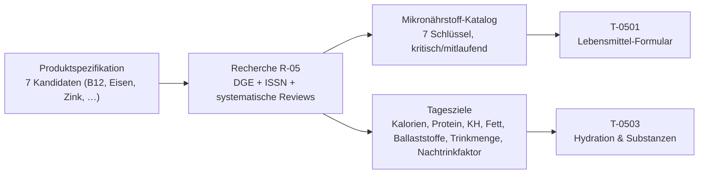

## Was

Bevor `sk8-nutrition` ein Lebensmittel anlegen oder eine Tagesbilanz zeichnen kann, muss feststehen,
**welche** Mikronährstoffe überhaupt gezählt werden und **wogegen** verglichen wird. Diese Recherche
beantwortet genau das für das konkrete Profil (vegetarisch, Käse erlaubt, keine Eier, keine sonstigen
Milchprodukte, starkes Schwitzen, linkes Knie mit Mikrotrauma): sieben Mikronährstoff-Schlüssel mit
deutschem Namen, Einheit, Tagesziel und einer Kennzeichnung „kritisch" gegen „mitlaufend", dazu
Kalorien-, Protein-, Kohlenhydrat-, Fett-, Ballaststoff- und Trinkmengenziele sowie ein Umrechnungsfaktor
von Schweißverlust in Nachtrinkmenge. Jede Zahl trägt eine Quelle und einen Evidenzgrad von A bis D –
vollständig nachlesbar in `.claude/state/research/mikronaehrstoffe.md`.



## Warum

`PRODUCT-SPEC.md` Abschnitt 6 nennt B12, Eisen, Zink, Omega-3, Kalzium, Vitamin D und Jod nur als
**Kandidaten** – welche davon für dieses konkrete Ernährungsprofil wirklich kritisch sind, war offen.
Das ist keine Nebensache: Jeder aufgenommene Schlüssel wird ein Pflichtfeld im
Lebensmittel-Anlage-Formular in `sk8-nutrition`, und die Tagesziele bestimmen, wogegen die spätere
Tagesbilanz vergleicht. Beides ist nachträglich teuer zu ändern, weil bereits erfasste Lebensmittel
sonst unvollständige Daten für ein neu hinzugefügtes Feld hätten. R-05 blockierte deshalb sowohl
`T-0501` (Lebensmittel anlegen) als auch `T-0503` (Hydration/Substanzen) – ohne belegte Zahlen hätte
der Implementierer geraten, und geratene Grenzwerte in einer Ernährungs-App sind nicht vertretbar.

Zentrale Erkenntnis der Recherche: **Käse deckt die Lücken sehr ungleich.** Bei Calcium ist Käse eine
exzellente Quelle (bis über 1000 mg/100 g bei Hartkäse) – Calcium blieb deshalb im Katalog, aber als
„mitlaufend", nicht „kritisch". Bei Jod ist das Gegenteil der Fall: Beim Käsen geht ein Großteil des
Jods aus der Milch in die Molke verloren, sodass Käse ein deutlich schwächerer Jodlieferant ist als
Milch oder Joghurt – und genau diese beiden fehlen im Profil. Jod wurde deshalb als der kritischste
Einzelwert im Katalog eingestuft.

## Wie

**1. Referenzwerte zuerst, dann Abweichungsgründe.** Für sechs der sieben Kandidaten (B12, Eisen, Zink,
Jod, Calcium, Vitamin D) liefert die DGE einen offiziellen D-A-CH-Referenzwert für erwachsene Männer –
diese Werte wurden einzeln von den jeweiligen `dge.de`-Referenzwertseiten abgerufen, nicht aus dem
Gedächtnis übernommen:

```
Eisen        11 mg/Tag        Jod          150 µg/Tag       B12   4,0 µg/Tag
Vitamin D    20 µg/Tag        Calcium      1000 mg/Tag       Zink  11–16 mg/Tag (phytatabhängig)
```

Für Omega-3 existiert kein fester D-A-CH-Wert (nur 0,5 %E für ALA) – hier wurde die in einer
systematischen Übersichtsarbeit (Neufingerl & Eilander 2021) referenzierte Zielgröße von 250 mg/Tag
EPA+DHA übernommen und im Recherche-Dokument als offene Frage markiert, weil sie nicht gegen eine
Primärquelle wie EFSA verifiziert wurde.

**2. Kandidaten gegen Studienlage geprüft, keiner verworfen.** Eine systematische Übersichtsarbeit über
141 Einzelstudien (Neufingerl & Eilander 2021) lieferte die entscheidenden Vergleichszahlen zwischen
Mischkost, Vegetariern und Veganern – zum Beispiel B12-Inadäquanz bei 32 % der Vegetarier gegenüber 11 %
bei Mischkost, oder Eisen-Inadäquanz trotz höherer Gesamtzufuhr (schlechtere Bioverfügbarkeit
pflanzlichen Eisens, ~10 % gegenüber ~18 %). Das rechtfertigte, alle sieben Kandidaten aufzunehmen –
keiner wurde verworfen, aber Calcium bekam die Kennzeichnung „mitlaufend" statt „kritisch", weil die
Käse-Ausnahme im Profil diese Lücke schließt.

**3. Kalorienziel als Formel, mit Rechenbeispiel.** Statt einer festen Kalorienzahl (die bei
Gewichtsschwankungen sofort falsch wäre) steht die Formel Ruheenergieverbrauch (Mifflin-St-Jeor) × PAL
im Ergebnis, mit einem durchgerechneten Beispiel für 80 kg:

```
Ruheenergieverbrauch = 10×80 + 6,25×178 − 5×40 + 5 = 1717,5 kcal
Gesamtenergiebedarf  = 1717,5 × PAL 1,6 ≈ 2750 kcal/Tag
```

**4. Nachtrinkfaktor direkt aus der einschlägigen Positionsposition.** Die DGE-Arbeitsgruppe
Sporternährung hat 2020 eine eigene Position zum Flüssigkeitsmanagement im Sport veröffentlicht
(Mosler et al., Volltext gelesen): Für schnelle und vollständige Rehydration werden 1,5 Liter
Flüssigkeit pro Kilogramm Gewichtsverlust empfohlen, aufgenommen innerhalb von sechs Stunden – exakt
der Faktor, den `T-0503` für die Verrechnung von `skate_session.weight_before_kg` und
`weight_after_kg` braucht. Natrium wird Teil der Nachtrinkstrategie, sobald die Schweißrate 1,2 l/h
oder die Belastungsdauer zwei Stunden übersteigt.

**5. Wo die Recherche an Grenzen stieß, wurde das offen benannt.** Zwei Quellen waren nicht direkt
zugänglich (eine Magnesium-Gelenk-Übersichtsarbeit hinter einer Cookie-Sperre, die ALA→EPA/DHA-
Umwandlungsrate nur über Suchausschnitte) – beide sind im Recherche-Dokument explizit als „nicht
verifiziert" markiert statt stillschweigend als gesicherte Fakten zu erscheinen. Die einzige direkte
Studie zu Kollagensynthese (Shaw et al. 2017) arbeitet mit Gelatine, einem tierischen Produkt – das
Ergebnis wurde deshalb nicht als Empfehlung für das vegetarische Profil übernommen, sondern nur als
Beleg dafür, dass diese Übertragung fehlt.

## Tests

Sieben im Ticket vorgegebene Prüfungen wurden durchgeführt und ihr Ergebnis liegt im
Recherche-Dokument:

| Prüfung | Ergebnis |
|---|---|
| Jede Quelle im Verzeichnis einmal aufrufen | 20 von 22 Quellen direkt geöffnet, 2 explizit als „nicht verifiziert" markiert |
| Katalogtabelle gegen Spaltenschema abgleichen | Alle 7 Zeilen vollständig (Schlüssel, Name, Einheit, Tagesziel, kritisch, Spanne) |
| Schlüssel auf Eindeutigkeit/Schreibweise prüfen | `iodine`, `omega3`, `b12`, `iron`, `zinc`, `vitamin_d`, `calcium` – eindeutig, stabil |
| Einheiten gegen `mg`/`µg` prüfen | Keine dritte Einheit verwendet |
| Sieben Kandidaten der Produktspezifikation abhaken | Alle sieben aufgenommen, keiner verworfen |
| Tagesziele auf Vollständigkeit prüfen | Alle sieben Ziele gesetzt oder begründet als Spanne/ohne festen Wert markiert |
| Beispielrechnung für 80 kg nachrechnen | 1717,5 kcal Ruheenergieverbrauch × PAL 1,6 ≈ 2750 kcal/Tag, nachgerechnet korrekt |

Validiert mit `make console ARGS="docs:import --dry-run"` im Repo `sk8-docs` (prüft Frontmatter und
Pflicht-Abschnitte dieses Eintrags).

## Lernpunkte

1. **Evidenzhierarchie statt „allgemein bekannt"** – die Recherche-Rolle stuft jede Aussage nach
   Studientyp ein (A: mehrere hochwertige Studien/Meta-Analysen, B: einzelne Studien/konsistente
   Leitlinien, C: Expertenkonsens/Transfer, D: Plausibilität ohne Beleg). Das ist dasselbe Prinzip wie
   ein Test-Pyramiden-Konzept in der Softwareentwicklung: Nicht jede Behauptung verdient dasselbe
   Vertrauen, und das Dokument macht das für jede Zeile einzeln sichtbar statt es zu vermischen.
2. **D-A-CH-Referenzwerte als „offizielle API" für Ernährungszahlen** – die DGE veröffentlicht für
   jeden Nährstoff einen einzelnen, versionierten Referenzwert (aktuell 3. Auflage 2025), abrufbar
   unter einer stabilen URL je Nährstoff. Für `sk8-backend` heißt das: Diese Werte sind eine
   nachvollziehbare, zitierfähige Quelle für `NutritionTargets`, keine Setzung durch das Projekt selbst.
   [DGE Referenzwerte](https://www.dge.de/wissenschaft/referenzwerte/)
3. **ISSN Position Stands als Konsens-Dokumente** – anders als eine Einzelstudie fasst ein „Position
   Stand" der International Society of Sports Nutrition den Stand vieler Studien zu einer Fachfrage
   (hier: Protein und Nutrient Timing) zusammen und wird von einem Fachgremium getragen. Das ist die
   sportwissenschaftliche Entsprechung zu einem RFC oder einer W3C-Recommendation: nicht die neueste
   Einzelmeinung, sondern der ausgehandelte Stand.
   [ISSN Position Stand: Protein and Exercise](https://pmc.ncbi.nlm.nih.gov/articles/PMC5477153/)
4. **Formel statt fixer Zahl, wenn die Eingabegröße sich ändert** – das Kalorienziel ist bewusst als
   Formel (Ruheenergieverbrauch × PAL) mit einem Rechenbeispiel dokumentiert, nicht als einzelne Zahl.
   Für `NutritionTargets` bedeutet das: Der Service muss `body_weight`, Größe und Alter als Eingabe
   nehmen und daraus rechnen, nicht einen konstanten Kalorienwert zurückgeben – vergleichbar mit einer
   berechneten statt einer statisch gespeicherten Eigenschaft.
5. **Eine offene Frage ist ein gültiges Rechercheergebnis** – für Omega-3 gibt es keinen offiziellen
   D-A-CH-Wert; statt eine Zahl zu erfinden, steht im Ergebnis „250 mg/Tag, aus Sekundärliteratur,
   noch gegen eine Primärquelle zu verifizieren". Für die spätere Implementierung heißt das: Dieses
   Ziel sollte im Code als vorläufig markierbar sein, nicht mit derselben Sicherheit wie die
   DGE-Werte behandelt werden.
