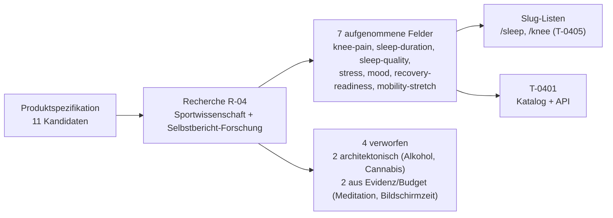

## Was

Bevor `T-0401` eine Datenbanktabelle und einen `app:habits:sync`-Befehl für den
Gewohnheiten-Katalog bauen kann, muss feststehen, **welche** Gewohnheiten überhaupt erfasst werden –
nicht nach Bauchgefühl, sondern belegt. Diese Recherche beantwortet das für elf Kandidaten aus
`PRODUCT-SPEC.md` Abschnitt 5: sieben werden aufgenommen (`knee-pain`, `sleep-duration`,
`sleep-quality`, `stress`, `mood`, `recovery-readiness`, `mobility-stretch`), zwei sind laut
Architekturentscheidung in `EPIC-04-habits.md` von vornherein ausgeschlossen (Alkohol, Cannabis –
die laufen als `substance_entry` über `sk8-nutrition`), zwei werden aus Evidenz- und
Feld-Budget-Gründen verworfen (Meditation, Bildschirmzeit). Jede aufgenommene Zeile trägt Feldtyp,
Einheit oder Skala, Zielrichtung, Evidenzgrad und Quelle – vollständig nachlesbar in
`.claude/state/research/habit-auswahl.md`.

## Warum

`EPIC-04-habits.md` verlangt ausdrücklich, dass die Recherche-Rolle den endgültigen Satz bestimmt,
nicht der Implementierer. Der Grund ist Haltbarkeit: Ein Katalog mit zu vielen Feldern wird nach
zwei Wochen nicht mehr ausgefüllt, ein zu knapper Katalog lässt später keinen Zusammenhang zu
Leistung und Verletzungsrisiko erkennen – und beides ist nachträglich teuer, weil ein abgebrochener
oder unvollständiger Datensatz sich nicht rückwirkend reparieren lässt.

Zwei Entscheidungen aus der Recherche grenzen den Umfang bewusst ein:

- **Obergrenze von sieben aktiven Feldern**, begründet über eine Meta-Analyse zur Compliance bei
  Selbstbericht-Erhebungen (Williams et al. 2021: Compliance sinkt bei mehr als 26 Items pro
  Erhebungszeitpunkt deutlich) und, deutlich vorsichtiger gewichtet, über nicht-akademische
  Praxisempfehlungen (3–5 Gewohnheiten). Sieben liegt bewusst zwischen beidem.
- **Schlafregelmäßigkeit wird kein eigenes Feld.** Das Datenmodell von `habit_entry` kennt nur einen
  Zahlen- oder Bool-Wert pro Tag, keine Uhrzeit. Regelmäßigkeit ist aber eine Streuung über mehrere
  Tage, keine Tageseigenschaft – sie muss aus dem Verlauf der `sleep-duration`-Einträge berechnet
  werden, nach demselben Prinzip wie Serie und Erfüllungsquote in `EPIC-04-habits.md`
  („abgeleitete Werte gehören nicht in die Tabelle"). Das betrifft `T-0403`, nicht `T-0401`.

## Wie

**1. Zwei Skalenkonventionen, nicht eine.** Für `knee-pain` gilt die klinische 0–10-NRS (0 = kein
Schmerz, 10 = stärkster vorstellbarer Schmerz), für alle übrigen Skalen-Felder eine 1–5-Likert-Skala
– der sportwissenschaftliche Standard für tägliche Wellness-Konstrukte (Fatigue, Sleep Quality,
Soreness, Stress, Mood), etabliert seit McLean et al. (2010) für Athlet:innen-Monitoring. Diese
Trennung ist bewusst: Schmerz hat eine eigene klinische Konvention, alles andere folgt der
Sport-Monitoring-Konvention. Ein Wechsel der Skalenbreite ist laut Ticket-Randbedingung einmalig –
deshalb steht die Begründung schon jetzt fest, nicht erst beim Implementieren.

**2. Evidenzstärke bestimmt die Reihenfolge, nicht das Alphabet.** Die am stärksten belegte
Verbindung zu athletischer Leistung ist Schlafverlust: Eine Meta-Analyse über 227 Messwerte fand
einen mittleren Leistungsabfall von 7,56 % bei akutem Schlafmangel, bei technisch-koordinativen
Aufgaben bis zu 20,9 % (Craven et al. 2022). Genau solche Aufgaben – Ollie, Pop Shove-it, Manual –
sind der Kern des Trick-Trees aus `EPIC-02`. Schmerz steht trotzdem an erster Stelle im Katalog,
weil er laut `PRODUCT-SPEC.md` Abschnitt 3 eine harte Sicherheitsgrenze ist, keine
Leistungsvariable, die man gegen andere abwägt.

**3. Wo eine Quelle nicht zu öffnen war, wurde das offen benannt statt überspielt.** Die klassische
„2-Punkte-oder-30-%"-Faustregel für bedeutsame Schmerzveränderung (Farrar et al. 2001) ließ sich
über PubMed und Semantic Scholar nicht direkt öffnen (leerer Inhalt bzw. Cookie-Banner statt
Artikeltext) und wurde deshalb **nicht** als eigene Zahl übernommen. Stattdessen trägt der Katalog
nur den tatsächlich geöffneten Wert aus einer systematischen Übersichtsarbeit zu Knie-Arthrose-MID
(Silva et al. 2023: 0,7–2,1 Punkte auf einer 0–10-Skala). Ebenso wurde die vielzitierte
„66-Tage-Regel" zur Gewohnheitsbildung (Lally et al. 2010) nur über eine geöffnete
Sekundärquelle referenziert, mit dem Hinweis, dass nur 39 von 82 Teilnehmenden einen guten
Modell-Fit zeigten – die Primärquelle selbst gab bei drei Versuchen (Wiley, ResearchGate, BPS)
HTTP 403 zurück.

**4. Architektur vor Evidenz, wo eine Architekturentscheidung schon steht.** Alkohol- und
Cannabiskonsum sind fachlich Gewohnheiten und hätten mit Leistungsbelegen aufgenommen werden
können – `EPIC-04-habits.md` hat aber bereits entschieden, dass Konsum als `substance_entry` in
`sk8-nutrition` erfasst wird, nicht als `habit`-Zeile. Die Recherche liefert für diese beiden
Kandidaten trotzdem die Wirkfenster (wie viele Folgetage markiert werden), weil `T-0503` und die
spätere Leistungskorrelation das brauchen, auch ohne eigene Katalogzeile: Alkohol beeinträchtigt
laut einem systematischen Review noch am Morgen danach Gedächtnis, Aufmerksamkeit und
psychomotorisches Tempo mit mittleren Effektstärken (Gunn et al. 2018) – Konsumtag und ein
Folgetag werden markiert. Für Cannabis ist die akute psychomotorische Wirkung bei
Gewohnheitskonsument:innen meist nach ein bis zwei Stunden abgeklungen (Karoly et al. 2022), aber
die Schlafarchitektur der Konsumnacht bleibt gestört (Velzeboer et al. 2025) – ebenfalls Konsumtag
plus ein Folgetag, mit dem ausdrücklichen Hinweis, dass diese Übertragung von chronischen
Studienkohorten auf gelegentlichen Konsum schwächer belegt ist als bei Alkohol.

## Tests

Recherche ist nicht mit einem Testrahmen prüfbar. Die sechs im Ticket vorgegebenen Prüfungen wurden
durchgeführt, Ergebnis im Ticket `R-04` festgehalten:

| Prüfung | Ergebnis |
|---|---|
| Jede Quelle im Verzeichnis einmal aufrufen | 15 von 20 referenzierten Quellen direkt geöffnet, 5 explizit als „nicht verifiziert" markiert (Primärquellen Lally 2010, McLean 2010, Farrar 2001, Hamel 2022, NSCA, Duignan 2020) |
| Katalogtabelle gegen Spaltenschema abgleichen | Alle 7 Zeilen vollständig: `slug`, `name`, `value_type`, `unit`, `scale_min`/`scale_max`, `target_direction`, `target_value` (gefüllt oder begründet leer), `sort_order`, `is_active` |
| Slugs gegen `kebab-case` und Eindeutigkeit prüfen | `knee-pain`, `sleep-duration`, `sleep-quality`, `stress`, `mood`, `recovery-readiness`, `mobility-stretch` – alle eindeutig, alle `kebab-case` |
| `value_type` gegen die vier erlaubten Werte prüfen | Nur `scale`, `duration`, `boolean` verwendet – keiner außerhalb des Schemas |
| Bei `duration`: Einheit gesetzt; bei `scale`: `scale_min < scale_max` | `sleep-duration` trägt `h`; alle `scale`-Zeilen haben `scale_min < scale_max` (0–10 bzw. 1–5) |
| Elf Kandidaten der Produktspezifikation abhaken | Alle elf im Recherche-Dokument aufgeführt: sieben aufgenommen, zwei architektonisch verworfen (Alkohol, Cannabis), zwei aus Evidenz-/Budget-Gründen verworfen (Meditation, Bildschirmzeit) |

Validiert mit `make console ARGS="docs:import --dry-run"` im Repo `sk8-docs` (prüft Frontmatter und
Pflicht-Abschnitte dieses Eintrags).

## Lernpunkte

1. **Evidenzgrad als Pflichtspalte, nicht als Fußnote** – jede Aussage im Recherche-Dokument trägt
   A bis D (A: mehrere hochwertige Studien/Meta-Analysen, B: einzelne Studien/konsistente Befunde,
   C: Expertenkonsens/Transfer, D: Plausibilität ohne Beleg). Das verhindert, dass ein gut
   klingender Blogpost („3–5 Gewohnheiten empfohlen") dieselbe Gewichtsklasse bekommt wie eine
   Meta-Analyse über 227 Messwerte – vergleichbar mit dem Unterschied zwischen einer
   Community-Diskussion und einem RFC in der Softwarewelt.
2. **Zwei verschiedene Skalen-Konventionen bewusst getrennt halten** – 0–10-NRS für Schmerz,
   1–5-Likert für alles andere. Für `sk8-habits` heißt das konkret: Die Oberfläche darf diese
   Skalenbreiten nicht aus einer einzigen Konstante ableiten, sondern muss sie pro Gewohnheit aus
   `GET /api/habits` lesen (`scale_min`/`scale_max`) – dieselbe Regel wie „die Oberfläche kennt
   keine Gewohnheit namentlich" aus `EPIC-04-habits.md`.
3. **Ein berechneter statt gespeicherter Wert für Regelmäßigkeit** – `sleep-regularity` existiert
   nicht als Spalte, weil `habit_entry` keine Uhrzeit kennt, nur `value_numeric`. Vergleichbar mit
   `successRate` bei `skate_session`: eine aus dem Verlauf abgeleitete Größe gehört in den
   Verlaufs-Endpunkt (`T-0403`), nicht in die Stammdaten-Tabelle.
4. **Fehlgeschlagene Quellenzugriffe sind ein gültiges, dokumentiertes Ergebnis** – bei fünf von
   zwanzig Quellen scheiterte der direkte Abruf (HTTP 403 bei Wiley, ResearchGate, Allen Press,
   NSCA; leerer Inhalt bei PubMed/Semantic Scholar). Statt die Zahl trotzdem als gesichert zu
   präsentieren, führt das Recherche-Dokument einen eigenen Abschnitt „nicht verifizierte Quellen"
   und verwendet für die betroffenen Aussagen ausschließlich geöffnete Sekundärquellen oder lässt
   die Zahl ganz weg (Farrar-Faustregel).
5. **Architekturentscheidung schlägt Einzelevidenz, wenn sie schon getroffen ist** – Alkohol und
   Cannabis hätten fachlich starke Belege für eine eigene `habit`-Zeile geliefert. Die
   Recherche hat sie trotzdem nicht aufgenommen, weil `EPIC-04-habits.md` bereits entschieden hatte,
   dass Konsum in `substance_entry` gehört. Eine Recherche-Rolle liefert Evidenz für offene Fragen,
   sie hebelt keine bereits getroffene, begründete Architekturentscheidung aus.
