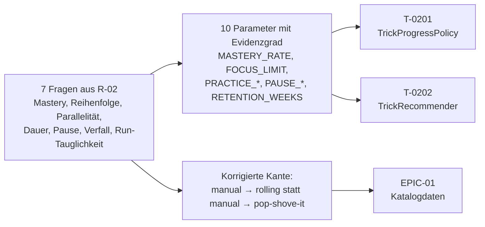

## Was

Bevor `TrickProgressPolicy` (`T-0201`) entscheiden kann, ob ein Trick als „sitzt" gilt, und bevor
`TrickRecommender` (`T-0202`) eine Übungsempfehlung mit Versuchszahl, Minuten und Pausenhinweis
ausgeben kann, mussten sieben fachliche Fragen mit Quellen beantwortet werden – keine geschätzten
Zahlen, weil unsichtbar falsch kalibrierte Schwellen im schlechtesten Fall zu früh zum nächsten Trick
schicken, genau in der Phase, in der eine Bewegung noch nicht automatisiert ist. Diese Recherche
liefert für jeden der zehn Parameter aus `PRODUCT-SPEC.md` einen Wert oder eine Spanne, einen
Evidenzgrad (A bis D) und eine Quelle, vollständig nachlesbar in
`.claude/state/research/trick-progression.md`.

## Warum

`PRODUCT-SPEC.md` Abschnitt 4 verlangt für den Trick-Tree ausdrücklich eine „wissenschaftlich
begründete" Progressionslogik. Ohne diese Recherche hätte `TrickProgressPolicy` entweder mit
geratenen Zahlen starten oder auf `T-0201`/`T-0202` warten müssen. Zwei Entscheidungen aus der
Recherche grenzen den Umfang bewusst ein:

- **`RETENTION_WEEKS` bleibt bewusst ohne Wert.** Physische, natürliche und geschwindigkeitsbasierte
  Aufgaben verfallen laut einer Meta-Analyse zum Fähigkeitsverfall langsamer als kognitive,
  künstliche und genauigkeitsbasierte Aufgaben – ein Skateboard-Trick ist als Bewegung eher im
  ersten Lager, sein Erfolgskriterium „gelandet oder nicht" eher im zweiten. Die beiden Faktoren
  zeigen in entgegengesetzte Richtungen; eine belastbare Wochenzahl lässt sich daraus nicht ableiten.
  Ein erfundener Wert wäre hier schädlicher als gar keiner.
- **Eine Korrektur an der Zielkette wird vorgeschlagen, nicht stillschweigend übernommen.** Eine
  EMG-Studie an Skateboardern zeigt, dass Ollie, Kickflip und 360°-Flip eine gemeinsame
  neuromuskuläre „Sprung"-Synergie teilen und nur die Rotationssteuerung trickspezifisch neu
  hinzukommt. Im Umkehrschluss: Manual (Rollbalance auf der Hinterachse, kein Pop, keine Rotation)
  teilt keine Teilfähigkeit mit Pop Shove-it. Die Recherche schlägt vor, `manual` auf `rolling` statt
  auf `pop-shove-it` aufbauen zu lassen – die Entscheidung über die Katalogdaten selbst liegt bei
  EPIC-01, nicht bei dieser Recherche.

Bezug zu `PRODUCT-SPEC.md` Abschnitt 3 (Knie-Mikrotrauma als harte Nebenbedingung): Die
Pausen-Parameter (`PAUSE_KNEE_PAIN`, `PAUSE_CONSECUTIVE_DAYS`) sind deshalb bewusst konservativ
hergeleitet, mit dem ausdrücklichen Hinweis, dass sie keine ärztliche oder physiotherapeutische
Abklärung ersetzen.

## Wie

**1. Konsistenz über Einheiten statt einer einzelnen Quote.** `MASTERY_MODE = each_session` statt
`pooled` – begründet über die in der Motor-Learning-Literatur übliche Definition von „gelernt" als
Konsistenz der Leistung über aufeinanderfolgende Einheiten, nicht als ein einzelner guter Wert. Eine
gepoolte Quote hätte erlaubt, dass eine überdurchschnittliche Einheit mehrere schwache Einheiten
rechnerisch ausgleicht – genau das Muster, das bei einer noch nicht automatisierten Bewegung ein
falsches „sitzt" auslösen würde.

**2. Zwei gegenläufige Faktoren offen benannt statt geglättet.** Eine Meta-Analyse über 189
Datenpunkte aus 53 Studien liefert Effektstärken für Fähigkeitsverfall nach Trainingspausen
unterschiedlicher Länge, aufgeschlüsselt auch nach Aufgabentyp:

> „Physical, natural, and speed-based tasks were less susceptible to skill loss than cognitive,
> artificial, and accuracy-based tasks."

Ein Skateboard-Trick ist als Bewegung physisch und natürlich (spricht für langsamen Verfall), aber
sein Erfolgskriterium ist genauigkeitsbasiert – gelandet oder nicht (spricht für schnellen Verfall).
Statt eine Zahl zwischen diesen beiden Polen zu schätzen, bleibt `RETENTION_WEEKS` offen, mit dem
Vermerk, dass eine Umsetzung eine neue Spalte `mastered_on` in `trick_progress` voraussetzt – diese
Spalte ist in `T-0201` bisher nicht spezifiziert.

**3. Contextual Interference als Grundlage für die Parallelitäts-Obergrenze.** Zwei aktuelle
systematische Übersichtsarbeiten mit Meta-Analyse zeigen: Random/variables Üben verbessert Retention
und Transfer gegenüber blockiertem Üben mit mittlerem Effekt insgesamt, aber der Effekt ist in
angewandten/Sport-Settings deutlich kleiner und teils nicht signifikant als im Labor. Daraus folgt für
`FOCUS_LIMIT`: 2 Tricks gleichzeitig „im Aufbau", angelehnt an die in solchen Studien übliche
Kombination von zwei bis drei Skill-Varianten, aber bewusst am unteren Rand gehalten, weil die
untersuchten Stichproben meist jünger und uneingeschränkt belastbar waren als die Zielperson dieser
App.

**4. Ein Sehnen-Modell für eine Knie-Frage – Transfer ausdrücklich markiert.** `PAUSE_KNEE_PAIN`
übernimmt das Schmerz-Monitoring-Modell aus einer randomisierten kontrollierten Studie zur
Achillessehnen-Rehabilitation: Schmerz bis 5 von 10 während/nach Belastung akzeptabel, muss bis zum
nächsten Morgen abklingen, darf über die Woche nicht ansteigen. Diese Studie untersucht eine Sehne,
nicht ein Knie – die Übertragung ist Evidenzgrad C, nicht B, und der Recherche-Text enthält
ausdrücklich den Hinweis, dass eine individuelle ärztliche oder physiotherapeutische Einschätzung des
Mikrotraumas dadurch nicht ersetzt wird.

**5. Fehlgeschlagene Quellenzugriffe wurden offen benannt statt überspielt.** Zwei Quellen zur
optimalen Erfolgsquote während der Übungsphase (ein Scientific-Reports-Artikel und ein zugehöriger
Preprint) waren nicht zu öffnen (Login-Redirect bzw. HTTP 429) und wurden deshalb nicht zur Begründung
von `MASTERY_RATE` verwendet, obwohl sie in der Suche auftauchten. Ein tandfonline-Review zu
Choking-under-pressure-Interventionen scheiterte an einer Zugriffssperre (HTTP 403); an seiner Stelle
trägt ein tatsächlich geöffneter, gleichwertiger Review (Yu 2015, *Frontiers in Behavioral
Neuroscience*) die Aussage zu F7 – die isolierte Übungs-Erfolgsquote reicht für Run-Tauglichkeit nicht
aus, weil sich unter Bewertungsdruck automatisiert ausgeführtes Können nachweislich zurück zu bewusst
gesteuerter, fehleranfälligerer Ausführung verschiebt.

## Tests

Recherche ist nicht mit einem Testrahmen prüfbar. Die im Ticket `R-02` vorgegebenen Prüfungen wurden
durchgeführt:

| Prüfung | Ergebnis |
|---|---|
| Jede Quelle im Verzeichnis wurde abgerufen, Abrufdatum vorhanden | 12 von 14 referenzierten Quellen direkt geöffnet (davon 5 mit Volltext selbst gelesen: Arthur et al. 1998, Donovan & Radosevich 1999, Silbernagel et al. 2007 sowie zwei PMC-Übersichtsarbeiten); 2 explizit als „nicht verifiziert" markiert (Scientific-Reports-Artikel zur optimalen Erfolgsquote, Choking-Review bei tandfonline) |
| Jede Zeile der Befund-Tabelle hat genau einen Evidenzgrad A–D | Alle 18 Zeilen der Befund-Tabelle im Recherche-Dokument tragen genau einen Grad |
| Jeder Parameter der Zieltabelle ist belegt oder offen markiert | 9 von 10 Parametern mit Wert/Spanne und Evidenzgrad, `RETENTION_WEEKS` ausdrücklich offen mit Begründung |
| Hinweis auf ärztliche/physiotherapeutische Abklärung vorhanden | Im Vorspann und bei F5/`PAUSE_KNEE_PAIN` im Recherche-Dokument enthalten |
| Keine Werkzeug-/Anbieternamen im Ergebnis | Geprüft, keine Treffer |

Validiert mit `make console ARGS="docs:import --dry-run"` im Repo `sk8-docs` (prüft Frontmatter und
Pflicht-Abschnitte dieses Eintrags).

## Lernpunkte

1. **Evidenzgrad als Pflichtspalte macht Unsicherheit sichtbar statt sie zu verstecken** – jede
   Aussage im Recherche-Dokument trägt A bis D. Das verhindert, dass eine plausibel klingende
   Herleitung (z. B. `FOCUS_LIMIT = 2`, Grad D) dieselbe Gewichtsklasse bekommt wie eine
   Meta-Analyse mit 2.068 Teilnehmenden (Grad B) – vergleichbar mit dem Unterschied zwischen einer
   Annahme im Code-Kommentar und einem getesteten Verhalten.
2. **Ein offen gelassener Parameter ist ein gültiges Ergebnis** – `RETENTION_WEEKS` bekommt keinen
   Wert, weil die Literatur zwei gegenläufige Effekte für dieselbe Größe liefert (physische Aufgaben
   verfallen langsamer, genauigkeitsbasierte schneller). Eine erfundene Zahl hätte in
   `TrickProgressPolicy` unsichtbar falsch gewirkt; ein fehlender Wert mit Begründung zwingt
   `T-0201`, die Frage explizit zu vertagen (dokumentiert als Datenmodell-Nachtrag `mastered_on`).
3. **Ein Rückschluss aus einer verwandten Studie kann eine Katalog-Kante korrigieren** – die
   EMG-Studie zu geteilten Synergien zwischen Ollie, Kickflip und 360°-Flip untersucht Manual gar
   nicht selbst. Der Vorschlag, `manual` von `pop-shove-it` auf `rolling` umzuhängen, ist ein
   Umkehrschluss (Manual teilt keine der untersuchten Synergien), keine direkte Messung – deshalb
   Evidenzgrad C und ausdrücklich als Vorschlag an EPIC-01 formuliert, nicht als Faktum.
4. **Transfer aus einer anderen Struktur bleibt Transfer, auch wenn er gut passt** – das
   Schmerz-Monitoring-Modell aus der Sehnen-Rehabilitation (NRS bis 5, Abklingen bis zum nächsten
   Morgen) ist eine der am besten belegten Aussagen dieser Recherche (randomisierte kontrollierte
   Studie), gilt aber einem anderen Gewebe als dem Knie-Mikrotrauma der Zielperson. Der Grad C statt
   B markiert genau diesen Unterschied, nicht die Qualität der Ursprungsstudie.
5. **Ein direkt gelesenes PDF ist eine stärkere Quelle als eine Suchmaschinen-Zusammenfassung** –
   bei mehreren zentralen Quellen (u. a. der Fähigkeitsverfall-Metaanalyse mit 53 Studien) lieferte
   der erste Abrufversuch nur unlesbaren Binärinhalt; erst das Öffnen der gespeicherten PDF-Datei
   selbst lieferte die tatsächlichen Tabellenwerte (z. B. die Effektstärken je Zeitintervall). Eine
   Suchmaschinen-Zusammenfassung allein wäre nicht als „abgerufene Quelle" durchgegangen.
