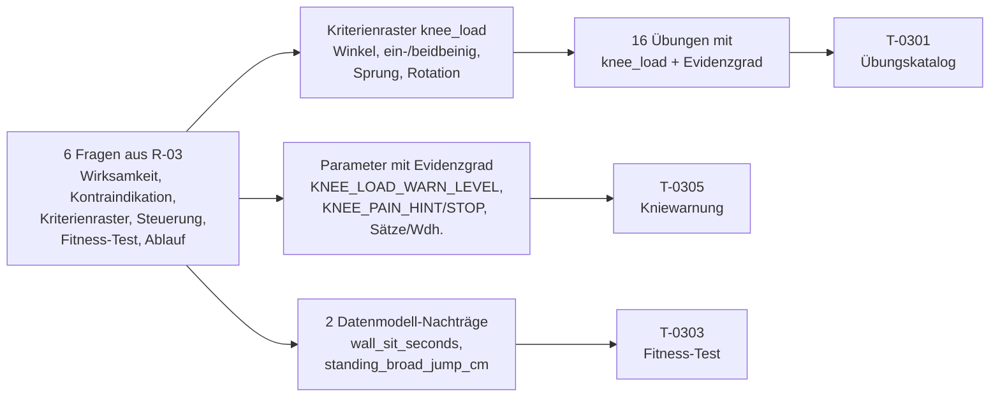

## Was

Bevor `T-0301` (Übungskatalog), `T-0303` (Fitness-Ausgangstest) und `T-0305` (Trainingseinheiten mit
Kniewarnung) gebaut werden können, musste feststehen, welche Körpergewichts- und Ringe-Übungen
skateboardspezifisch wirksam sind, wie jede davon nach Kniebelastung einzuordnen ist, und was in den
Fitness-Ausgangstest gehört. Diese Recherche liefert dafür ein wiederverwendbares Kriterienraster für
`exercise.knee_load` (vier Kriterien: Kniebeugewinkel unter Last, ein- vs. beidbeinig, Sprung-/
Landeanteil, Rotation unter Last), eine fertige Übungsliste mit 16 Einträgen als JSON sowie
Belastungssteuerung, Messanleitungen und ein Wiederholungsintervall für den Fitness-Test. Vollständig
nachlesbar in `.claude/state/research/training-knie.md`.

## Warum

`PRODUCT-SPEC.md` Abschnitt 3 macht Knieschutz zur harten Nebenbedingung jedes Trainingsplans, „kein
Hinweis am Rand". `DATENMODELL.md` verweist für die Auswahl der Übungen und die Einordnung von
`knee_load` direkt auf dieses Ticket. Der Schaden einer falschen Antwort ist hier körperlich: Eine
Übung, die fälschlich als „niedrig" eingestuft wird, obwohl sie hohe Scherkräfte im Kniegelenk erzeugt,
würde von der App vorgeschlagen und von keiner Warnung erfasst. Deshalb steht am Anfang der Recherche
ein Kriterienraster statt einzelner Einschätzungen – es lässt sich auf jede später hinzugefügte Übung
anwenden, ohne erneut zu recherchieren, und jede Zuordnung trägt eine eigene Quelle statt einer
allgemeinen Aussage zu „Ringen sind gelenkschonend".

Eine Entscheidung grenzt den Umfang bewusst ein: **Der maximale dynamische Kniebeuge-Test wird nicht
unverändert übernommen.** Die Literatur zeigt, dass die patellofemorale Gelenkspannung im 60–90°-Bereich
progressiv steigt (7,00 auf 10,21 MPa) – genau der Bereich, den ein Wiederholungsmaximum unter Ermüdung
typischerweise durchläuft, wenn die Form nachlässt. Statt `squats_max` stillschweigend zu belassen,
schlägt die Recherche einen isometrischen Wandsitz-Test als knieschonendere Ergänzung vor und benennt
das ausdrücklich als Datenmodell-Nachtrag, den `T-0303` übernehmen oder verwerfen kann.

Bezug zu [ADR-004](../adr/ADR-004-docs-plattform.md) (Recherche-Einträge als eigener Doku-Typ) und zur
harten Nebenbedingung Knieschutz aus `PRODUCT-SPEC.md` Abschnitt 3.

## Wie

**1. Ein Kriterienraster statt Einzelfall-Urteile.** `knee_load` wird über vier unabhängig belegte
Faktoren hergeleitet, die jeweils die Stufe anheben können: Kniebeugewinkel unter Last (0–45° = niedrig,
45–90° = mittel), ein- vs. beidbeinige Ausführung (einbeinig erzeugt laut Biomechanik-Studie etwa die
doppelte patellofemorale Kraft bei gleichem Winkel: 2056–2279 N gegenüber 837–964 N), Sprung-/
Landeanteil (jede Sprunglandung wird automatisch „hoch", weil Skate-Landungen belegt das 4,5- bis
12-fache Körpergewicht erzeugen) und Rotation/Valgus unter Last. Eine Sonderregel für isometrische
Übungen (Wandsitz) bindet den Winkel statt der Bewegung an die Beanspruchung, weil Herzfrequenz und
Blutdruck nachweislich mit spitzerem Winkel steigen, auch ohne Bewegung.

**2. Widersprüche offen benannt statt geglättet.** Die klinische Praxisleitlinie der amerikanischen
Physiotherapie-Fachgesellschaft hält tiefe Kniebeugung für zulässig, solange sie schmerzfrei bleibt –
das biomechanische systematische Review empfiehlt aus reiner Spannungssicht 0–45° als sicheren Bereich.
Für unbeaufsichtigte Eigenübungen ohne physiotherapeutische Begleitung übernimmt die Recherche
ausdrücklich den vorsichtigeren Wert, mit Begründung im Dokument, nicht als stillschweigende Auswahl.

**3. Sieben von 16 Übungen als gezielt präventiv markiert.** Hüftabduktion (Muschelübung, Seitstütz),
isometrische Quadrizepsarbeit (flache Kniebeuge, Wandsitz-Vorstufe), exzentrisches
Beinbeuger-Training (Nordisches Curl), Wadenheben und der kontrollierte Stufenabstieg tragen
`isPrevention: true`, jeweils mit eigener Quelle zur Wirkung auf Hüftkontrolle bzw. Valgus-Reduktion.

**4. Zwei Datenmodell-Nachträge statt stillschweigender Umdeutung.** `fitness_assessment` bekommt zwei
vorgeschlagene Spalten: `wall_sit_seconds` (isometrischer Quadrizeps-Test als knieschonendere
Alternative zu `squats_max`) und `standing_broad_jump_cm` (fehlender Sprungkraft-Wert – eine
skate-spezifische Studie erklärt 76 % der Ollie-Höhe über Sprungkraft, die aktuelle Testbatterie misst
das nicht). Beide werden im Recherche-Dokument mit Spaltenname, Typ und Einheit benannt, `DATENMODELL.md`
wird davon nicht in diesem Ticket, sondern erst mit `T-0303` geändert.

**5. Fehlgeschlagene Quellenzugriffe wurden offen benannt statt überspielt.** Ein Artikel zur
Balance-vor-Kraft-Sequenzierung sowie die JOSPT-Originalseiten zur Behandlungsleitlinie waren per
HTTP 403 nicht zu öffnen; die Leitlinien-Aussage stützt sich stattdessen auf die tatsächlich geöffnete
Zusammenfassung der Fachgesellschaft für Allgemeinmedizin, die Sequenzierungs-Aussage bleibt als
Praxis-Konsens (Evidenzgrad C) ohne Primärquelle gekennzeichnet.

## Tests

Recherche ist nicht mit einem Testrahmen prüfbar. Die im Ticket `R-03` vorgegebenen Prüfungen wurden
durchgeführt:

| Prüfung | Ergebnis |
|---|---|
| Jede der sechs Fragen hat eine Kurzantwort mit mindestens einer abgerufenen Quelle | Alle sechs Abschnitte (F1–F6) enthalten Befund-Tabellen mit je mindestens einer tatsächlich geöffneten Quelle |
| Übungsliste als gültiges JSON, mindestens 12 Übungen, davon mindestens 4 mit `isPrevention: true` | 16 Übungen, 7 davon `isPrevention: true`, JSON maschinell geparst und geprüft |
| Jede Übung hat genau einen `kneeLoad`-Wert mit Begründung in einem Satz | Geprüft für alle 16 Einträge (`kneeLoadReason`-Feld) |
| Kriterienraster ist ohne die Übungsliste anwendbar | Vier Kriterien mit Schwellenwerten und Quellen unabhängig von den 16 Beispielen formuliert |
| Kein Gerät außerhalb `bodyweight`/`rings` | Geprüft, alle 16 Einträge nutzen nur diese beiden Werte |
| Jeder Testwert hat eine Messanleitung, der Test ein Wiederholungsintervall | Sechs bestehende plus zwei neu vorgeschlagene Werte mit Anleitung, Intervall 6 Wochen (als Evidenzgrad C/D offen ausgewiesen) |
| Fehlender Testwert als Datenmodell-Nachtrag benannt | `wall_sit_seconds` und `standing_broad_jump_cm` mit Typ und Einheit |
| Hinweis auf ärztliche/physiotherapeutische Abklärung vorhanden, Du-Form | Eigener Abschnitt am Dokumentanfang, wortgleich als Oberflächentext für `T-0304`/`T-0305`/`T-0307` markiert |
| Keine Werkzeug-/Anbieternamen im Ergebnis | Geprüft, keine Treffer |

Validiert mit `make console ARGS="docs:import --dry-run"` im Repo `sk8-docs` (prüft Frontmatter und
Pflicht-Abschnitte dieses Eintrags).

## Lernpunkte

1. **Ein Kriterienraster ist wertvoller als eine Liste fertiger Urteile** – die vier Kriterien
   (Beugewinkel, ein-/beidbeinig, Sprunganteil, Rotation) lassen sich auf jede künftig hinzugefügte
   Übung anwenden, ohne erneut zu recherchieren. Das ist der eigentliche Auftrag von `R-03`: Der
   Übungskatalog selbst wächst später, das Raster bleibt stabil.
2. **Ein Faktor kann mehrere gute Übungen gegeneinander abwägen** – die einbeinige Kniebeuge ist
   biomechanisch die anspruchsvollste, aber auch die für Skateboard spezifischste Übung (Ollie-Landung
   ist grundsätzlich einbeinig). Das Raster löst diesen Zielkonflikt nicht auf, sondern macht ihn
   sichtbar: hohe `knee_load`, aber `isPrevention: false` statt eines pauschalen Verbots.
3. **Ein Widerspruch zwischen einer Leitlinie und einer Biomechanik-Studie wird benannt, nicht
   verschwiegen** – die Physiotherapie-Leitlinie erlaubt schmerzfreie tiefe Kniebeugen unter
   Betreuung, die Biomechanik-Studie empfiehlt 0–45° ohne Betreuung. Für eine unbeaufsichtigte App
   zählt der vorsichtigere Wert, mit offen dokumentierter Begründung statt stiller Auswahl.
4. **Ein fehlender Testwert ist ein gültiges Rechercheergebnis, keine Lücke** – dass die bestehende
   Fitness-Testbatterie keinen Sprungkraft-Wert enthält, obwohl eine skate-spezifische Studie 76 % der
   Ollie-Höhe darüber erklärt, wird als expliziter Datenmodell-Nachtrag formuliert statt stillschweigend
   in eine bestehende Spalte umgedeutet.
5. **Ein Evidenzgrad-C-Wert bleibt sichtbar C, auch wenn er zentral fürs Produkt ist** – die
   Schmerzschwellen `KNEE_PAIN_HINT`/`KNEE_PAIN_STOP` stammen aus einem Sehnen-Belastungsmodell, nicht
   aus einer für Knie-Mikrotrauma validierten Studie. Der niedrigere Evidenzgrad ändert nichts daran,
   dass der Wert im Produkt verwendet wird – er macht nur sichtbar, dass eine individuelle
   physiotherapeutische Bestätigung diesen Wert noch verändern könnte.
