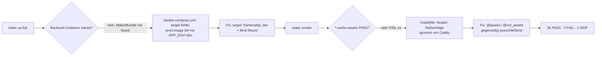

## Was

`railway/README.md` in `sk8-infrastructure` beschrieb Befehle einer Railway-CLI-Version, die nicht mehr
installiert war, und eine Service-Reihenfolge, die den allerersten Build ohne Datenbank-Zugang laufen
ließ. Beides ist jetzt korrigiert, zusammen mit einer vollständigen Variablen-Matrix und einem neuen
Abschnitt „Was passiert, wenn eine Variable fehlt". Dazu kommt `scripts/railway-smoke.sh`: ein
Bash-Skript, das eine laufende Installation — lokal oder auf Railway — in 18 Prüfungen abklopft und
`PASS`/`FAIL`/`SKIP` pro Zeile meldet, aufrufbar über `make smoke`.

Der eigentliche Wert zeigte sich erst beim Beweislauf gegen den lokalen Compose-Verbund: Das Skript
fand zwei echte Bugs, die nichts mit der README zu tun hatten — einen kaputten Dev-Container-Build und
einen Cache-Control-Fehler in allen drei Frontends, der jedes gehashte Asset bei jedem Seitenaufruf neu
hätte ausliefern lassen.



## Warum

Ein falsch gesetzter Wert auf Railway macht eine öffentliche API angreifbar oder erzeugt sichtbare
Fehl-Deployments — und der Preis für einen Fehler ist hier höher als sonst, weil Railway-Ressourcen
Geld kosten (`.claude/rules/infrastructure.md`). Nach ADR-007 gilt: „Was geprüft werden muss, wird
ausführbar geprüft." Zwölf `curl`-Aufrufe von Hand nach jedem Deploy werden nach dem zweiten Mal
abgekürzt; ein Skript nicht.

Die Ticket-Vorgabe ging von Railway-CLI 5.9.0 aus; installiert war zum Umsetzungszeitpunkt 5.45.5.
Jeder Befehl wurde deshalb neu gegen `railway <befehl> --help` dieser Version verifiziert, statt die
Ticket-Annahme blind zu übernehmen (Belegt: `railway --version` → `5.45.5`). Zwei Abweichungen wogen
dabei am schwersten: `railway usage limit set` existiert in 5.45.5 (das Ticket ging vom Gegenteil aus),
und das Flag für Laufzeit-Logs heißt `--deployment`, nicht `--deploy` wie im Ticket-Text.

Die interessantere Frage ist aber nicht die CLI-Version, sondern was das Abnahmeskript beim ersten
echten Lauf fand — zwei Bugs, die kein Code-Review entdeckt hätte, weil beide erst bei laufenden
Containern sichtbar werden:

1. **`docker-compose.yml` baute versehentlich das Prod-Image.** Ohne `target:` nutzt `docker build`
   den letzten Stage eines Multi-Stage-Dockerfiles (Belegt: `sk8-backend/Dockerfile:8`, „The last stage
   is the default target"). Backend und Docs liefen aber mit `APP_ENV=dev`, das Prod-Image hat jedoch
   keine Dev-Bundles im Autoloader — der Container stürzte beim Boot mit
   `Class "Symfony\Bundle\MakerBundle\MakerBundle" not found` ab.
2. **Alle drei Frontend-Caddyfiles cachten `/assets/*` nie unveränderlich.** Ein `header`-Block im
   globalen Scope setzte unbedingt `Cache-Control: no-cache`, ein späterer `@assets`-Matcher sollte das
   für gehashte Dateien überschreiben — lief aber nie, weil Caddy gleichnamige `header`-Direktiven nach
   eigener interner Priorität ausführt, nicht nach der Reihenfolge im Caddyfile. Verifiziert per
   `docker exec <container> caddy adapt`: der unbedingte Block lief real *nach* dem `@assets`-Block.

Beide Funde stehen nicht im Ticket-Wortlaut von `T-0602` — sie kamen erst zutage, weil das Ticket
verlangte, das Abnahmeskript **vor** jeder Railway-Ausgabe gegen den lokalen Verbund zu beweisen
(„kostet nichts"). Genau das ist der Lernwert: ein Abnahmeskript, das die Bugs findet, die es finden
soll, bevor Geld für Railway ausgegeben wird.

Bezug: [ADR-007](../adr/ADR-007-test-und-qualitaetsstrategie.md) (ausführbare Prüfung statt manueller
Handgriffe).

## Wie

**1. Ein Secret, das nie als Kommandozeilen-Argument auftaucht.** `ps aux` und `bash -x` zeigen beide
die vollständige Argv-Liste eines Prozesses. Ein `-H "X-Api-Key: $SK8_API_KEY"` hätte den Schlüssel
dort sichtbar gemacht. Stattdessen liest curl die Header-Zeile von stdin:

```bash
# scripts/railway-smoke.sh — curl_get()
curl -sS -o "$BODY_FILE" -D "$HDR_FILE" -w '%{http_code}' --config - "$url" <<CURLCFG || true
header = "X-Api-Key: ${key}"
CURLCFG
```

`--config -` liest die Konfiguration von stdin; der Wert steht damit nie in `$@` eines Prozesses. Das
Skript setzt `set -x` selbst nirgends — eine Anforderung aus dem Ticket, „auch nicht bei `set -x`",
bleibt so erfüllt, selbst wenn ein Aufrufer `bash -x railway-smoke.sh` verwendet.

**2. Fehlend vs. leer — ein einziges Zeichen entscheidet über SKIP oder Default.**

```bash
# scripts/railway-smoke.sh, Zeile 38
SK8_SKATE_URL="${SK8_SKATE_URL-http://localhost:5173}"
```

`${VAR-default}` (kein Doppelpunkt) ersetzt nur eine **fehlende** Variable; `${VAR:-default}` würde
auch eine bewusst **leer gesetzte** Variable (`SK8_SKATE_URL=`) durch den Default ersetzen und die
Unterscheidung „noch nicht deployt" von „nicht konfiguriert" unmöglich machen. `require_target()`
prüft danach nur noch `[ -z "$value" ]` und meldet in dem Fall `SKIP` statt eines Verbindungsfehlers —
damit ist das Skript schon nach einem Teil-Deploy nutzbar.

**3. Der Docker-Compose-Fix — ein fehlendes `target:` baute still das falsche Image.**

```yaml
# docker-compose.yml, backend-Service
  backend:
    build:
      context: ../sk8-backend
      target: frankenphp_dev      # vorher: fehlte -> letzter Stage (frankenphp_prod) gewann
    volumes:
      - ../sk8-backend:/app       # Quellcode bind-mounten statt im Image einbacken
```

`sk8-backend/Dockerfile` dokumentiert selbst, dass ohne explizites `target:` der letzte Stage
(`frankenphp_prod`) gebaut wird. Railways eigenes Produktions-Deployment ist von diesem Fix nicht
betroffen — das läuft ohne dieses Compose-File und behält den Dockerfile-Default bei.

**4. Der Caddy-Fix — Matcher statt Reihenfolge.**

```caddyfile
# Caddyfile (identisch in sk8-skate, sk8-nutrition, sk8-habits)
	@assets path /assets/*
	header @assets Cache-Control "public, max-age=31536000, immutable"
	@not_assets not path /assets/*
	header @not_assets Cache-Control "no-cache"
```

Vorher stand `Cache-Control "no-cache"` unbedingt im globalen `header`-Block, der `@assets`-Block
darunter sollte das für Assets überschreiben. Caddy ordnet gleichnamige `header`-Direktiven aber nach
eigener interner Priorität neu, nicht nach Datei-Reihenfolge — verifiziert mit `caddy adapt`, das die
tatsächliche Ausführungsreihenfolge der kompilierten Konfiguration zeigt. Zwei sich gegenseitig
ausschließende Matcher (`@assets` / `@not_assets`) machen das Ergebnis unabhängig von dieser Priorität,
weil jetzt für jede Anfrage nur noch genau einer der beiden Blöcke überhaupt zutrifft.

**5. Die neue Variablen-Matrix schließt zwei stille Lücken.** `SYMFONY_TRUSTED_PROXIES=REMOTE_ADDR`
(backend, docs) und `PORT` (alle fünf Services) waren in der Anleitung unerwähnt, obwohl beide Werte
produktionsrelevant sind:

```
# env/backend.env.example — neu
PORT=8000
SYMFONY_TRUSTED_PROXIES=REMOTE_ADDR
```

Ohne `SYMFONY_TRUSTED_PROXIES` hält Symfony den Railway-Proxy für den eigentlichen Client;
`X-Forwarded-Proto` wird ignoriert, erzeugte absolute URLs werden `http` statt `https`.

## Tests

Für dieses Ticket gab es keinen separaten Tester-Schritt (`agents` enthält bewusst keinen `tester`):
reines Bash/Doku ohne Unit-Test-Framework, ADR-007 verlangt hier einen echten Lauf gegen laufende
Container statt isolierter Testfälle. Alle Zahlen unten stammen aus tatsächlich ausgeführten Befehlen,
keine geschätzt.

| Prüfung | Befehl | Ergebnis |
|---|---|---|
| Statische Prüfung (AK9) | `make -C sk8-infrastructure check` | grün: `docker compose config`, `bash -n` (9 Skripte), `shellcheck` ohne Befund |
| Vollverbund grün (AK6) | `make -C sk8-infrastructure up-full && make -C sk8-infrastructure smoke` | **36 PASS, 0 FAIL, 2 SKIP** (38 Einzelprüfungen), Exit-Code `0`; Prüfung 4 und 9 melden `SKIP` wie gefordert |
| Negativlauf (AK7) | `docker compose stop backend && ./scripts/railway-smoke.sh; echo $?` | `health` und sieben Folgeprüfungen `FAIL`, Skript-Exit-Code `1` (über `make smoke` wird daraus `2`, GNU-Make-Konvention bei Rezept-Fehler) |
| Kein Secret-Leak (AK8) | `SK8_API_KEY=zzz-probe make smoke 2>&1 \| grep -c zzz-probe` | `0` |
| Befehlsabgleich (AK1) | jeder `railway`-Aufruf der README gegen `railway <befehl> --help` 5.45.5 | keine Abweichung mehr zur installierten CLI |
| Matrixabgleich (AK3) | `grep -ohE '^[A-Z_]+' env/*.env.example \| sort -u` gegen README-Matrix | alle 15 Variablen kommen in der Matrix vor, inklusive `PORT`/`SYMFONY_TRUSTED_PROXIES` |
| Keine `.claude`/Ticket-Verweise (AK10) | `grep -rn '\.claude\|T-0[0-9]\{3\}' railway/README.md scripts/railway-smoke.sh Makefile` | leer |

Beide Infrastruktur-Bugs wurden erst durch den AK6-Lauf sichtbar, nicht durch statische Prüfung:
`make check` blieb während der gesamten Fehlersuche grün, weil weder ein fehlendes `target:` in
Compose noch eine Header-Prioritätsregel in Caddy sich statisch prüfen lassen — beides zeigt sich nur,
wenn Container tatsächlich booten und Antworten tatsächlich abgeholt werden.

## Lernpunkte

1. **Multi-Stage-Dockerfiles bauen ohne `target:` immer den letzten Stage** — `docker build` (und
   damit auch `docker compose build`) nimmt implizit den zuletzt deklarierten Stage, wenn kein Ziel
   genannt wird. Fundstelle: `sk8-infrastructure/docker-compose.yml` (`target: frankenphp_dev` fehlte),
   erklärt in `sk8-backend/Dockerfile:6-8`. In einer Nuxt/Vite-Welt hat man selten Multi-Stage-Images,
   der nächste Vergleich ist eher ein mehrstufiger CI-Job, bei dem ein fehlender `needs:`/Stage-Bezug
   den letzten statt den gewünschten Job auslöst. Quelle: [Docker-Doku, Multi-Stage-Builds](https://docs.docker.com/build/building/multi-stage/) (Abschnitt „Stop at a specific build stage").
2. **Deklarative Konfiguration mit „letzter Treffer gewinnt"-Regeln ist kein Gesetz der Reihenfolge im
   Text.** Caddyfile-Direktiven werden vor der Ausführung nach einer internen Direktiven-Priorität
   sortiert, nicht nach der Zeilenfolge in der Datei — überraschend für jeden, der aus CSS
   (Kaskade nach Reihenfolge + Spezifität) oder Vue-Style-Scoping kommt, wo „später im Dokument"
   tendenziell gewinnt. Fundstelle: `sk8-skate/Caddyfile` (analog `sk8-nutrition`, `sk8-habits`),
   verifiziert per `caddy adapt`. Quelle: [Caddy-Doku, Directive Order](https://caddyserver.com/docs/caddyfile/directives#directive-order) (die Liste, nach der Caddy Direktiven wie `header` sortiert, unabhängig von der Quelltext-Position).
3. **Sich gegenseitig ausschließende Matcher sind robuster als Ausführungsreihenfolge.** Statt sich auf
   „Block B überschreibt Block A, weil er später steht" zu verlassen, macht ein `not`-Matcher
   (`@not_assets not path /assets/*`) die beiden Regeln strukturell disjunkt — vergleichbar mit einem
   `v-if`/`v-else`-Paar statt zweier unabhängiger `v-if`s, die sich in der Auswertungsreihenfolge
   zufällig überschneiden könnten. Fundstelle: `sk8-skate/Caddyfile:18-21`.
4. **`${VAR-default}` und `${VAR:-default}` sind keine Stilfrage, sondern zwei verschiedene
   Bedingungen.** Der fehlende Doppelpunkt prüft nur „ist die Variable gesetzt", der Doppelpunkt prüft
   zusätzlich „und nicht leer". Fundstelle: `scripts/railway-smoke.sh:38-40`. In TypeScript ist die
   nächste Analogie der Unterschied zwischen `??` (nullish coalescing, nur bei `null`/`undefined`) und
   `||` (bei jedem falsy-Wert, auch leerem String) — dieselbe Sorgfaltsfrage in anderer Syntax. Quelle:
   [Bash-Referenzhandbuch, Shell Parameter Expansion](https://www.gnu.org/software/bash/manual/bash.html#Shell-Parameter-Expansion) (Abschnitt zu `${parameter-word}` vs. `${parameter:-word}`).
5. **Ein Secret als Kommandozeilen-Argument ist über `ps aux` für jeden anderen lokalen Prozess
   lesbar** — unabhängig von Dateiberechtigungen. `curl --config -` mit Heredoc verlagert den Wert in
   eine Datei-artige Eingabe, die nur curl selbst liest, genau wie `docker login --password-stdin`
   dasselbe Muster für Passwörter nutzt. Fundstelle: `scripts/railway-smoke.sh:108-117`. Quelle:
   [curl-Doku, `--config`](https://curl.se/docs/manpage.html#-K) (liest Optionen aus einer Datei oder von stdin, nie über Argv).
6. **CLI-Oberflächen sind keine stabile Spezifikation.** Zwischen Ticket-Erstellung und Umsetzung
   sprang die installierte Railway-CLI von 5.9.0 auf 5.45.5, und zwei Unterbefehle änderten sich dabei
   real (`usage` kam hinzu, `logs --deploy` wurde zu `logs --deployment`). Die README nennt jetzt die
   geprüfte Version explizit und fordert eine erneute `--help`-Prüfung nach jedem `railway upgrade`,
   statt stillschweigend „aktuell" zu unterstellen. Fundstelle: `railway/README.md`, Abschnitt
   „Voraussetzungen".
7. **Eine Konfiguration, die nicht abstürzt, kann gefährlicher sein als eine, die es tut.**
   `composer dump-env prod` bäckt `.env`-Defaults zur Build-Zeit fest ins Image ein — ein fehlendes
   `APP_API_KEY` erzeugt keinen Fehler, sondern eine leise, öffentlich bekannte Hintertür
   (`dev-key-change-me`), während ein fehlendes `DATABASE_URL` einen lauten, nach 60 Sekunden
   sichtbaren Absturz erzeugt. Laut wird schneller behoben als leise. Fundstelle: neuer README-Abschnitt
   „Was passiert, wenn eine Variable fehlt", belegt gegen `sk8-backend/.env` und
   `sk8-backend/Dockerfile` (`composer dump-env prod`).
