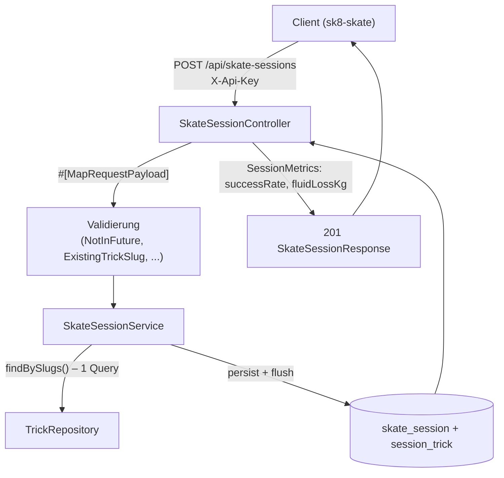

## Was

Eine Skate-Einheit lässt sich jetzt über fünf Routen unter `/api/skate-sessions` vollständig verwalten:
anlegen, als Liste und einzeln lesen, ändern und löschen. Jede Einheit trägt Datum, Startzeit, Dauer,
Ort, Gewicht vor und nach dem Skaten, empfundene Anstrengung, Knieschmerz, eine Notiz – und die dabei
geübten Tricks mit Versuchen und Treffern. Die Antwort liefert zusätzlich abgeleitete Werte: die
Erfolgsquote je Trick, die Erfolgsquote der ganzen Einheit und den Flüssigkeitsverlust aus der
Gewichtsdifferenz. Diese Werte stehen **nie** in der Datenbank – nur in der Antwort, damit eine später
korrigierte Trefferzahl nie eine veraltete, gespeicherte Quote stehen lässt.



## Warum

`PRODUCT-SPEC.md` verlangt Session-Tracking mit Datum, Dauer, Ort, geübten Tricks, Erfolgsquote,
Notizen und dem Wiegen vor/nach der Einheit, um den Flüssigkeitsverlust zu erfassen. Der Knieschmerz
gehört in jede Einheit, weil das linke Knie laut `PRODUCT-SPEC.md` eine harte Nebenbedingung jeder
Trainings- und Skate-Planung ist – ohne erfasste Werte kann ein späteres Epic die Belastung nicht
steuern.

Zwei Design-Entscheidungen grenzen den Umfang bewusst ein, siehe
[design.md](../adr/ADR-002-backend-stack.md):

- **Ableitungen nur in der Antwort, nie in der Tabelle.** Eine gespeicherte Erfolgsquote wäre nach der
  nächsten Korrektur einer Trefferzahl (`PUT`) unbemerkt falsch – Berechnung in
  `App\Service\Skate\SessionMetrics` ist immer konsistent und braucht keine Synchronisationslogik.
- **`PUT` statt `PATCH`.** Der Bearbeiten-Dialog schickt ohnehin immer die vollständige Einheit; eine
  echte Teilaktualisierung der Trick-Liste bräuchte Zusammenführungsregeln, für die es keinen zweiten
  Anwendungsfall gibt.

Bezug zu [ADR-002](../adr/ADR-002-backend-stack.md) (Schichtung), [ADR-005](../adr/ADR-005-datenbank-deployment.md)
(Migrationen), [ADR-006](../adr/ADR-006-api-zugriff-sicherheit.md) (`X-Api-Key`, Fehlerformat) und
[ADR-008](../adr/ADR-008-sprache-und-konventionen.md) (Konventionen). Keine Abweichung gefunden, kein
neues ADR nötig.

## Wie

**1. Zwei neue Entities, eine erweiterte Beziehung.** `SkateSession` hält ihre Trick-Zeilen als
`OneToMany` mit `cascade: ['persist']` **und** `orphanRemoval: true` – anders als die reine Lese-Kante
`Trick::$prerequisites` aus T-0101, weil `PUT` die Zeilen über genau diese Collection abgleicht:

```php
// src/Entity/SkateSession.php:60-65
/**
 * @var Collection<int, SessionTrick>
 */
#[ORM\OneToMany(targetEntity: SessionTrick::class, mappedBy: 'skateSession', cascade: ['persist'], orphanRemoval: true)]
#[ORM\OrderBy(['id' => 'ASC'])]
private Collection $tricks;
```

`orphanRemoval: true` heißt: eine Zeile, die aus `$tricks` entfernt wird (`removeTrick()`), wird beim
`flush()` aus der Datenbank gelöscht – ohne dass der Service selbst `DELETE` aufrufen muss.

**2. `PUT` gleicht die Trick-Zeilen anhand des Slugs ab, nicht anhand der Zeilen-ID.** Der Client kennt
die IDs der Trick-Zeilen gar nicht (nur `trickSlug`), also läuft der Abgleich über eine
Slug-zu-Zeile-Map:

```php
// src/Service/Skate/SkateSessionService.php:83-105
foreach ($request->tricks as $input) {
    $submittedSlugs[$input->trickSlug] = true;
    $existingRow = $existingBySlug[$input->trickSlug] ?? null;

    if (null !== $existingRow) {
        $existingRow->setAttempts($input->attempts); // Slug bleibt -> Zeile bleibt, gleiche id
        $existingRow->setLanded($input->landed);
        $existingRow->setNotes($input->notes);
        continue;
    }

    $trick = $this->trickFor($input->trickSlug, $tricksBySlug); // Slug ist neu -> neue Zeile
    $session->addTrick(new SessionTrick($session, $trick, $input->attempts, $input->landed, $input->notes));
}

foreach ($existingBySlug as $slug => $row) {
    if (!isset($submittedSlugs[$slug])) {
        $session->removeTrick($row); // Slug fehlt jetzt -> orphanRemoval löscht sie
    }
}
```

**3. Die Listenabfrage darf `setMaxResults()` nicht mit einem Fetch-Join kombinieren.** Ein
`LEFT JOIN` über die `tricks`-Beziehung erzeugt pro Trick-Zeile eine SQL-Ergebniszeile; ein
`LIMIT` danach schneidet also *Join-Zeilen* ab, nicht Sessions – bei zwei Sessions mit je drei Tricks
liefert `LIMIT 1` dann eine Session mit nur einem statt drei Tricks. Die Lösung sind zwei getrennte
Abfragen:

```php
// src/Repository/SkateSessionRepository.php:39-49 (gekürzt)
$idQuery = $this->createQueryBuilder('s')
    ->select('s.id')                 // Schritt 1: nur IDs, kein Join, LIMIT wirkt korrekt
    ->orderBy('s.sessionDate', 'DESC')
    ->addOrderBy('s.createdAt', 'DESC')
    ->setMaxResults($limit);
$rows = $idQuery->getQuery()->getScalarResult();
```

Schritt 2 lädt die vollen Entities per `WHERE s.id IN (:ids)` mit Fetch-Join – aber Doctrine sortiert
das Ergebnis einer `IN (:ids)`-Abfrage nicht in der Reihenfolge der übergebenen IDs. Ohne eine
explizite Rückordnung würde `sessionDate DESC, createdAt DESC` aus Schritt 1 verloren gehen; das
Repository ordnet deshalb anhand der Reihenfolge aus Schritt 1 selbst zurück
(`src/Repository/SkateSessionRepository.php:67-78`).

## Zwei stille Bugs

Zwei Fehler in dieser Implementierung waren beim Lesen des Codes allein nicht erkennbar – sie kamen erst
über fehlschlagende Tests ans Licht, und beide sind lehrreich, weil sie Symfony-/PHP-Verhalten
betreffen, das an keiner Stelle offensichtlich dokumentiert im Weg steht.

**Bug 1: `#[MapQueryString]` liefert bei ungültigen Query-Parametern 404, nicht 422.** Kriterien 21/22
verlangen 422 für `?limit=201` oder `?from=…&to=…` mit `from > to`. Der erste Versuch nutzte
`#[MapQueryString]` ohne Optionen – die Functional-Tests scheiterten reproduzierbar mit „404 not_found“
statt 422. Der Grund: `#[MapQueryString]` hat einen anderen Default als sein Geschwister
`#[MapRequestPayload]`. Laut [Symfony-Dokumentation](https://symfony.com/doc/current/controller.html)
ist der Standard-Statuscode bei fehlgeschlagener Validierung für `MapQueryString` **404** (nicht 422 wie
bei `MapRequestPayload`) – vermutlich, weil eine ungültige Filterkombination in vielen APIs eher „keine
passende Ressource“ als „falsche Eingabe“ bedeutet. Für diese API gilt aber der einheitliche Vertrag
(422 bei jeder Validierungsverletzung), also wird der Code explizit gesetzt:

```php
// src/Controller/Api/SkateSessionController.php:138-144
public function list(
    // MapQueryString defaults validationFailedStatusCode to 404, not 422
    // (Symfony's own default) - wrong here: criteria 21/22 require 422.
    #[MapQueryString(validationFailedStatusCode: Response::HTTP_UNPROCESSABLE_ENTITY)]
    ?SkateSessionListQuery $query,
): JsonResponse {
```

Der Kommentar bleibt im Code stehen, weil derselbe Fallstrick beim nächsten Endpunkt mit
Query-Validierung wieder zuschlagen kann.

**Bug 2: `JsonResponse::setEncodingOptions()` verliert eine bereits gesetzte Nachkommastelle.** Ein
abgeleiteter Float, der zufällig auf einer ganzen Zahl landet (`successRate: 0.0`, ein glattes
Kilo-Gewicht), braucht das PHP-Flag `JSON_PRESERVE_ZERO_FRACTION`, sonst kodiert `json_encode()` ihn als
JSON-Ganzzahl (`0` statt `0.0`) und der Client bekommt einen `int` statt eines `float`. Ein erster
Versuch setzte das Flag scheinbar korrekt – schlug aber sporadisch fehl, abhängig von den zufälligen
Testdaten (Faker-Seed), wenn eine Session zwei Trick-Zeilen mit `landed: 0` hatte:

```php
// naiv, funktioniert NICHT zuverlässig:
$response = new JsonResponse($data, $status);              // kodiert SOFORT mit alten Optionen
$response->setEncodingOptions($response->getEncodingOptions() | \JSON_PRESERVE_ZERO_FRACTION);
```

Der Grund steht im Quellcode von `JsonResponse`: `setEncodingOptions()` dekodiert die **bereits
kodierte** JSON-Zeichenkette per `json_decode($this->data)` und kodiert sie mit den neuen Optionen neu.
War `successRate` zum Zeitpunkt des ersten `json_encode()` noch `0.0`, steht im JSON-String bereits `0`
– `json_decode('0')` liefert ein PHP-`int`, die Information „das war ein Float“ ist zu diesem Zeitpunkt
unwiederbringlich weg. Kein später gesetztes Flag kann das rückgängig machen. Die funktionierende
Reihenfolge setzt die Optionen auf einen **leeren** Body, bevor die echten Daten überhaupt kodiert
werden:

```php
// src/Controller/Api/SkateSessionController.php:214-220
private static function jsonResponse(mixed $data, int $status = Response::HTTP_OK, array $headers = []): JsonResponse
{
    $response = new JsonResponse(null, $status, $headers);                              // 1. leerer Body
    $response->setEncodingOptions($response->getEncodingOptions() | \JSON_PRESERVE_ZERO_FRACTION); // 2. Flag setzen
    $response->setData($data);                                                          // 3. erst jetzt echte Daten kodieren

    return $response;
}
```

Gefunden über acht aufeinanderfolgende Testläufe mit unterschiedlichen Faker-Seeds, verifiziert am
`JsonResponse`-Quellcode selbst (`setEncodingOptions()` ruft intern `$this->setData(json_decode($this->data))`
auf). Alle vier Antworten mit Body laufen jetzt über diesen Helfer statt über `new JsonResponse(...)`
direkt.

## Tests

| Testdatei | Beweist |
|---|---|
| `tests/Unit/Service/Skate/SessionMetricsTest.php` | `successRate`/`fluidLossKg`-Rundung, `null` bei 0 Versuchen bzw. fehlendem Gewicht, negativer Flüssigkeitsverlust erlaubt |
| `tests/Unit/Validator/NotInFutureValidatorTest.php` | Heute gültig, morgen ungültig, 00:30 Uhr Berliner Zeit gültig (`mode: 'date'`), `mode: 'instant'` für `startedAt` – mit `MockClock` |
| `tests/Unit/Validator/ExistingTrickSlugValidatorTest.php` | Bekannter Slug ohne Verletzung, unbekannter mit deutscher Meldung, Slugliste wird nur einmal je Validator-Instanz geladen (Fake statt Mock, da `TrickRepository` `final` ist) |
| `tests/Functional/Api/SkateSessionWriteTest.php` | Anlegen mit `Location`-Header, Gewichtsrundung, `PUT`-Zeilenabgleich mit stabiler `id`, `DELETE` mit Kaskade, 400 bei kaputtem JSON |
| `tests/Functional/Api/SkateSessionReadTest.php` | Sortierung, `limit`/`total`, Zeitraumfilter inklusive Grenztage, leere Liste, Detail, 404 bei unbekannter/ungültiger ID |
| `tests/Functional/Api/SkateSessionValidationTest.php` | Je ein Fall pro Validierungsregel: Statuscode, `field`, deutsche und nicht-leere Meldung |
| `tests/Functional/Api/SkateSessionAuthTest.php` | Alle fünf Routen ohne/mit falschem `X-Api-Key` → 401 |
| `tests/Factory/SkateSessionFactory.php`, `SessionTrickFactory.php` | Werkzeug (Foundry-Factories); Sessions ohne Tricks als Standard, damit jeder Test die Zeilen bewusst hinzufügt |

Ausführen: `make test`. Laut Prüflauf: **106 Tests, 1033 Assertions, grün** (55 bestehend aus T-0101 +
51 neu aus diesem Ticket). `make check` (phpstan level max, cs-fixer dry-run, phpunit) läuft vollständig
grün, `bin/console nelmio:apidoc:dump` fehlerfrei.

## Datenbank

Neue Tabellen `skate_session` und `session_trick` (Migration `Version20260909184514`), sieben
`CHECK`-Constraints (Dauer, beide Gewichte, Anstrengung, Knieschmerz, Versuche, Treffer ≤ Versuche),
absteigender Index `idx_skate_session_date` und `uniq_session_trick` über
(`skate_session_id`, `trick_id`). `trick_id` ist `ON DELETE RESTRICT`: ein bereits geübter
Katalogeintrag darf nicht unbemerkt verschwinden. `down()` gegen `up()` geprüft
(`doctrine:migrations:migrate prev` gefolgt von erneutem `migrate`), `doctrine:migrations:diff` ist
danach leer.

## API

Fünf Routen unter `/api/skate-sessions`, `X-Api-Key`-geschützt: `POST` (201 + `Location`), `GET`-Liste
(`from`/`to`/`limit`, Standard-Sortierung `sessionDate DESC, createdAt DESC`), `GET /{id}` (404 auch bei
formal ungültiger UUID dank `requirements: ['id' => Requirement::UUID]`), `PUT /{id}` (voller Ersatz
inkl. Trick-Abgleich), `DELETE /{id}` (204, kaskadiert). Fehlerformat durchgehend
`{"error":"<code>"}` bzw. `{"error":"validation_failed","violations":[{"field","message"}]}` über den
zentralen `ApiExceptionListener` (unverändert wiederverwendet, [ADR-006](../adr/ADR-006-api-zugriff-sicherheit.md)).

## Lernpunkte

1. **`#[MapQueryString]` validiert standardmäßig gegen 404, `#[MapRequestPayload]` gegen 422** –
   `src/Controller/Api/SkateSessionController.php:138-144`. Laut
   [Symfony-Doku](https://symfony.com/doc/current/controller.html) ist `validationFailedStatusCode` bei
   `MapQueryString` standardmäßig `404`, muss hier explizit auf `422` gesetzt werden. Vergleichbar mit
   einer Nuxt-Route, die bei einem falschen Query-Parameter versehentlich `createError({ statusCode: 404 })`
   statt eines Validierungsfehlers wirft – zwei ähnlich aussehende Decorators mit unterschiedlichem
   Standardverhalten sind ein klassischer API-Fallstrick, den nur das Lesen der Doku (nicht die
   Namensähnlichkeit) auflöst.
2. **`JsonResponse::setEncodingOptions()` re-kodiert bereits kodierte Daten, statt nur ein Flag zu
   setzen** – `src/Controller/Api/SkateSessionController.php:214-220`. Der Symfony-Quellcode zeigt:
   `setEncodingOptions()` ruft intern `$this->setData(json_decode($this->data))` auf – ein Flag wie
   `JSON_PRESERVE_ZERO_FRACTION`, das nach dem ersten `json_encode()` gesetzt wird, kommt zu spät. Ein
   ähnliches Timing-Problem wie ein Vue-`computed`, das einen bereits gerundeten Wert erneut rundet: die
   Reihenfolge der Operationen entscheidet, nicht nur ihre Anwesenheit.
3. **`ClockInterface` statt `new \DateTimeImmutable('now')`** – `src/Validator/NotInFutureValidator.php:21-27`,
   erster Verbraucher im Repo. Macht „jetzt“ für Tests austauschbar über `MockClock`
   ([Symfony-Doku](https://symfony.com/doc/current/components/clock.html)): `NotInFutureValidatorTest`
   prüft die 00:30-Uhr-Berliner-Zeit-Situation ohne auf echte Mitternacht zu warten. Vergleichbar mit dem
   Injizieren einer `now()`-Funktion in ein Vue-Composable statt `Date.now()` direkt zu verwenden – nur
   dass Symfony dafür ein Standard-Interface mitbringt statt eine Ad-hoc-Lösung zu verlangen.
4. **Doctrines `decimal`/`numeric`-Typ liefert PHP `string`, nicht `float`** –
   `src/Entity/SkateSession.php:42-46` (`weightBeforeKg`/`weightAfterKg`). Laut
   [Doctrine-DBAL-Doku](https://www.doctrine-project.org/projects/doctrine-dbal/en/latest/reference/types.html)
   ist das bewusst so: „this type is not converted to a double as PHP can only preserve the precision to
   a certain degree“. Die Umwandlung passiert deshalb genau einmal, in `SessionMetrics`
   (`src/Service/Skate/SessionMetrics.php`) – anders als in TS/Prisma, wo `Decimal`-Felder oft
   transparenter wirken, zwingt Doctrine die Anwendung, explizit zu entscheiden, wann gerundet wird.
5. **Eigene Validator-Constraints: `Constraint`-Attribut + `ConstraintValidator`-Klasse** –
   `src/Validator/NotInFuture.php`+`NotInFutureValidator.php` und
   `src/Validator/ExistingTrickSlug.php`+`ExistingTrickSlugValidator.php`, erstes Vorkommen dieses
   Musters im Repo. Laut [Symfony-Doku](https://symfony.com/doc/current/validation/custom_constraint.html)
   verbindet Symfony beide Klassen über Namenskonvention (`Foo` → `FooValidator`) automatisch. Das
   Äquivalent zu einem eigenen Zod-`.refine()` in TS, aber als wiederverwendbares, über Dependency
   Injection konfigurierbares Attribut statt einer Inline-Funktion.
6. **`setMaxResults()` nach einem Fetch-Join begrenzt Join-Zeilen, nicht Wurzel-Entities** –
   `src/Repository/SkateSessionRepository.php:39-79`. Ein `LIMIT` nach einem `LEFT JOIN` über eine
   `to-many`-Beziehung wirkt auf die SQL-Ergebniszeilen (eine je Trick), nicht auf die Anzahl der
   Sessions – ein Doctrine-spezifisches Verhalten ohne direkte Entsprechung in Prisma (dessen
   `include`+`take` das anders löst). Der Zwei-Schritt-Workaround (erst IDs mit `LIMIT`, dann `IN (:ids)`
   mit Fetch-Join, danach Rückordnung von Hand, da `IN` die Reihenfolge nicht garantiert) ist ein
   verbreitetes Muster in ORMs mit Fetch-Joins.
