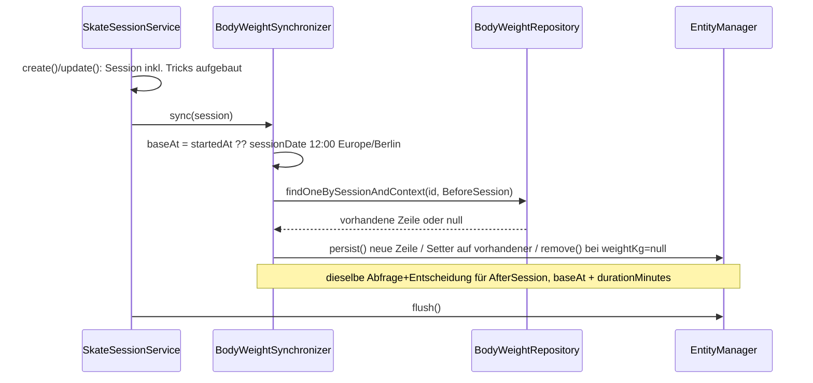

## Was

Jede Skate-Einheit mit Gewicht vor und nach dem Skaten legt jetzt automatisch bis zu zwei Zeilen in
einer neuen Tabelle `body_weight` an – eine mit `context = vor_session`, eine mit `context =
nach_session`. Ändert Konrad die Einheit später (`PUT`), wandern diese Zeilen mit: ein korrigiertes
`weightAfterKg` aktualisiert die passende Zeile, ein auf `null` gesetztes Gewicht löscht sie, ein
verschobenes `sessionDate` verschiebt beide. Löscht er die Einheit, verschwinden auch ihre Zeilen. Kein
neuer API-Endpunkt entsteht dabei – der bestehende Vertrag von `/api/skate-sessions` aus dem
[vorigen Eintrag](0012-skate-session-api-with-tricks.md) bleibt unverändert, nur was in der Datenbank
liegt, ändert sich. Der Gewichtsverlauf selbst bekommt seinen ersten Leser erst in einem späteren Epic.



## Warum

`.claude/specs/DATENMODELL.md`, Abschnitt „Körper", schreibt es ausdrücklich vor: Beim Speichern einer
Einheit mit Gewichten entstehen zwei Zeilen im Verlauf, damit dieser vollständig ist, sobald ein
späteres Epic ihn darstellt. Die Werte stehen bewusst doppelt – in `skate_session`, damit die Einheit
für sich lesbar bleibt, und in `body_weight`, damit der Verlauf eine eigene Quelle hat. Diese Redundanz
ist nur harmlos, solange sie automatisch gepflegt wird; genau das ist der Auftrag von Ticket T-0103.

Die entscheidende Design-Frage war, **wie** die zwei Zeilen einer Einheit beim Ändern oder Löschen
wiedergefunden werden. Drei Alternativen ohne eigenen Fremdschlüssel wurden verworfen:

| Alternative | Warum verworfen |
|---|---|
| Über (`measured_on`, `context`) identifizieren | Bricht, sobald an einem Tag zwei Einheiten stattfinden |
| Zeilen des Tages löschen und neu anlegen | Gleiches Problem, zusätzlich Datenverlust bei der zweiten Einheit |
| Über den abgeleiteten `measured_at` wiederfinden | Der Wert vor der Änderung ist nach einer Korrektur von Datum/Startzeit/Dauer nicht mehr rekonstruierbar |

Die gewählte Lösung ist ein nullbarer Fremdschlüssel `skate_session_id` mit `ON DELETE CASCADE`,
partiell eindeutig über (`skate_session_id`, `context`) `WHERE skate_session_id IS NOT NULL` – nullbar,
weil ein Morgengewicht ohne Einheit (`context = morgens`/`sonstiges`) diesem Ticket noch fremd ist,
aber im Datenmodell bereits vorgesehen war. Bezug zu [ADR-005](../adr/ADR-005-datenbank-deployment.md)
(getrennte Schema-/Datenmigration) und [ADR-008](../adr/ADR-008-sprache-und-konventionen.md)
(Konventionen – mit einer bewussten Ausnahme, siehe Lernpunkt 4). Keine Abweichung von ADR-004 zur
Doku-Plattform selbst.

## Wie

**1. Eine eigene Synchronizer-Klasse statt drei Zeilen im bestehenden Service.** `SkateSessionService`
löst bereits Trick-Slugs auf und gleicht Trick-Zeilen ab. Käme die Gewichts-Buchführung direkt dazu,
hätte er drei Aufgaben, und die Ableitung des Basiszeitpunkts wäre nur noch über den HTTP-Endpunkt
testbar. `BodyWeightSynchronizer::sync()` bekommt stattdessen zwei genau definierte Aufrufstellen:

```php
// src/Service/Skate/SkateSessionService.php:58-60 (create), 113-114 (update)
$this->entityManager->persist($session);
$this->bodyWeightSynchronizer->sync($session);   // legt/aktualisiert/löscht die 2 Zeilen
$this->entityManager->flush();                   // erst danach schreiben – 1 Transaktion
```

`delete()` ruft stattdessen `removeForSession()` (`src/Service/Skate/SkateSessionService.php:122`) –
zusätzlich zum `ON DELETE CASCADE` der Datenbank, siehe Lernpunkt 3.

**2. Pro Kontext eine Vier-Fälle-Entscheidung.** `syncRow()` schaut nach, ob für diesen Kontext schon
eine Zeile existiert, und ob ein Gewicht übergeben wurde:

```php
// src/Service/Body/BodyWeightSynchronizer.php:52-70 (gekürzt)
private function syncRow(SkateSession $session, BodyWeightContext $context, ?string $weightKg, \DateTimeImmutable $measuredAt): void
{
    $existing = $this->bodyWeightRepository->findOneBySessionAndContext($session->getId(), $context);

    if (null === $weightKg) {
        if (null !== $existing) {
            $this->entityManager->remove($existing);   // Gewicht entfernt -> Zeile weg (AK 6)
        }
        return;
    }

    if (null !== $existing) {
        $existing->setMeasuredAt($measuredAt);          // Zeile bleibt, id bleibt (AK 5, 8)
        $existing->setMeasuredOn($session->getSessionDate());
        $existing->setWeightKg($weightKg);
        return;
    }

    $this->entityManager->persist(new BodyWeight(...)); // neue Zeile (AK 3, 7)
}
```

Kein Gewicht und keine Zeile bleibt unberührt (AK 4) – der Code tut in diesem Fall implizit nichts,
weil weder der `null`-Zweig noch der `persist`-Zweig greift.

**3. Zwei getrennte Migrationen, wie schon in T-0101/T-0102.** Die Schema-Migration
(`migrations/Version20260909193000.php`) legt Tabelle, Fremdschlüssel, die zwei `CHECK`-Constraints und
den partiellen Unique-Index an – Letztere von Hand ergänzt, weil `doctrine:migrations:diff` weder
`CHECK` noch `WHERE`-qualifizierte Indizes introspiziert:

```sql
-- migrations/Version20260909193000.php:44-47
CREATE UNIQUE INDEX uniq_body_weight_session_context
    ON body_weight (skate_session_id, context) WHERE (skate_session_id IS NOT NULL);
ALTER TABLE body_weight ADD CONSTRAINT chk_body_weight_range CHECK (weight_kg BETWEEN 30 AND 250);
ALTER TABLE body_weight ADD CONSTRAINT chk_body_weight_context
    CHECK (context IN ('morgens', 'vor_session', 'nach_session', 'sonstiges'));
```

Die Datenmigration (`Version20260909193001.php`) trägt für längst existierende Einheiten mit Gewicht
die fehlenden Zeilen nach – beim aktuellen Datenstand ein No-op (keine Bestands-Sessions vorhanden),
aber korrekt geschrieben für jede künftige Bestandsdatenbank. Sie rechnet den Ersatzzeitpunkt komplett
in SQL (`session_date + INTERVAL '12 hours'`), weil eine Migration keinen Zugriff auf den injizierten
`%app.timezone%`-Parameter hat – dieselbe Regel wie im Live-Pfad, aber ohne Zeitzonen-Offset (siehe
`design.md`, Risiko „Timezone-Drift" – akzeptiert, weil so vom Ticket vorgeschrieben und die Migration
beim aktuellen Datenstand ohnehin leer läuft).

## Zwei Zeitzonen-Fallstricke in derselben Session

Beide Funde drehen sich um denselben Kernsatz: „ein Tag in der Zukunft" ist ohne explizite Zeitzone
mehrdeutig – einmal als Produktlogik, die es richtig macht, einmal als Testcode, der es zunächst falsch
machte.

**1. Produktlogik: 12:00 statt 00:00 als Ersatzbasiszeitpunkt.** Hat eine Einheit kein `startedAt`
(AK 2), braucht `BodyWeightSynchronizer` trotzdem einen Zeitpunkt, von dem aus `durationMinutes`
addiert werden kann. Mitternacht (`00:00`) wäre der naheliegende Ersatzwert – aber `00:00 Europe/Berlin`
ist, in UTC ausgedrückt, bereits `22:00` oder `23:00` des **Vortages**. Eine Session vom 6. September
würde dann mit einem UTC-Zeitstempel vom 5. September gespeichert. 12:00 mittags dagegen bleibt in
praktisch jeder real existierenden Zeitzone auf dem gemeinten Kalendertag:

```php
// src/Service/Body/BodyWeightSynchronizer.php:82-91
private function baseMeasuredAt(SkateSession $session): \DateTimeImmutable
{
    if (null !== $session->getStartedAt()) {
        return $session->getStartedAt();
    }

    return new \DateTimeImmutable(
        $session->getSessionDate()->format('Y-m-d').' 12:00:00',
        new \DateTimeZone($this->timezone),   // z.B. Europe/Berlin
    );
}
```

Verifiziert gegen AK 1 mit echten Werten: `startedAt = 2026-09-06T16:30:00+02:00`,
`durationMinutes = 95` → `vor_session` bei **78.40 kg um 14:30 UTC**, `nach_session` bei
**77.10 kg um 16:05 UTC** – beide mit `measured_on = 2026-09-06`. Über `POST /api/skate-sessions` live
angelegt und per `psql` gegen `body_weight` gelesen; exakt die im Ticket vorgegebenen Werte.

**2. Testcode: `new \DateTimeImmutable('+1 day')` ohne Zeitzone traf real den Bug, den Punkt 1 vermeidet.**
Während dieser Session lief die echte Systemzeit für rund zwei Stunden durch das Fenster um Mitternacht
UTC, in dem in `Europe/Berlin` bereits der nächste Tag begonnen hat (23:40 UTC = 01:40 CEST). In diesem
Fenster schlug ein bestehender T-0102-Test aus `tests/Functional/Api/SkateSessionValidationTest.php`
fehl:

```php
// vorher – ohne Zeitzone, mehrdeutig genau wie das 00:00-Problem oben:
'sessionDate' => (new \DateTimeImmutable('+1 day'))->format('Y-m-d'),
```

`NotInFutureValidator` (aus dem vorigen Feature) prüft „liegt in der Zukunft" in `Europe/Berlin`. Ohne
Zeitzonen-Angabe rechnet `\DateTimeImmutable('+1 day')` mit der PHP-Prozess-Standardzeitzone (in diesem
Fall UTC) – lief die echte Uhrzeit also gerade zwischen 22:00 und 00:00 UTC, war das „UTC-Morgen"
tatsächlich schon der Tag, den `Europe/Berlin` als „heute" sieht, und der Validator akzeptierte ein
Datum, das der Test als abgelehnte Zukunft erwartete. Der Fix macht die Zeitzone explizit, an genau den
zwei betroffenen Stellen:

```php
// nachher – tests/Functional/Api/SkateSessionValidationTest.php:115, 169
'sessionDate' => (new \DateTimeImmutable('+1 day', new \DateTimeZone('Europe/Berlin')))->format('Y-m-d'),
```

Keine Assertion wurde verändert, nur die Mehrdeutigkeit beseitigt. Der Fund gehört inhaltlich zu T-0102
(der Validator existierte schon vorher), nicht zum Funktionsumfang von T-0103 – er kam nur zufällig
während dieser Verifikation ans Licht, weil die Systemzeit genau in dieses schmale Fenster fiel.

## Tests

| Testdatei | Was sie beweist |
|---|---|
| `tests/Unit/Service/Body/BodyWeightSynchronizerTest.php` | Ableitung des Basiszeitpunkts mit/ohne `startedAt`, Mitternacht-Regel für `measured_on`, „nur ein Gewicht"/„kein Gewicht", Update in Place, Entfernen bei `null`-Gewicht, `removeForSession()` – kernelfrei gegen ein In-Memory-Repository-Double |
| `tests/Functional/Api/SkateSessionBodyWeightTest.php` | Anlegen mit beiden Gewichten, `PUT`-Änderung/-Löschung einer Zeile, Ergänzen beider Zeilen nachträglich, Datumsverschiebung, `DELETE`-Kaskade, zwei Einheiten am selben Tag sauber getrennt – über die bestehenden T-0102-Endpunkte geschrieben, mit `BodyWeightRepository` gelesen |
| `tests/Functional/Body/BodyWeightConstraintTest.php` | Partieller Unique-Index greift nur bei gesetzter `skate_session_id`, doppelte (`skate_session_id`, `context`) wird von der Datenbank abgewiesen, unbekannter `context` wird von `chk_body_weight_context` abgewiesen |
| `tests/Functional/Api/SkateSessionReadTest.php` (unverändert) | `/api/skate-sessions`-Vertrag (Felder, Statuscodes) ist gegenüber T-0102 unverändert geblieben – Datei bewusst nicht angefasst |

Ausführen: `make test`. Prüflauf-Ergebnis: **125 Tests, 1190 Assertions, grün** (106 unverändert
bestehend aus T-0101/T-0102 + 19 neu). `make check` (PHPStan max, cs-fixer, PHPUnit) läuft vollständig
grün.

Eine Ausnahme läuft nicht als PHPUnit-Test: Das Nachtragen von Bestandsdaten durch die Datenmigration
wurde als eigener Prüflauf verifiziert, weil ein `migrate prev`/`migrate`-Zyklus in der von `dama`
gerollten Test-Transaktion nicht sinnvoll ausführbar ist. Ablauf: Einheit mit Gewichten über die API
angelegt, `doctrine:migrations:migrate prev` zweimal (Daten-, dann Schema-Migration), danach wieder
vorwärts gespielt. Ergebnis: beide Migrationen sauber zurückgerollt und erneut angewendet,
`doctrine:migrations:diff` meldet danach `NoChangesDetected`.

## Datenbank

Neue Tabelle `body_weight` (Migration `Version20260909193000`, sechs Spalten, zwei `CHECK`-Constraints,
ein partieller Unique-Index, `ON DELETE CASCADE` auf `skate_session`), plus die getrennte
Datenmigration `Version20260909193001` für Bestandsdaten. `.claude/specs/DATENMODELL.md` enthielt den
Nachtrag zur Spalte `skate_session_id` bereits vor dieser Umsetzung.

## Lernpunkte

1. **Unidirektionale `ManyToOne`-Relation** – `src/Entity/BodyWeight.php:47-48`. `BodyWeight` zeigt per
   `#[ORM\ManyToOne]` auf `SkateSession`, aber `SkateSession` bekommt keine `OneToMany`-Gegenseite. Laut
   [Doctrine-Doku zu Assoziationen](https://www.doctrine-project.org/projects/doctrine-orm/en/latest/reference/association-mapping.html)
   reicht dafür ein einzelnes Attribut ohne `mappedBy`/`inversedBy`. Vergleichbar mit einer Pinia-Store-Relation,
   bei der ein Store nur eine ID aus einem anderen Store liest, ohne dass der andere Store etwas davon
   weiß – die Abhängigkeitsrichtung ist bewusst einseitig, damit die Skate-Domäne nicht von der
   Körper-Domäne wissen muss.
2. **`00:00` ist ohne Zeitzone kein neutraler Ersatzwert** – `src/Service/Body/BodyWeightSynchronizer.php:82-91`.
   Laut [PHP-Doku zu DateTimeImmutable](https://www.php.net/manual/de/class.datetimeimmutable.php)
   übernimmt ein neu konstruiertes Datum ohne explizite `DateTimeZone` die Prozess-Standardzeitzone; wird
   „Mitternacht am gemeinten Tag" in UTC gerechnet, landet sie in `Europe/Berlin` schon am Vorabend. 12:00
   ist der robuste Ersatzwert, weil er in praktisch keiner realen Zeitzone über den Kalendertag rutscht.
   Vergleichbar mit einer Nuxt-Composable, die `new Date()` ohne `Intl.DateTimeFormat`-Zeitzone rechnet
   und sich auf die Browser-Systemzeit verlässt, statt sie explizit zu setzen.
3. **`ON DELETE CASCADE` plus expliziter Application-Code lösen unterschiedliche Probleme** –
   `src/Entity/BodyWeight.php:47-48` (Datenbank-Constraint) und
   `src/Service/Body/BodyWeightSynchronizer.php:33-37` (`removeForSession()`). Die DB-Kaskade greift
   auch bei einem Löschweg, der nicht über den Service läuft; der explizite Aufruf hält zusätzlich
   Doctrines Identity-Map (die In-Memory-Sicht der aktuellen Unit of Work,
   [Doctrine-Doku](https://www.doctrine-project.org/projects/doctrine-orm/en/latest/reference/working-with-objects.html))
   konsistent, falls eine Zeile im selben Request bereits als „managed" geladen war. Ohne direkte
   Vue-Entsprechung – am ehesten vergleichbar mit einem Frontend-Store, der nach einem
   serverseitigen Cascade-Delete seinen lokalen Cache selbst nachziehen muss.
4. **Backed Enums mit absichtlich „falschen" (deutschen) Werten** – `src/Enum/BodyWeightContext.php:19-22`.
   Die Case-*Namen* (`BeforeSession`) bleiben englische Code-Bezeichner nach
   [ADR-008](../adr/ADR-008-sprache-und-konventionen.md), die Backing-*Werte* (`->value`, z. B.
   `'vor_session'`) sind deutsch, weil `.claude/specs/DATENMODELL.md` und die Datenbank sie so
   festlegen. Laut [PHP-Doku zu Backed Enumerations](https://www.php.net/manual/de/language.enumerations.backed.php)
   ist das ein legitimer Bruch zwischen Code-Identifier und gespeichertem Wert – vergleichbar mit einem
   TypeScript-`enum`, dessen Member-Namen `PascalCase` bleiben, während die zugewiesenen String-Werte
   ein externes API- oder DB-Vokabular abbilden.
5. **Ein Tag „in der Zukunft" ist ohne Zeitzone zweideutig – zweimal im selben Feature** –
   Produktlogik in `src/Service/Body/BodyWeightSynchronizer.php:82-91` (Lernpunkt 2, dort richtig
   gemacht) und Testcode in `tests/Functional/Api/SkateSessionValidationTest.php:115,169` (zunächst
   falsch gemacht: `new \DateTimeImmutable('+1 day')` ohne Zeitzone rechnete in der Prozess-Standardzeit,
   während `NotInFutureValidator` in `Europe/Berlin` prüft). In einem rund zweistündigen Fenster um
   Mitternacht UTC – wenn es in Berlin bereits der nächste Tag ist – lieferte das ein Datum, das der
   Validator nicht mehr als „morgen" erkannte, und der Test schlug fehl, als die echte Systemzeit genau
   dort lag. Derselbe Fallstrick wie in
   [PHP-Doku zu DateTime und Zeitzonen](https://www.php.net/manual/de/datetime.construct.php) beschrieben:
   ein relativer Ausdruck wie `+1 day` ist nur innerhalb einer festgelegten Zeitzone eindeutig. Fix: die
   Zeitzone an beiden Stellen explizit angeben, keine Assertion verändert. Vergleichbar mit einer
   Jest/Vitest-Suite, die `new Date()` ohne `TZ`-Umgebungsvariable oder explizite Zeitzone nutzt und
   deshalb nur auf manchen Rechnern und zu manchen Uhrzeiten grün ist.
