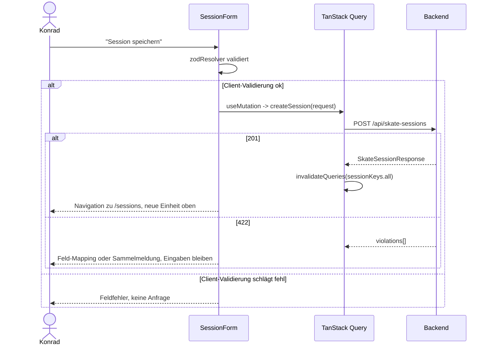

## Was

`sk8-skate` bekommt zwei neue Screens. Unter `/sessions/new` erfasst Konrad eine Einheit: Datum,
Dauer und Ort sind vorbelegt, Tricks wählt er per Tipp auf eine Kachel statt über ein Auswahlfeld, und
Versuche/Treffer zählt er über 44-px-Zählflächen statt Zifferneingabe. Alles, was nicht in jeder
Session gebraucht wird – Startzeit, Gewicht, Anstrengung, Knieschmerz, Notiz – liegt hinter einem
zugeklappten `details`-Block. Unter `/sessions` sieht er danach seinen Verlauf: nach Monaten
gruppiert, neueste Einheit oben, mit Dauer, Trickzahl und Erfolgsquote je Zeile.

```
┌─────────────────────────────────┐        ┌─────────────────────────────────┐
│ Sessions · 3                    │        │ Session erfassen                │
│ [   Session erfassen   ]        │        │ Datum  [2026-09-08]             │
│ September 2026                  │  ──►   │ Dauer  [30][45][60•][90][120]   │
│  Sa., 6. Sept.          56 %    │  ◄──   │ Ort    [Skatepark Braunschweig]  │
│  Skatepark BS · 60 min · 3 T.   │        │ Tricks [Ollie•][Kickflip] ...    │
└─────────────────────────────────┘        └─────────────────────────────────┘
```

Backend-seitig ändert sich nichts – das Feature konsumiert ausschließlich den bereits akzeptierten
Vertrag aus T-0101/T-0102 über `pnpm gen:api`. Eine neue shadcn-Komponente
(`src/components/ui/textarea.tsx`) wird zusätzlich byte-identisch nach `sk8-nutrition` und
`sk8-habits` gespiegelt, weil `.claude/rules/react-frontend.md` das für gemeinsam genutzte
UI-Bausteine verlangt.

## Warum

`PRODUCT-SPEC.md` Abschnitt 4 verlangt Session-Tracking, Abschnitt 10 „minimalistisch und ruhig, aber
informationsdicht" mit deutschen Oberflächentexten. Die Bedienung mit verschwitzten Händen am
Skatepark ist dabei keine Zugabe, sondern eine harte Anforderung: Dauert das Erfassen länger als eine
Minute oder verliert ein Fehltipp die Eingabe, wird es nicht gemacht – und die Plattform hat laut
`ROADMAP.md` genau eine Datenquelle für alles Weitere. Deshalb sind Touch-Ziele ab 44 px
(`.claude/rules/react-frontend.md`), Vorbelegungen und Zähler statt Tastatur in diesem Ticket
Pflicht, keine Gestaltungsvorliebe.

Die Liste gehört in dasselbe Ticket, weil eine Erfassung ohne sichtbares Ergebnis keinen Nachweis
liefert, dass gespeichert wurde – sie ist zugleich der Erfolgszustand des Formulars.

Design-Entscheidung, die es wert ist, festzuhalten: Trick-Auswahl per Kachel statt Dropdown. 16 Tricks
passen als Kacheln auf einen Telefonbildschirm, ein Tipp ist schneller als ein sich öffnendes Element
mit Suche. Ebenso bewusst verworfen: ein `Slider` (shadcn) für Anstrengung/Knieschmerz – das Ticket
verlangt explizit diskrete Schaltflächenreihen (10 bzw. 11 Stück à 44 px), weil ein kontinuierlicher
Regler auf einer 44-px-Fläche für Ganzzahlwerte schlechtere Touch-Präzision hätte.

## Wie

**1. `pnpm gen:api` gegen den laufenden Backend-Stand, nicht gegen die eingecheckte `schema.d.ts`.**
Das Backend lief unter `localhost:8000` bereits mit dem vollständigen T-0101+T-0102-Vertrag; die im
Repo liegende `schema.d.ts` war älter. Feldabgleich (Architect, `design.md`) ergab **keine Abweichung**
zwischen den 34 Akzeptanzkriterien des Tickets und dem live gezogenen OpenAPI-Schema – trotzdem wurde
neu generiert, weil sonst stillschweigend gegen einen veralteten Vertrag kompiliert worden wäre.

**2. Query-Keys mit einer einzigen Invalidierungswurzel.**

```ts
// src/features/sessions/api.ts
export const sessionKeys = {
  all: ["sessions"] as const,
  list: (filter: SessionListFilter) => ["sessions", "list", filter] as const,
};
```

Nach erfolgreichem `createSession` reicht `invalidateQueries({ queryKey: sessionKeys.all })` – das
trifft jede `sessionKeys.list(filter)`-Variante unabhängig vom konkreten `filter`, weil TanStack Query
Key-*Präfixe* matcht, nicht exakte Keys. Der Trick-Katalog (`trickKeys.list()`) wird nie invalidiert und
läuft mit `staleTime: Infinity` – Stammdaten, die sich nur per DB-Migration ändern, nie durch eine
Nutzeraktion in der App.

**3. `NumberStepper` trennt den angezeigten Wert vom rohen Tastatureingabe-String.** Die `+`/`−`-
Flächen clampen hart auf `[min, max]` (Kriterium 15); die Direkteingabe tut das bewusst nicht
(Kriterium 16 verlangt stattdessen eine Fehlermeldung bei Überschreiten). Ohne einen separaten
`draft`-State sprang ein geleertes Eingabefeld beim nächsten Tastendruck sofort auf `min` zurück, statt
die neue Ziffer entgegenzunehmen:

```tsx
// src/features/sessions/components/NumberStepper.tsx
const [draft, setDraft] = useState<string | null>(null);

function handleInputChange(event: React.ChangeEvent<HTMLInputElement>) {
  const raw = event.target.value;
  setDraft(raw);                              // eigener State, unabhängig von `value`-Prop
  if (raw.trim().length === 0) return;        // leeres Feld bleibt leer, kein Reset auf min
  const parsed = Number.parseInt(raw, 10);
  if (!Number.isNaN(parsed)) onChange(parsed); // unclamped nach oben
}
```

**4. `ScaleInput` als `role="radiogroup"` statt unabhängiger Buttons.** Zehn bzw. elf Schaltflächen, von
denen genau eine gültig ist, sind semantisch eine Radiogruppe – mit `aria-checked`, roving `tabIndex`
und Pfeiltasten-Navigation zwischen den Optionen, exakt nach dem WAI-ARIA-Radiogroup-Pattern.



## Drei unabhängige Funde: Verifikation auf mehreren Ebenen

Dieses Feature zeigt, dass „Screens gebaut, Tests grün" allein nicht reicht – drei Funde entstanden
auf drei verschiedenen Ebenen (generierter Code, Ticket-Text selbst, eigener Testcode), jeweils weil
jemand eine Zahl nachgerechnet statt sie zu übernehmen.

**1. `openapi-typescript` markierte ein optionales Feld fälschlich als Pflichtfeld.** Der Live-Vertrag
(`GET /api/doc.json`) listet in `SessionTrickInput.required` nur `trickSlug`/`attempts`/`landed` –
`notes` ist optional mit Server-Default `null`. `openapi-typescript` behandelt aber jedes Feld mit
einem JSON-Schema-`default` automatisch als „immer vorhanden" im generierten TypeScript-Typ, sodass
`components["schemas"]["SkateSessionRequest"]` `tricks[].notes` als nicht-optional auswies – obwohl
`SessionTrickRow` in diesem Formular nie eine Notiz pro Trick erfasst. Der Implementer baute deshalb
einen eigenen, wörtlich vertragskonformen Typ (`CreateSessionRequest` in
`src/features/sessions/api.ts:33-44`) statt den generierten Typ direkt zu verwenden, und castet nur
einmalig beim tatsächlichen `api.POST`-Aufruf (kommentiert im Code, siehe Snippet oben in `api.ts`).
Ohne diesen Schritt hätte der generierte Typ eine Eigenschaft erzwungen, die es im Wire-Vertrag gar
nicht geben muss.

**2. Ein Datums-Tippfehler im Ticket selbst.** Ticket und `design.md` geben als Beispieltext für
`formatSessionDate("2026-09-06")` den Wert „Sa., 6. September 2026" an. Kalendarisch nachgerechnet
(`date -j -f "%Y-%m-%d" "2026-09-06" "+%A"`) ist der 6. September 2026 tatsächlich ein **Sonntag**, kein
Samstag. Der Tester übernahm den Ticket-Fehler nicht, sondern schrieb den Test auf den korrekten
Wochentag:

```ts
// src/features/sessions/format.test.ts:13-20
/*
 * design.md/ticket give "Sa., 6. September 2026" as the example output for
 * formatSessionDate("2026-09-06") – but the 6th of September 2026 is a Sunday
 * (verified via date-fns/de and the system `date` command) – "Sa." there is
 * a typo in the ticket, not a spec to follow.
 */
expect(formatSessionDate("2026-09-06")).toBe("So., 6. September 2026");
```

**3. Ein Synchronisationsfehler im eigenen Testcode.** Ein Test rief `screen.getByRole("status")`
direkt nach `renderApp()` auf, ohne `await`. TanStack Router rendert nach einem frischen `renderApp()`
grundsätzlich nichts synchron – der initiale Match läuft über `router.load({ sync: true })`, das trotz
des Namens erst nach mindestens einem Makrotask-Tick auflöst. Der Test wäre damit unabhängig von der
Implementierung nie grün geworden. Im Review-Schritt gefunden und korrigiert – konsistent mit jedem
anderen Screen-Test im Repo, der konsequent mit `findByRole`/`findByText` wartet:

```ts
// src/features/sessions/components/SessionListScreen.test.tsx:48-53
renderApp({ initialPath: "/sessions" });
// TanStack Router renders nothing synchronously right after renderApp(),
// so the initial status has to be awaited like every other screen test.
expect(await screen.findByRole("status")).toHaveTextContent("Sessions werden geladen …");
```

Keine Assertion wurde in einem der drei Fälle abgeschwächt – jeweils wurde die Mehrdeutigkeit oder der
falsche Typ beseitigt, nicht die Prüfung selbst.

## Barrierefreiheit über den Ticket-Wortlaut hinaus

Das Ticket legt die Oberfläche bereits vollständig fest; die `uiux`-Rolle fand dabei drei Lücken und
ergänzte sie, ohne den Text neu zu erfinden:

- **Zusammengesetzte `aria-label` für Zähler.** `form.decrease`/`form.increase` („Eins weniger"/„Eins
  mehr") sind pro Zähler identisch beschriftet – bei zwei Zählern (Versuche, Treffer) je Trick-Zeile
  und mehreren Zeilen wäre der Screenreader-Name ohne Bezug mehrdeutig. `NumberStepper` baut daraus
  `"{Feld} für {Trick}: Eins mehr/weniger"`, z. B. „Versuche für Ollie: Eins mehr".
- **`role="radiogroup"` für die Skalen** (Anstrengung, Knieschmerz) statt unmarkierter Toggle-Buttons –
  siehe `ScaleInput.tsx` oben.
- **Fokus-Management nach Fehlern**: erstes fehlerhaftes Feld nach Client-Validierung, `role="alert"`-
  Container nach 422-Sammelmeldung oder 500/Netzfehler, feldgenaues Fokussieren bei zuordenbaren
  422-Verletzungen.

## Kriterium 34 (Touch-Ziel-Höhen)

Nicht als Testfall geschrieben: Tailwind-Höhenklassen sind in jsdom nicht messbar (kein echtes Layout).
Stattdessen im Review per Klassenprüfung bestätigt – `src/components/ui/button.tsx` (`size="lg"` =
`h-10` = 40 px) und `src/components/ui/input.tsx` (fix `h-9` = 36 px) erreichen die geforderten 44/48 px
in ihren Standardgrößen *nicht*; `NumberStepper` und `ScaleInput` setzen deshalb explizit `h-11 w-11`
(44 px) statt sich auf eine shadcn-Standardgröße zu verlassen, die 48-px-Flächen (Erfassen-/Speichern-
Button, Datumsfeld) erhalten `h-12` on top. Diese Klassen wurden im Quellcode gegenkontrolliert, nicht
per automatisiertem Test.

## Tests

| Testdatei | Was sie beweist |
|---|---|
| `src/features/sessions/format.test.ts` | die sechs Formatierungen inkl. der korrigierten Wochentags-Ausgabe |
| `src/features/sessions/schema.test.ts` | zod-Regeln ohne Oberfläche: Kriterien 16–20, Trick-Obergrenze, leere Felder → `null` |
| `src/features/sessions/api.test.ts` | `fetchSessions`-Query-Parameter, `createSession`-Body, 401/500-Weiterleitung, stabile Query-Keys |
| `src/features/sessions/components/SessionListScreen.test.tsx` | Kriterien 1–6: vier Zustände, Monatsgruppen, Reihenfolge, „–" ohne Tricks, „Mehr laden" |
| `src/features/sessions/components/SessionForm.test.tsx` | Kriterien 12–23, 27, 29–31: Trick-Kacheln, Zähler-Obergrenze, Feldfehler, Flüssigkeitsverlust, Knie-Hinweis, 422-Abbildung, 500 |
| `src/features/sessions/components/SessionCreateScreen.test.tsx` | Kriterien 7–11, 24–26, 28, 32: Vorbelegungen mit eingefrorener Uhr, Katalogfehler, abgesendeter Body, Wechsel zur Liste, Abbrechen |
| `src/features/sessions/components/telemetry.test.tsx` | Kriterium 33: jedes markierte Element trägt seinen `data-track`-Wert |

Ausführen: `pnpm test` in `sk8-skate`. Prüflauf-Ergebnis: **147 von 147 Tests grün** (inklusive der
beiden oben beschriebenen Testkorrekturen), `pnpm lint`/`pnpm typecheck`/`pnpm build` grün. Nach dem
Spiegeln von `src/components/ui/textarea.tsx`: `sk8-nutrition` **59/59** und `sk8-habits` **59/59**
Tests unverändert grün, jeweils mit grünem `lint`/`typecheck`/`build` – die neue Komponente wird dort
noch nirgends importiert.

## Lernpunkte

1. **Key-Präfix-Invalidierung in TanStack Query** – `src/features/sessions/api.ts` (`sessionKeys`).
   `invalidateQueries({ queryKey: sessionKeys.all })` trifft jede Query, deren Key mit
   `["sessions", …]` beginnt, ohne den genauen `filter` zu kennen. Laut
   [TanStack-Query-Doku zu Query Invalidation](https://tanstack.com/query/latest/docs/framework/react/guides/query-invalidation)
   matcht `invalidateQueries` standardmäßig Key-*Präfixe*. Vergleichbar mit einem Pinia-Store, der beim
   Invalidieren eines Cache-Namespace-Präfixes alle abgeleiteten Getter auf einmal neu berechnen lässt,
   statt jede Variante einzeln zu kennen.
2. **`staleTime: Infinity` für echte Stammdaten** – `trickKeys.list()` in `src/features/tricks/api.ts`.
   Der Trick-Katalog ändert sich nur per DB-Migration, nie durch eine Nutzeraktion in der App; ihn als
   „nie veraltend" zu markieren erspart Refetches ohne Konsistenzrisiko. Laut
   [TanStack-Query-Doku zu `staleTime`](https://tanstack.com/query/latest/docs/framework/react/guides/important-defaults)
   verhindert das jeden automatischen Refetch, bis die Query manuell invalidiert wird. Vergleichbar mit
   Nuxts `useAsyncData`-Option `getCachedData`, wenn man Daten bewusst nie automatisch neu holen will.
3. **WAI-ARIA-Radiogroup-Pattern für diskrete Skalen** – `src/features/sessions/components/ScaleInput.tsx`.
   Zehn/elf Schaltflächen mit genau einem gültigen Wert sind semantisch eine Gruppe sich gegenseitig
   ausschließender Optionen, kein unabhängiges Toggle-Set. Laut
   [WAI-ARIA Authoring Practices, Radio Group Pattern](https://www.w3.org/WAI/ARIA/apg/patterns/radio/)
   braucht das `role="radiogroup"`, `role="radio"` je Option, `aria-checked` und roving `tabindex` statt
   `tabindex` auf jeder Option. Ohne direkte Vue-Entsprechung – am ehesten vergleichbar mit einer
   selbstgebauten Button-Gruppe, die man in einem Nuxt-Projekt statt eines nativen `<input
   type="radio">` einsetzt und deshalb dieselbe ARIA-Semantik von Hand nachbauen muss.
4. **Generierter Code ist kein blinder Vertrauensanker** – `src/features/sessions/api.ts:18-44`
   (`CreateSessionRequest`). `openapi-typescript` leitet „Pflichtfeld" strikt aus dem
   OpenAPI-`required`-Array ab, behandelt aber ein Feld mit JSON-Schema-`default` intern wie
   „immer vorhanden" im generierten Typ – eine Diskrepanz zwischen dem tatsächlichen Wire-Vertrag und
   dem generierten TypeScript-Typ, die nur durch Nachlesen der rohen OpenAPI-Antwort
   (`GET /api/doc.json`) auffiel, nicht durch Vertrauen auf `schema.d.ts` allein. Vergleichbar mit einem
   auto-generierten TypeScript-Typ aus einem Prisma-Schema, bei dem ein Feld mit `@default` im Schema
   nicht automatisch bedeutet, dass die API es beim Schreiben verlangt.
5. **Drei unterschiedliche Verifikationsebenen für dieselbe Art von Fehler** – siehe Abschnitt oben.
   Ein generierter Typ, ein von Menschen geschriebener Ticket-Text und ein selbst geschriebener Test
   können alle drei unabhängig voneinander falsch sein; keiner davon ist automatisch die Quelle der
   Wahrheit, nur weil er „schon vorher da war". Der gemeinsame Nenner aller drei Funde in diesem
   Feature: eine kalendarische/vertragliche Tatsache wurde tatsächlich nachgerechnet oder gegen die
   Laufzeit geprüft, statt den vorhandenen Text zu übernehmen.
