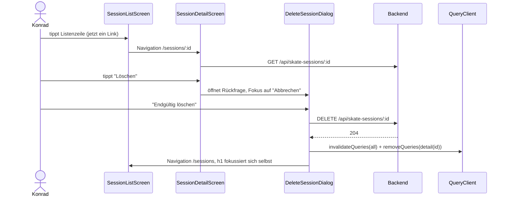

## Was

`sk8-skate` bekommt zwei neue Routen: Ein Tipp auf eine Listenzeile führt jetzt auf
`/sessions/<id>`, die Kennzahlen, Trick-Zeilen mit Notiz und – ab Knieschmerz 6 – den bekannten
Pausen-Hinweis zeigt. Von dort geht es über „Bearbeiten" auf `/sessions/<id>/edit` (dasselbe Formular
aus T-0104, wiederverwendet statt kopiert) oder über „Löschen" in eine Rückfrage, die vor dem
endgültigen Entfernen warnt. Die Startseite (`/`) bekommt zwischen dem Contest-Countdown und den drei
Bereichskarten einen neuen Block: die letzte Session als Link, darunter die laufende Kalenderwoche
(Montag bis Sonntag) als sieben Balken, deren Höhe die tägliche Dauer zeigt.

```
┌─────────────────────────────────┐        ┌─────────────────────────────────┐
│ Sessions · 3                    │        │ Sa., 6. September 2026          │
│ [   Session erfassen   ]        │  ──►   │ Skatepark Braunschweig · 90 min │
│ September 2026                  │        │ Versuche 30 · Treffer 21 · 70 % │
│  Sa., 6. Sept.          56 %    │  ◄──   │ Geübte Tricks (mit Notiz)       │
│  Skatepark BS · 60 min · 3 T.   │        │ [Bearbeiten]      [Löschen]     │
└─────────────────────────────────┘        └─────────────────────────────────┘
```

Backend-seitig ändert sich nichts – `GET/PUT/DELETE /api/skate-sessions/{id}` existiert seit T-0102
bereits und wird nur zum ersten Mal vom Frontend konsumiert. Die Erweiterung von `StartScreen.tsx` (ein
`children`-Slot) wurde byte-identisch nach `sk8-nutrition` und `sk8-habits` gespiegelt.

## Warum

`PRODUCT-SPEC.md` Abschnitt 10 verlangt „informationsdicht, Navigation minimieren" – die Startseite ist
laut UX-Recherche der einzige Screen, den Konrad bei jedem Öffnen der App sieht, deshalb beantwortet der
neue Block „Wie viel diese Woche schon?" ohne Klick. Bearbeiten ist kein Komfort: Zahlen werden am
Skatepark mit verschwitzten Händen eingetippt, und ohne Korrekturmöglichkeit bliebe ein Zahlendreher
stehen, weil Löschen-und-neu-Erfassen zu lästig wäre – alles Weitere im Projekt rechnet mit diesen
Zahlen.

Zwei Design-Entscheidungen aus `design.md`, die es wert sind, festgehalten zu werden:

- **`SessionForm` wiederverwenden statt ein zweites Formular zu bauen.** Ein eigenes
  `SessionEditForm` hätte Validierung, Trick-Feldarray und Gewichts-/Flüssigkeitsverlust-Ableitung
  dupliziert; jede künftige Regeländerung hätte zwei Stellen gebraucht. Stattdessen bekommt
  `SessionForm` vier neue, alle mit T-0104-kompatiblen Defaults versehene Props
  (`submitLabel`, `pendingLabel`, `trackName`, `cancelTrackName`) – `SessionCreateScreen` ändert sich
  dadurch nicht.
- **Kein eigener Query-Key für die Wochenübersicht.** `sessionKeys.list({ from, to, limit: 20 })`
  wiederverwenden statt `sessionKeys.week()` zu erfinden – ein eigener Key hätte denselben Endpunkt
  doppelt gecacht. `limit: 20` statt `7`, weil an einem Tag zwei Einheiten liegen können.

Bezug zu ADRs: ADR-003 (Router-Typisierung, `date-fns`), ADR-007 (Testphilosophie), ADR-009
(Telemetrie-Pflicht auf jedem interaktiven Element mit Analysewert).

## Wie

**1. Der `children`-Slot in `StartScreen.tsx` – der Lernpunkt mit dem größten Hebel in diesem Ticket.**
`.claude/rules/react-frontend.md` verlangt, dass diese Datei in allen drei Apps byte-identisch bleibt.
Damit die Skate-App trotzdem einen eigenen Block einbauen kann, ohne diese Regel zu brechen, bekommt die
Komponente einen leeren, inhaltsfreien Slot – React rendert bei fehlendem `children` einfach nichts,
`nutrition`/`habits` können also unverändert bleiben:

```tsx
// src/features/start/StartScreen.tsx – die einzige inhaltliche Änderung
import type * as React from "react";
// ...
export function StartScreen({ children }: { children?: React.ReactNode }) {
  // ...
  return (
    <div className="space-y-4">
      <section aria-labelledby="countdown-heading">{/* Countdown, unverändert */}</section>

      {children /* NEU: leer in nutrition/habits, <StartSessionSummary /> in skate */}

      <section aria-label="Bereiche">{/* Bereichskarten, unverändert */}</section>
    </div>
  );
}
```

Das App-Eigene wandert dadurch dorthin, wo es laut `react-frontend.md` hingehört: in die (ohnehin schon
app-spezifische) Route, nicht in die gemeinsame Komponente:

```tsx
// sk8-skate/src/routes/index.tsx
export const Route = createFileRoute("/")({
  component: () => (
    <StartScreen>
      <StartSessionSummary />
    </StartScreen>
  ),
});
```

`sk8-nutrition`/`sk8-habits` behalten `component: StartScreen` ohne Kind. Drei geänderte Zeilen in
`StartScreen.tsx`, verifiziert per `diff` über alle drei Apps – byte-identisch (Kriterium 28, siehe
Abschnitt Tests).

**2. `summarizeWeek(sessions, now)` – reine Funktion, kein React, kein Netzwerk.** Die Wochengrenzen
Montag–Sonntag kommen aus `date-fns`, die Erfolgsquote wird aus den rohen Summen berechnet statt aus
den bereits gerundeten Pro-Session-Quoten gemittelt – sonst wären ungleich lange Sessions falsch
gewichtet:

```ts
// src/features/sessions/week.ts
export function summarizeWeek(sessions: SkateSessionSummary[], now: Date): WeekSummary {
  const start = startOfWeek(now, { weekStartsOn: 1 }); // Montag, nicht Sonntag
  const end = endOfWeek(now, { weekStartsOn: 1 });
  const inWeek = sessions.filter((s) => {
    const date = parseISO(s.sessionDate);
    return date >= start && date <= end; // schließt die Vorwoche aus
  });

  const totalAttempts = inWeek.reduce((sum, s) => sum + s.totalAttempts, 0);
  const totalLanded = inWeek.reduce((sum, s) => sum + s.totalLanded, 0);

  return {
    sessionCount: inWeek.length,
    totalDurationMinutes: inWeek.reduce((sum, s) => sum + s.durationMinutes, 0),
    // Gewichtet über rohe attempts/landed, nicht über den Mittelwert der
    // Einzel-Quoten – sonst zählt eine 5-Minuten-Session gleich viel wie
    // eine 90-Minuten-Session.
    successRate: totalAttempts === 0 ? null : Math.round((totalLanded / totalAttempts) * 1000) / 1000,
    days /* sieben Einträge Mo–So, s. week.ts */,
  };
}
```

`week.test.ts` prüft diese Funktion vollständig ohne `render()` – die Trennung von Berechnung und
Darstellung zahlt sich direkt in Testgeschwindigkeit aus.

**3. Löschen: `invalidateQueries` reicht nicht, `removeQueries` schon.** Nach `DELETE` markiert
`invalidateQueries({ queryKey: sessionKeys.all })` (Präfix-Match, deckt Liste, Startseite *und*
Detailansicht mit einem Aufruf ab) nur „veraltet" – bis zum nächsten Fetch zeigt der Cache weiter die
gelöschte Einheit. Deshalb zusätzlich `removeQueries` gezielt auf den Detail-Key:

```tsx
// src/features/sessions/components/DeleteSessionDialog.tsx
onSuccess: () => {
  queryClient.invalidateQueries({ queryKey: sessionKeys.all });
  queryClient.removeQueries({ queryKey: sessionKeys.detail(sessionId) }); // sofort weg,
  // nicht nur "veraltet" – ein Zurück-Klick soll die gelöschte Session nicht
  // kurz aufblitzen lassen, bevor die 404-Antwort ankommt.
  navigate({ to: "/sessions" });
},
```

**4. Fokus-Management nach dem Löschen-Dialog** (Radix' `onOpenAutoFocus`, siehe Lernpunkte):

```tsx
<DialogContent
  onOpenAutoFocus={(event) => {
    // Apple HIG: der Erst-Fokus eines destruktiven Dialogs geht nie auf die
    // gefährliche Aktion, sondern auf "Abbrechen".
    event.preventDefault();
    const container = event.currentTarget as HTMLElement;
    container.querySelector<HTMLButtonElement>("[data-delete-cancel]")?.focus();
  }}
>
```



## Drei kleinere Funde

Wie schon bei T-0104 stimmte der vorab geschriebene Text nicht in jedem Detail mit dem gelesenen Code
überein – drei kleine, unabhängige Abweichungen, keine davon änderte ein Akzeptanzkriterium:

1. **`formatSessionCount` existierte nicht.** `design.md` behauptete, diese Funktion käme unverändert
   aus `format.ts`. Im Code gab es dort nur eine strukturell ähnliche, aber anders benannte und nicht
   exportierte `sessionCountText`-Hilfsfunktion, lokal in `SessionListScreen.tsx`. Da kein Test den
   Namen `formatSessionCount` referenzierte, bekam `StartSessionSummary.tsx` eine eigene, lokale
   `sessionCountText`-Funktion nach demselben Muster – keine „Wiederverwendung" einer Funktion, die es
   nie gab.
2. **Fokus-Management war im Ticket komplett offen gelassen.** Weder Ticket noch `design.md` erwähnen,
   wohin der Fokus nach einem Routenwechsel ohne vollen Seitenaufbau springt (Löschen-Erfolg,
   Bearbeiten-Abbrechen, Bearbeiten-Erfolg). `ux.md` ergänzte das eigenständig: jeder betroffene Screen
   bekommt eine `h1` mit `tabIndex={-1}`, die sich in einem `useEffect` beim Mount selbst fokussiert.
3. **`SessionListScreen.tsx` musste zusätzlich angefasst werden**, obwohl `design.md`s Dateitabelle sie
   nicht als geändert listet – der dritte der drei Fokus-Fälle aus Punkt 2 betrifft ausgerechnet diese
   Datei (`h1` „Sessions" fokussiert sich nach dem Löschen selbst). Minimal und additiv: nur
   `ref`/`tabIndex`/Fokus-Effekt ergänzt, kein bestehender Test prüfte die Abwesenheit dieses
   Verhaltens.

## Tests

| Testdatei | Was sie beweist |
|---|---|
| `src/features/sessions/week.test.ts` | Wochengrenzen Mo–So schließen die Vorwoche aus, sieben Tageswerte, `successRate: null` ohne Versuche, leere Woche |
| `src/features/sessions/components/SessionDetailScreen.test.tsx` | Trick-Zeilen mit Notiz, „–" bei leeren Kennzahlen, Knie-Hinweis ab 6, „nicht gefunden" ohne `role="alert"` (mit Selbst-Fokus), 500 + „Nochmal versuchen" |
| `src/features/sessions/components/DeleteSessionDialog.test.tsx` | Abbrechen ohne Anfrage, genau eine `DELETE`-Anfrage mit Wechsel zur Liste, 500 hält den Dialog offen, `variant="destructive"` nur auf „Endgültig löschen", Erst-Fokus auf „Abbrechen" |
| `src/features/sessions/components/SessionEditScreen.test.tsx` | Vorbefüllung aller Felder inkl. aufgeklapptem „Weitere Angaben", exakter `PUT`-Body nach Trick-Wechsel, Erfolgsnavigation, 422 unter dem Dauerfeld, Abbrechen ohne Anfrage, `weightAfterKg: null` |
| `src/features/sessions/components/StartSessionSummary.test.tsx` | letzte Session mit Link, Leerzustand mit „Session erfassen", Woche ohne Quote, Woche leer, Fehlerzustand isoliert vom Rest der Startseite, `<ul aria-label>`-Gruppe mit sieben `<li>` |
| `src/features/sessions/components/SessionListItem.test.tsx` | Zeile ist ein Link auf `/sessions/<id>`, trägt `data-track="session.open"` |
| `src/features/start/StartScreen.test.tsx` | 3 bestehende T-0104-Fälle unverändert grün, plus: Countdown/Bereichskarten bleiben sichtbar, während der `children`-Block einen Fehler zeigt |
| `src/features/sessions/components/telemetry.test.tsx` | alle zehn neuen `data-track`-Werte, 9 bestehende T-0104-Fälle unverändert grün |

Ausführen: `pnpm test` in `sk8-skate`. Ergebnis: **190 von 190 Tests grün** (147 bestehende + 43
neue/geänderte), `pnpm lint`/`pnpm typecheck`/`pnpm build` grün. Nach dem Spiegeln des
`StartScreen`-Slots: `sk8-nutrition` **59/59** und `sk8-habits` **59/59** Tests unverändert grün, jeweils
mit grünem `lint`/`typecheck`/`build`.

**Kriterium 28 war laut Ticket kein Testfall, sondern ein Prüflauf**, nicht automatisierbar (Byte-Identität
über drei Repos hinweg ist keine Aussage, die ein einzelner Testlauf treffen kann): `diff` von
`StartScreen.tsx` gegen `sk8-nutrition` und `sk8-habits` – beide leer, byte-identisch. Ebenso nicht als
Test geschrieben: die Touch-Ziel-Höhen (48 px Aktionen, 44/64 px Dialog-Buttons/Listenzeile) – Tailwind-
Klassen sind in jsdom nicht messbar, nur im Quellcode gegenkontrolliert.

## Lernpunkte

1. **Dynamische Routen-Segmente typsicher lesen** – `src/routes/sessions/$sessionId/index.tsx` +
   `useParams({ from: "/sessions/$sessionId/" })` in `SessionDetailScreen.tsx`. Laut
   [TanStack-Router-Doku zu Path Params](https://tanstack.com/router/latest/docs/framework/react/guide/path-params)
   erzeugt ein `$`-Präfix im Dateinamen ein benanntes Segment, und beim Navigieren „will TypeScript
   require you to pass the params either as an object or as a function that returns an object of
   params". Vergleichbar mit Nuxts `pages/sessions/[id]/index.vue` plus `useRoute().params.id` – nur
   dass hier ein fehlender oder falsch benannter Parameter schon beim Kompilieren auffällt, nicht erst
   zur Laufzeit.
2. **`children` als Slot-Äquivalent** – `src/features/start/StartScreen.tsx`. Laut
   [React-Doku „Passing JSX as children"](https://react.dev/learn/passing-props-to-a-component#passing-jsx-as-children)
   kann man sich eine Komponente mit `children`-Prop als ein „Loch" vorstellen, das Eltern-Komponenten
   mit beliebigem JSX füllen – bleibt das Loch leer, wird nichts gerendert. Das direkte Analogon zu
   Vues Default-`<slot />`: kein benannter Slot nötig, weil hier nur eine einzige Einfügestelle
   gebraucht wird.
3. **`weekStartsOn` für Montag-Wochen statt Default-Sonntag** – `src/features/sessions/week.ts`
   (`startOfWeek`/`endOfWeek`). Die `date-fns`-Quelle dokumentiert selbst im Beispiel: „If the week
   starts on Monday, the start of the week for 2 September 2014 … `{ weekStartsOn: 1 }`" – ohne diese
   Option wäre der implizite Default Sonntag (US-Konvention), was Kriterium 22/23 (Vorwoche korrekt
   ausschließen) gebrochen hätte. In Vue/Nuxt gäbe es dafür meist eine App-weite Locale-Konfiguration;
   hier ist es ein expliziter Funktionsparameter pro Aufruf.
4. **`removeQueries` löscht sofort, `invalidateQueries` markiert nur veraltet** –
   `DeleteSessionDialog.tsx`s `onSuccess`. Die
   [TanStack-Query-Doku zu Query Invalidation](https://tanstack.com/query/latest/docs/framework/react/guides/query-invalidation)
   beschreibt, dass APIs wie `invalidateQueries` und `removeQueries` „match multiple queries by their
   prefix" – beide treffen also `sessionKeys.detail(id)` über den `["sessions"]`-Präfix, aber nur
   `removeQueries` entfernt den Cache-Eintrag sofort statt ihn nur zum Neuladen vorzumerken. Ohne
   direkte Pinia-Entsprechung – am ehesten vergleichbar mit einem Store, bei dem „als veraltet markieren"
   und „Eintrag löschen" zwei bewusst verschiedene Aktionen auf demselben Namespace-Präfix sind.
5. **Erst-Fokus eines Dialogs gezielt umlenken** – `DeleteSessionDialog.tsx`s `onOpenAutoFocus`. Laut
   [Radix-UI-Doku zu Dialog](https://www.radix-ui.com/primitives/docs/components/dialog) feuert
   `onOpenAutoFocus` beim Öffnen, bevor die Komponente den Fokus automatisch platziert, und
   `event.preventDefault()` erlaubt es, „implement custom focus management logic" statt der
   Standard-Platzierung auf das erste fokussierbare Element zu folgen – hier genutzt, um den Fokus
   verlässlich auf „Abbrechen" statt auf die destruktive Aktion zu legen. Radix' Headless-Primitives
   entsprechen am ehesten Headless-UI-artigen Vue-Bibliotheken (z. B. Radix Vue): Verhalten und
   Barrierefreiheit sind vorgegeben, das Styling bleibt frei.
