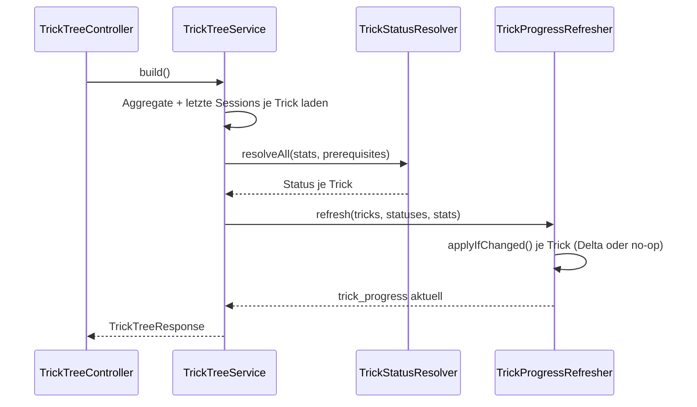

## Was

`sk8-backend` bekommt einen neuen Endpunkt: `GET /api/trick-tree`. Ein Aufruf liefert **alle** Tricks
aus dem Katalog mit ihrem Status (`gesperrt`, `bereit`, `uebe`, `sitzt`), ihren Kennzahlen (Versuche,
Treffer, Erfolgsquote, letzter Übungstag) und allen Voraussetzungskanten – dazu die vier
Schwellenwerte, gegen die der Status berechnet wurde. Eine neue Tabelle `trick_progress` hält dafür
einen Fortschritts-Schnappschuss je Trick, wird aber bei jedem Aufruf des Endpunkts aus den
`session_trick`-Daten neu berechnet. Noch kein Frontend liest diesen Endpunkt – die Oberfläche
(Trick-Baum als Graph) folgt in `T-0203`.

```
GET /api/trick-tree
{
  "nodes": [
    { "slug": "ollie",     "status": "sitzt",    "successRate": 0.772, ... },
    { "slug": "boardslide","status": "gesperrt", "successRate": null,  ... }
  ],
  "edges":  [{ "from": "ollie", "to": "boardslide" }],
  "policy": { "masteryRate": 0.75, "masterySessions": 3,
              "masteryMinAttempts": 15, "masteryMode": "each_session" }
}
```

## Warum

`DATENMODELL.md` beschreibt `trick_progress` ausdrücklich als „abgeleitet gepflegt". Das Ticket
begründet das so, und diese Begründung ist der eigentliche Kern dieses Fein­schliffs – nicht Doctrine,
nicht DQL, sondern eine Datenmodell-Entscheidung:

> Ein von Hand gesetzter Status wäre eine zweite Wahrheit neben den Session-Daten und würde die
> Aussage „Ollie sitzt" wertlos machen, weil man ihr nicht mehr ansehen könnte, ob sie gemessen oder
> geklickt wurde.

Es gibt deshalb **keinen** `PUT`/`PATCH`-Endpunkt für `trick_progress` – die einzige Schreiboperation
ist `TrickProgressRefresher::refresh()`, und der rechnet ausschließlich aus `session_trick` nach.

Die zweite, ebenso bewusste Entscheidung: Die Fortschreibung läuft bei jedem **Lesen** des Trick-Tree,
nicht beim Speichern einer Session. Drei Alternativen wurden dafür geprüft und verworfen (Ticket,
Abschnitt „Auslösung"):

| Verworfene Alternative | Warum |
|---|---|
| Doctrine-`postFlush`-Listener auf `SessionTrick` | Wirkt aus der Ferne, schwer zu testen |
| Neuberechnung direkt im Session-Speichern-Endpunkt | Gehört zu EPIC-01 – hätte fremde Dateien angefasst |
| Reine Berechnung beim Lesen, ganz ohne Persistenz | Dann bräuchte es `trick_progress` gar nicht – aber `DATENMODELL.md` verlangt die Tabelle, und `T-0202` filtert später per SQL nach Status |

Jede der drei Alternativen hätte entweder eine Kopplung in ein fremdes Epic (EPIC-01, Session-Erfassung)
gebraucht oder die Tabelle überflüssig gemacht. Die gewählte Lösung – ein lesender Endpunkt mit
Schreibnebenwirkung – ist laut Ticket „die bewusst akzeptierte Unschönheit dieser Lösung; bei einem
Nutzer ohne Parallelzugriffe kostet sie nichts". `TrickProgress::applyIfChanged()` (siehe unten) macht
diese Nebenwirkung idempotent: ein zweiter Aufruf ohne neue Session ändert nichts.

Bezug zu ADRs: ADR-002 (Symfony/Doctrine/PostgreSQL-Stack), ADR-005 (Migrationen), ADR-006
(`X-Api-Key`, Fehlerformat), ADR-008 (englische Bezeichner – siehe die Korrektur im nächsten Abschnitt).

## Wie

**1. Eine Korrektur des Ticket-Wortlauts, bevor überhaupt Code entstand.** Das Ticket schreibt für das
neue `TrickStatus`-Enum deutsche Case-Namen vor (`Gesperrt`, `Bereit`, `Uebe`, `Sitzt`). Das würde
ADR-008 verletzen und dem in `T-0103` etablierten Muster (`BodyWeightContext`: englische Case-Namen,
deutsche Backing-Values) widersprechen. Behandelt als Übertragungsfehler, nicht als bindende Vorgabe –
die Backing-Values (was in der Datenbank und im `CHECK`-Constraint steht) bleiben exakt wie
spezifiziert deutsch:

```php
// src/Enum/TrickStatus.php
enum TrickStatus: string
{
    case Locked = 'gesperrt';     // Case-Name englisch (ADR-008) …
    case Ready = 'bereit';
    case Practicing = 'uebe';     // … Backing-Value deutsch (DB-Spalte, chk_trick_progress_status)
    case Mastered = 'sitzt';

    /** @return list<string> */
    public static function values(): array
    {
        return array_map(static fn (self $case): string => $case->value, self::cases());
    }
}
```

**2. Die vier `R-02`-Konstanten, an einer Stelle mit Evidenzgrad.** `TrickProgressPolicy` trägt die aus
`.claude/state/research/trick-progression.md` übernommenen Werte, jede mit einem Kommentar zur
Belastbarkeit – zwei davon (`MASTERY_RATE`, `MASTERY_MIN_ATTEMPTS`) sind laut Recherche bewusst
konservativ geschätzt (Evidenzgrad D), nicht empirisch hart bewiesen:

```php
// src/Service/Trick/TrickProgressPolicy.php (gekürzt)
final class TrickProgressPolicy
{
    public const float MASTERY_RATE = 0.75;          // Grad D, konservativ wegen Knie-Vorschädigung
    public const int MASTERY_SESSIONS = 3;            // Grad C, "Konsistenz über Einheiten hinweg"
    public const int MASTERY_MIN_ATTEMPTS = 15;        // Grad D, statistische Plausibilität
    public const string MASTERY_MODE = 'each_session'; // Grad C
}
```

**3. `TrickStatusResolver` – zwei Durchläufe statt Graph-Traversierung.** Durchlauf 1 entscheidet jeden
Trick aus seinen eigenen Zahlen (`sitzt` oder `uebe`); Durchlauf 2 entscheidet die restlichen Tricks
ausschließlich aus dem **fertigen** Ergebnis von Durchlauf 1 – nie aus sich selbst:

```php
// src/Service/Trick/TrickStatusResolver.php::resolveAll(), gekürzt
foreach ($stats as $trickId => $trickStats) {
    if ($this->isMastered($trickStats)) {
        $result[$trickId] = TrickStatus::Mastered;
        continue;
    }
    if ($trickStats->attemptsTotal > 0) {
        $result[$trickId] = TrickStatus::Practicing;
        continue;
    }
    $undecided[] = $trickId; // erst in Durchlauf 2 entschieden
}

foreach ($undecided as $trickId) {
    $prerequisiteIds = $prerequisiteIdsByTrickId[$trickId] ?? [];
    $result[$trickId] = $this->allPrerequisitesMastered($prerequisiteIds, $result)
        ? TrickStatus::Ready
        : TrickStatus::Locked;
}
```

Weil Durchlauf 2 nur liest, nicht neu berechnet, kann ihn ein Zyklus in `trick_prerequisite` (fachlich
verboten, aber Akzeptanzkriterium 12 verlangt einen Testfall dafür) nicht aufhängen – es gibt keine
Rekursion, die sich selbst erneut aufrufen könnte.

**4. `TrickProgress::applyIfChanged()` – der Baustein, der den Seiteneffekt sauber hält.** Er vergleicht
alle vier fachlichen Felder und setzt `updatedAt` nur bei einer echten Änderung:

```php
// src/Entity/TrickProgress.php, gekürzt
public function applyIfChanged(
    TrickStatus $status, int $attemptsTotal, int $landedTotal,
    ?\DateTimeImmutable $firstLandedOn, \DateTimeImmutable $now,
): bool {
    $changed = $this->status !== $status
        || $this->attemptsTotal !== $attemptsTotal
        || $this->landedTotal !== $landedTotal
        || $this->firstLandedOn?->format('Y-m-d') !== $firstLandedOn?->format('Y-m-d');

    if (!$changed) {
        return false; // updatedAt bleibt stehen (AK 7)
    }
    $this->status = $status; /* … */ $this->updatedAt = $now;
    return true;
}
```

`TrickProgressRefresher::refresh()` ruft das für jeden Trick auf und schreibt mit **einem** `flush()`
für alle Zeilen – kein Zeilen-für-Zeilen-Commit.

**5. Eine Abweichung vom Design: zwei DQL-Abfragen statt einer.** `design.md` sah eine einzige DQL-Abfrage
mit `MIN(CASE WHEN st.landed > 0 THEN ss.sessionDate ELSE NULL END)` vor, um `firstLandedOn` mitzuberechnen.
DQL erlaubt in einem `CASE`-Ausdruck aber kein bloßes `NULL` im `ELSE`-Zweig (nur `IS [NOT] NULL`,
`COALESCE`, `NULLIF` – keins davon passt typkompatibel neben ein Datumsfeld); der Parser meldet das mit
`Expected T_ELSE, got 'END'` bzw. `Unexpected 'NULL'`. `TrickProgressRepository::aggregatesByTrickId()`
löst das mit zwei Abfragen statt einer (die zweite ohne `CASE`, nur ein gefiltertes `MIN`), die beide auf
`IDENTITY(st.trick)` gruppieren – siehe Lernpunkt 4.

**6. Wiederverwendung statt zweiter Rundungsregel.** `App\Service\Skate\SessionMetrics::successRate()`
aus EPIC-01 berechnet an drei Stellen dieselbe Quote: `successRate` und `recentSuccessRate` im
Response-DTO, sowie `isMastered()` im Resolver. Keine dieser drei Stellen rundet selbst.



**7. Zwei echte Fehler in den Tests – gemeldet, nicht selbst behoben.** Der Implementer darf laut Rolle
Tests nicht eigenmächtig ändern; beide Punkte wurden im Implementierungsbericht zurückgemeldet und
danach im Review behoben:

- Eine Assertion prüfte `$node['successRate'] ?? 'MISSING'` gegen `null`. PHPs `??`-Operator kann
  „Schlüssel fehlt" nicht von „Schlüssel ist `null`" unterscheiden – bei korrekt gesetztem
  `successRate: null` (dem laut Akzeptanzkriterium 1 richtigen Wert) löst `??` **immer** den
  `'MISSING'`-Fallback aus. Die Assertion konnte für keine korrekte Implementierung grün werden. Fix:
  `assertArrayHasKey()` + direktes `assertNull()` ohne `??`.
- Ein Test nahm an, `ollie-stand` sei im Seed-Katalog wurzelständig. Tatsächlich setzt `ollie-stand`
  laut Katalog `rolling` voraus – die Annahme war falsch, nicht der Produktionscode. Fix: Assertion auf
  die eigentliche Kernaussage des Kriteriums reduziert, statt eine falsche konkrete Statusannahme zu
  prüfen.

## Tests

| Testdatei | Beweist |
|---|---|
| `tests/Unit/Service/Trick/TrickStatusResolverTest.php` | Alle vier Statuswerte als reine Funktion, „zu wenig Daten" nie `sitzt`, Zyklus terminiert |
| `tests/Unit/Service/Trick/TrickProgressPolicyTest.php` | Die vier `R-02`-Konstanten liegen in gültigen Bereichen |
| `tests/Functional/Api/TrickTreeTest.php` | Antwortform, Sortierung, Statuscodes (200/401/405), Kanten-Richtung, leerer Katalog |
| `tests/Functional/Service/Trick/TrickProgressRefresherTest.php` | Zeile wird angelegt/aktualisiert statt dupliziert, `updated_at` bleibt bei unveränderten Daten stehen, Cascade-Delete beim Löschen eines Tricks |
| `tests/Functional/Api/ApiDocTest.php` (erweitert) | Die neue Route bricht `nelmio:apidoc:dump` nicht |

Befehl: `make test` (bzw. `make check` für zusätzlich PHPStan max + cs-fixer). Ergebnis: **157 von 157
Tests grün** (125 bestehende EPIC-01-Tests unverändert + 32 neue), **1753 Assertions**. Migration
geprüft im vollen Rundlauf (`migrate` → `migrate prev` → `migrate` erneut, alle drei Schritte
fehlerfrei); `doctrine:migrations:diff` danach leer bestätigt.

## Lernpunkte

1. **Backed Enums: Case-Name ≠ Backing-Value.** `src/Enum/TrickStatus.php` nutzt einen englischen
   Case-Namen (`Locked`) mit einem deutschen `string`-Wert (`'gesperrt'`) – zwei unabhängige Bezeichner
   für dieselbe Sache. Laut [PHP-Doku zu Backed Enumerations](https://www.php.net/manual/en/language.enumerations.backed.php)
   ist der Case-Name der Bezeichner im Code, während `->value` das gespeicherte Skalar ist; `::from()`
   bzw. `::tryFrom()` wandeln in die andere Richtung. Vergleichbar mit einem TS-`enum MyEnum { Locked = "gesperrt" }`
   oder einer discriminated Union mit separatem Anzeige-Label – der Membername muss nicht mit dem
   gespeicherten String übereinstimmen.
2. **Unidirektionale `OneToOne`-Relation.** `src/Entity/TrickProgress.php:35-37` zeigt mit
   `#[ORM\OneToOne]` + `#[ORM\JoinColumn]` auf `Trick`, ohne dass `Trick` (EPIC-01) davon weiß. Laut
   [Doctrine-Doku zu Association Mapping](https://www.doctrine-project.org/projects/doctrine-orm/en/current/reference/association-mapping.html)
   braucht nur die besitzende Seite eine Annotation – „the other entity requires no mapping changes".
   Am ehesten vergleichbar mit einem Prisma-Modell, das ein `@relation`-Feld nur auf einer Seite
   deklariert: die Gegenseite bleibt komplett unberührt.
3. **`onDelete: 'CASCADE'` wirkt auf DB-Ebene, nicht in PHP.** Derselbe `#[ORM\JoinColumn]` in
   `TrickProgress.php:36` trägt `onDelete: 'CASCADE'`. Laut
   [Doctrine-Attribute-Referenz](https://www.doctrine-project.org/projects/doctrine-orm/en/current/reference/attributes-reference.html)
   wird dieser Wert als echter Fremdschlüssel-Constraint in die Datenbank geschrieben – das Löschen
   passiert dort, nicht durch Doctrines eigenes Cascade-Handling in PHP. Dadurch reicht ein einziger
   Testfall, der einen Trick per SQL löscht, um Akzeptanzkriterium 11 zu beweisen: die Datenbank
   erledigt das, nicht Anwendungscode.
4. **`IDENTITY()` liest den Fremdschlüssel, ohne die ganze Relation zu laden.** In
   `src/Repository/TrickProgressRepository.php` steht `SELECT IDENTITY(st.trick) AS trickId, …` statt
   `st.trick` direkt. Laut [Doctrine-Doku zur DQL](https://www.doctrine-project.org/projects/doctrine-orm/en/current/reference/dql-doctrine-query-language.html)
   liefert `IDENTITY(assoc)` „the foreign key column of association of the owning side" – nur die ID,
   nicht das hydratisierte Objekt. Genau das braucht ein `GROUP BY trick_id`: die ID als Gruppierungs-
   und Rückgabewert, ohne 40 `Trick`-Entities aus der Datenbank zu laden, nur um sie sofort wieder zu
   verwerfen.
5. **`enumType` übernimmt die Konvertierung zwischen Spalte und Enum automatisch.**
   `#[ORM\Column(type: Types::TEXT, enumType: TrickStatus::class)]` (`TrickProgress.php:39`) bedeutet:
   Doctrine liest `'sitzt'` aus der Spalte und hydratisiert `TrickStatus::Mastered`, und schreibt beim
   Speichern automatisch `->value` zurück. Laut [Doctrine-Doku zu Basic Mapping](https://www.doctrine-project.org/projects/doctrine-orm/en/current/reference/basic-mapping.html)
   passiert diese bidirektionale Umwandlung transparent, ohne eigenen Custom-Type. Vergleichbar mit
   einem Prisma-`enum`-Feld: die Übersetzung zwischen gespeichertem String und typisiertem Wert ist
   Framework-Aufgabe, nicht Anwendungscode.
