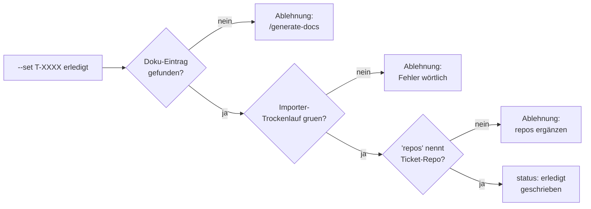

## Was

Bisher gab es für den Lern-Doku-Eintrag nur eine Erinnerung: Ein Stop-Hook meldete sich am Ende einer
Arbeitseinheit, ließ sich aber mit einer Marker-Datei (`.claude/state/docs-skip`) stumm schalten. Bei
hundert Features ist das hundertmal Gelegenheit, den Eintrag zu überspringen – und der Kontext eines
Features ist nach ein paar Tagen weg, der Rückstand also nicht mehr aufholbar. `/ticket <id> erledigt`
(intern `check-tickets.py --set <id> erledigt`) prüft jetzt **vor** dem Schreiben des neuen Status:
Existiert ein Doku-Eintrag, der das Ticket nennt, besteht er den Importer-Trockenlauf, und deckt sein
`repos`-Feld das Ticket-Repo ab? Fehlt eine dieser drei Bedingungen, wird der Abschluss mit deutscher
Begründung abgelehnt und `/generate-docs <slug>` als nächster Schritt genannt – die Ticket-Datei bleibt
dabei unverändert.



## Warum

### Warum reicht eine abschaltbare Erinnerung nicht?

Der Projektauftrag nennt die chronologische Dokumentation als kritisches Deliverable, weil Konrad
ausschließlich durchs Lesen lernt – er schreibt keinen Code selbst. Das Ticket begründet die
Verschärfung wörtlich sinngemäß so: Eine Erinnerung, die sich mit einer Marker-Datei abschalten lässt,
ist bei hundert Features hundert Gelegenheiten, sie zu überspringen, und der Rückstand wäre nicht
aufholbar, weil der Kontext eines Features nach ein paar Tagen verloren ist. Eine Erinnerung wirkt nur
im Moment der Achtsamkeit; eine Bedingung an der Stelle, an der es zählt – dem Abschluss selbst –,
wirkt unabhängig davon. Der bestehende Stop-Hook (`docs-guard.py`) bleibt als frühe Erinnerung
erhalten, ist aber nicht mehr die letzte Verteidigungslinie.

### Warum setzt der Marker `docs-skip` die neue Prüfung nicht ebenfalls aus?

Das wäre naheliegend gewesen – der Marker existiert ja schon –, wurde aber bewusst nicht so gebaut.
`check_doc_entry_for_completion()`, `find_doc_entry()` und `doc_entry_importer_dry_run_ok()` in
`.claude/specs/check-tickets.py` lesen den Marker an **keiner** Stelle; es gibt im Code keinen
`if docs_skip_exists: ...`-Pfad, den man versehentlich treffen könnte. Die Unabhängigkeit ist damit
strukturell garantiert, nicht nur eine Verhaltensentscheidung, die bei künftigen Änderungen wieder
kippen könnte. Der Trockenlauf mit gesetztem Marker (siehe Tests) bestätigt das nur, er erzeugt es
nicht – die Garantie liegt darin, dass der Lesezugriff auf die Datei im Prüfpfad schlicht nicht
vorkommt.

## Wie

`find_doc_entry()` sucht nicht per Namensraten am Slug, sondern liest gezielt das Frontmatter-Feld
`tickets`, das Ticket `T-0007` eingeführt hat:

```python
# .claude/specs/check-tickets.py:419-430
def find_doc_entry(specs_dir: Path, ticket_id: str):
    """Sucht in sk8-docs/content/entries/*.md nach einem Eintrag, dessen Frontmatter-Feld
    'tickets' die gegebene Ticket-ID nennt (kein Namensraten am Slug, T-0003 Kriterium 4).
    Liefert den ersten Treffer als Doc oder None."""
    entries_dir = specs_dir.parent.parent / "sk8-docs" / "content" / "entries"
    if not entries_dir.is_dir():
        return None
    for path in sorted(entries_dir.glob("*.md")):
        front, body = parse_front_matter(path.read_text())
        if front and ticket_id in front.get("tickets", []):
            return Doc(path, front, body)
    return None
```

Ob der gefundene Eintrag tatsächlich valide ist, entscheidet nicht `check-tickets.py` selbst, sondern
der echte Importer als Subprozess – doppelte Validierungslogik wäre eine zweite Quelle der Wahrheit,
die mit `sk8-docs/content/docs:import` auseinanderlaufen könnte:

```python
# .claude/specs/check-tickets.py:433-448
def doc_entry_importer_dry_run_ok(specs_dir: Path) -> tuple[bool, str]:
    """Fuehrt den echten Importer-Trockenlauf aus (T-0003 Kriterium 2: 'Besteht dieser Eintrag
    den Trockenlauf des Importers?'). Kein Netzwerk, keine Schreibaenderung."""
    import subprocess
    docs_dir = specs_dir.parent.parent / "sk8-docs"
    try:
        result = subprocess.run(
            ["make", "console", 'ARGS=docs:import --dry-run'],
            cwd=docs_dir, capture_output=True, text=True, timeout=120,
        )
    except Exception as exc:
        return False, f"Trockenlauf konnte nicht gestartet werden: {exc}"
    if result.returncode != 0:
        tail = (result.stdout + result.stderr).strip().splitlines()[-15:]
        return False, "Trockenlauf ist rot:\n" + "\n".join(tail)
    return True, ""
```

Beide Bausteine laufen in `check_doc_entry_for_completion()` zusammen, das die drei Bedingungen der
Reihe nach prüft und beim ersten Fehlschlag mit einer konkreten deutschen Begründung abbricht:

```python
# .claude/specs/check-tickets.py:451-476
def check_doc_entry_for_completion(specs_dir: Path, ticket) -> tuple[bool, str]:
    """T-0003: Abschlussbedingung fuer 'erledigt'. Prueft unabhaengig vom Marker
    '.claude/state/docs-skip' (der setzt laut Ticket nur die Stop-Hook-Erinnerung aus, nicht
    diese Bedingung - AK 5). Rueckgabe (ok, deutsche Begruendung bei Ablehnung)."""
    ticket_id = ticket.id
    entry = find_doc_entry(specs_dir, ticket_id)
    if entry is None:
        return False, (
            f"Kein Doku-Eintrag in sk8-docs/content/entries/ nennt '{ticket_id}' im Feld "
            f"'tickets'. Nächster Schritt: /generate-docs <slug>."
        )
    ok, detail = doc_entry_importer_dry_run_ok(specs_dir)
    if not ok:
        return False, (
            f"Doku-Eintrag {entry.path.name} gefunden, aber der Importer-Trockenlauf ist rot:\n"
            f"{detail}\nNächster Schritt: den Eintrag korrigieren, dann erneut versuchen."
        )
    ticket_repo = ticket.front.get("repo", "")
    entry_repos = entry.front.get("repos", [])
    if ticket_repo and ticket_repo != "workspace" and ticket_repo not in entry_repos:
        return False, (
            f"Doku-Eintrag {entry.path.name} nennt im Feld 'repos' nicht '{ticket_repo}' "
            f"(das eigene Repo des Tickets laut Frontmatter). Nächster Schritt: 'repos' im "
            f"Eintrag vervollständigen."
        )
    return True, ""
```

Angebunden ist das im Statuswechsel-Zweig von `main()` – die Prüfung läuft nur bei Zielstatus
`erledigt`, und nur bei Erfolg wird überhaupt geschrieben:

```python
# .claude/specs/check-tickets.py:511-524 (Ausschnitt)
if args.set:
    ticket_id, new_status = args.set
    if new_status not in STATUSES:
        print(f"Unbekannter Status '{new_status}', erlaubt: {', '.join(STATUSES)}")
        return 1
    epics, tickets, errors = check(specs_dir)
    if ticket_id not in tickets:
        print(f"Ticket '{ticket_id}' nicht gefunden.")
        return 1
    if new_status == "erledigt":
        ok, reason = check_doc_entry_for_completion(specs_dir, tickets[ticket_id])
        if not ok:
            print(f"{ticket_id}: Abschluss auf 'erledigt' abgelehnt.\n{reason}")
            return 1
    set_ticket_status(tickets[ticket_id].path, new_status)
    # ...
```

`set_ticket_status()` (unverändert seit Ticket `T-0001`) wird bei einer Ablehnung schlicht nicht
erreicht – kein Rollback nötig, weil nichts geschrieben wurde.

## Tests

Zwei der fünf Akzeptanzkriterien sind als dauerhafte Regressionstests in
`.claude/specs/testdaten/run_tests.py` verankert, gegen eine Fixture ohne `sk8-docs`-Geschwister
(damit `find_doc_entry()` den fehlenden Eintrag findet, ohne einen echten Importer zu brauchen):

| Test | Ort | Beweist |
|---|---|---|
| `check_erledigt_ohne_eintrag_ablehnen()` | `run_tests.py` (Fixture `erledigt-ohne-eintrag-rot`) | AK1: Abschluss ohne Eintrag scheitert, Rückgabewert 1, `/generate-docs` genannt, Ticket-Datei unverändert |
| `check_docs_skip_umgeht_abschlusspruefung_nicht()` | `run_tests.py`, gleiche Fixture + gesetzter Marker `.claude/state/docs-skip` | AK5: identisches Ergebnis trotz Marker |

Die beiden Kriterien, die den echten Importer-Trockenlauf brauchen (AK2, AK3), sind bewusst **nicht**
als Fixture-Test gebaut – dafür bräuchte jede Fixture ein eigenes vollständiges
sk8-docs-Docker/Symfony-Setup. Sie stehen stattdessen in `IMPORTER_DEPENDENT_CASES` dokumentiert und
wurden am echten Projektstand verifiziert, Ergebnis unten und im Ticket `T-0003` festgehalten.
Ausführen: `python3 .claude/specs/testdaten/run_tests.py`.

Vier Trockenläufe am echten Projektstand (10. September 2026):

1. **AK1 – Abschluss ohne Eintrag scheitert:** `--set T-0202 erledigt` (offen, ohne Eintrag) → Ablehnung
   mit `/generate-docs`-Hinweis, Rückgabewert 1, `status: offen` unverändert.
2. **AK2 – ungültiger Eintrag scheitert:** Scratch-Eintrag mit `tickets: [T-0202]`, aber ohne die vier
   Pflichtabschnitte und ohne `summary` → Trockenlauf rot, fünf Fehler wörtlich weitergereicht,
   Rückgabewert 1.
3. **AK3 – gültiger Eintrag gelingt:** direkte Prüfung gegen `T-0201` (Eintrag
   `0016-trick-progress-and-tree.md`, `tickets: [T-0201]`, `repos: [sk8-backend]`) → `ok=True`.
4. **AK4 – unvollständiges `repos`-Feld scheitert:** Scratch-Eintrag für `T-0202` (`repo: sk8-backend`)
   mit `repos: [sk8-nutrition]` → Ablehnung mit Hinweis, `repos` zu vervollständigen.
5. **AK5 – Marker umgeht Prüfung nicht:** Marker `docs-skip` gesetzt, Lauf 1 wiederholt → identische
   Ablehnung.

## Lernpunkte

1. **Reine Prüf-Funktion getrennt vom I/O-Aufrufer** – `check_doc_entry_for_completion()` nimmt
   Parameter entgegen und gibt `(ok, reason)` zurück, statt selbst zu `print()`en oder den Prozess zu
   beenden; `main()` entscheidet, was mit dem Ergebnis passiert. Gleiches Prinzip wie eine
   Validierungsfunktion in einem Vue-Composable, die einen Zustand zurückgibt statt selbst ein Toast
   zu triggern – leichter zu testen, weil kein Seiteneffekt mitgetestet werden muss.
2. **`tuple[bool, str]` als expliziter Ergebnistyp** – statt einer Exception oder eines rohen
   Wahrheitswerts trägt der Rückgabewert sowohl das Ergebnis als auch die Begründung. Vergleichbar mit
   einem Discriminated-Union-Result-Typ in TypeScript (`{ok: true} | {ok: false, reason: string}`),
   nur ohne Union-Type-Unterstützung in Python – die Python-Variante akzeptiert dafür, dass der
   `reason`-String bei Erfolg schlicht leer bleibt statt `undefined` zu sein.
   [Python-`tuple`-Doku](https://docs.python.org/3/library/stdtypes.html#tuple).
3. **Subprocess-Aufruf als Integrationstest-Ersatz** – `doc_entry_importer_dry_run_ok()` ruft den
   echten Importer über `subprocess.run(["make", "console", ...])` auf, statt Symfonys
   Validierungslogik in Python nachzubauen. Ähnlich wie ein E2E-Test, der einen echten Dev-Server
   über HTTP anspricht statt Handler-Funktionen zu mocken (z. B. Playwright gegen `pnpm dev` statt
   MSW) – langsamer, aber es kann nicht zwischen zwei Implementierungen der gleichen Regel
   auseinanderlaufen. [`subprocess.run`-Doku](https://docs.python.org/3/library/subprocess.html#subprocess.run).
4. **Explizite Referenz statt Namenskonvention** – `find_doc_entry()` matcht über das Feld `tickets`
   im Frontmatter, nicht über Ähnlichkeit zwischen Ticket-ID und Datei-Slug. Entspricht einer
   Foreign-Key-Spalte statt eines impliziten Namens-Join in SQL, oder einer expliziten `id`-Prop statt
   Index-basierter Zuordnung in einer Vue-`v-for`-Liste – robuster gegenüber Umbenennungen.
5. **Fail-Closed statt Fail-Open bei fehlendem Nachbarverzeichnis** – `find_doc_entry()` gibt bei
   fehlendem `sk8-docs`-Verzeichnis `None` zurück (= "kein Eintrag gefunden", also Ablehnung), nicht
   etwa `True` oder eine Exception, die den Abschluss versehentlich durchwinken könnte. Derselbe
   Reflex wie ein Router-Guard, der bei unklarem Auth-Zustand zur Login-Seite umleitet statt
   durchzulassen: im Zweifel die strengere Option.
6. **Guard vor dem Schreibzugriff, nicht danach** – die Prüfung sitzt in `main()` vor
   `set_ticket_status()`, sodass ein Fehlschlag den Dateizugriff nie erreicht; es braucht keinen
   Rollback. Vergleichbar mit einer `beforeRouteEnter`/`beforeLoad`-Guard-Funktion in Vue Router bzw.
   TanStack Router, die eine Navigation ablehnt, bevor die Zielkomponente überhaupt gemountet wird,
   statt danach wieder aufzuräumen.
