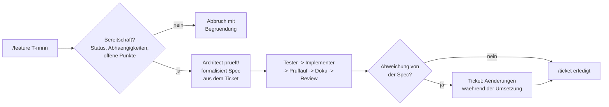

## Was

Bisher startete `/feature` mit einer Beschreibung in Prosa, und der Architekt entwarf Datenmodell,
API und Oberfläche jedes Mal neu – aus dem Nichts. Seit diesem Ticket liest `/feature <Ticket-ID>`
stattdessen eine bereits bestehende Spec aus `.claude/specs/`: Datenmodell, API-Vertrag, Oberfläche
und Akzeptanzkriterien stehen dort schon, weil sie im Ticketsystem vorgeklärt wurden. Vor jedem
weiteren Schritt prüft der Ablauf jetzt, ob das Ticket überhaupt bereit ist – existiert es, ist sein
Status passend, sind alle Abhängigkeiten erledigt, enthält ein Pflichtabschnitt noch offene Punkte?
Erst danach beginnt Design, Tests, Umsetzung, Prüflauf, Dokumentation und Review. Weicht die
Umsetzung begründet von der Spec ab, wird das nicht still hingenommen, sondern als Abschnitt
`## Änderungen während der Umsetzung` ins Ticket zurückgeschrieben.



## Warum

### Warum ein geprüftes Ticket statt einer frisch entworfenen Spec?

Der bisherige Ablauf ließ den Architekten bei jedem Aufruf neu entwerfen, obwohl das Ticketsystem
(`T-0001`) genau dafür gebaut wurde, Design vorzuklären. Das Ticket benennt den Widerspruch direkt:
„sonst wäre die Vorklärung des Wasserfalls wertlos". Ein Architekt, der ignoriert, was in der Spec
bereits steht, macht die gesamte vorgelagerte Klärungsarbeit – Datenmodell, API-Vertrag,
Akzeptanzkriterien – zu reiner Dokumentation ohne Wirkung auf den tatsächlichen Bau. Der neue
Skill-Text kehrt die Rolle deshalb um: Der Architekt **prüft und formalisiert** die Ticket-Spec gegen
ADRs und bestehenden Code, entwirft aber nicht mehr aus dem Nichts. Widerspricht der Ticket-Text
nachweislich einem ADR oder dem tatsächlichen Code-Stand, wird das im Design begründet und später ins
Ticket zurückgeschrieben – Fakten vor Ticket-Wortlaut, aber nie stillschweigend.

Der zweite Effekt ist eine verschwindende Fehlerquelle: Ohne verbindliche Spec konnte ein Feature am
Ende anders gebaut werden, als es ursprünglich gedacht war, ohne dass das irgendwo sichtbar wurde.
Mit der Spec als bindender Vorgabe **und** dem Rückschreib-Schritt für Abweichungen bleibt die
Ticket-Datei nach jedem Lauf der wahre, aktuelle Stand – nicht mehr nur die Absicht vor dem Bau.

### Warum wurde der im Ticket vorgesehene Trockenlauf-Plan nicht wörtlich befolgt?

Als das Ticket geschrieben wurde, war `T-0004` vermutlich noch offen und als kleiner,
risikoarmer Kandidat für den Nachweis von Kriterium 1 und 7 gedacht. Bis zur tatsächlichen
Umsetzung – Stand 8. September 2026 – war `T-0004` aber bereits `erledigt`: ein erneuter
`/feature T-0004`-Lauf wäre von der eigenen, gerade erst gebauten Bereitschaftsprüfung dieses Tickets
sofort mit „Status ist nicht bereit/in arbeit" abgelehnt worden. Der Ticket-Text war damit vom echten
Projektstand überholt – ein Plan, der beim Schreiben sinnvoll war, aber nicht mehr befolgbar ist, ohne
sich selbst zu widersprechen.

Statt trotzdem einen Trockenlauf zu erzwingen (etwa mit einem künstlichen Ersatzticket), griff der
Nachweis auf `T-0201` (Trick-Fortschritt/Trick-Tree) zurück: ein Ticket, das in **derselben Sitzung**
bereits real nach genau dem neuen Ablauf durchgearbeitet wurde – Bereitschaftsprüfung, Design, Tests,
Implementierung, Prüflauf, Dokumentation, Review, Abschluss über `check-tickets.py --set ...
erledigt` –, mit 157/157 grünen Tests und `FREIGABE` im Review. Der neue Skill-Text beschreibt exakt
diesen bereits gelaufenen Ablauf, nicht einen unbewiesenen. Ein bereits real erbrachter Nachweis
zählt mehr als ein künstlich wiederholter Durchlauf, der nur der Form wegen erneut liefe – derselbe
Grundsatz wie „Ergebnisse ehrlich berichten": ein zufällig veralteter Plan wird offen benannt statt
stillschweigend so getan, als sei er noch aktuell.

## Wie

Die Bereitschaftsprüfung sitzt jetzt als erster Schritt im Skill selbst, vor jedem Agenten-Aufruf –
vier Abbruchgründe, jeder mit eigener, sofort nennbarer Begründung:

```markdown
# .claude/skills/feature/SKILL.md:25-33
Abbruch mit klarer Begründung an Konrad, **kein** Schritt danach, wenn:
- das Ticket nicht existiert (`check-tickets.py --show` meldet das bereits),
- sein Status weder `bereit` noch `in arbeit` ist,
- eine Abhängigkeit aus `depends_on` nicht `erledigt` ist (`check-tickets.py --show <ID>` listet den
  Status jeder Abhängigkeit direkt mit),
- ein Pflichtabschnitt (`## Datenmodell`, `## API`, `## Akzeptanzkriterien`, sofern vorhanden) unter
  „Offene Punkte“ noch etwas nennt, das diesen Abschnitt blockiert.
```

Die Eingabe-Weiche davor entscheidet, ob überhaupt schon eine ID vorliegt. Eine Prosa-Beschreibung
erzeugt zuerst ein Ticket zur Bestätigung, statt direkt gebaut zu werden – „kein Feature ohne Spec"
gilt damit auch für den neuen Einstiegspunkt:

```markdown
# .claude/skills/feature/SKILL.md:12-20
| `$ARGUMENTS` | Wirkung |
|---|---|
| leer | `python3 .claude/specs/check-tickets.py --next`. Kein bereites Ticket → melden, nichts weiter tun. |
| eine Ticket-/Recherche-ID (`T-nnnn`, `R-nn`) | `python3 .claude/specs/check-tickets.py --show <ID>` |
| Beschreibung in Prosa | **Kein Feature ohne Spec.** Zuerst ein Ticket entwerfen ..., Konrad zur
  Bestätigung vorlegen, erst danach mit der bestätigten ID hier fortfahren. |
```

Der Architekt-Schritt trägt die neue Rollenbeschreibung direkt im Text: prüfen statt entwerfen, mit
explizitem Pfad für den begründeten Widerspruchsfall:

```markdown
# .claude/skills/feature/SKILL.md:44-52
**Die Spec ist bereits geklärt** (Datenmodell, API, Oberfläche, Akzeptanzkriterien stehen im Ticket) –
der Architekt prüft und formalisiert sie gegen ADRs und bestehenden Code, entwirft nicht aus dem
Nichts. Widerspricht der Ticket-Text nachweislich einem ADR, einer verbindlichen Konvention oder dem
tatsächlichen Stand des Codes ...: **nicht still übernehmen**. Die Abweichung im Design begründen und
in Schritt 8 ins Ticket zurückschreiben – Fakten und ADRs vor Ticket-Wortlaut, aber nie
stillschweigend.
```

Das Zurückschreiben selbst ist ein eigener, expliziter Schritt am Ende des Ablaufs, nicht Teil des
Reviews – damit er nicht vergessen werden kann, wenn das Review nur „FREIGABE" ohne weitere Punkte
zurückgibt:

```markdown
# .claude/skills/feature/SKILL.md:95-100
## 10. Abweichungen zurückschreiben (du selbst)
Weicht die Umsetzung begründet vom Ticket-Text ab ...: Ticket-Datei um einen
Abschnitt `## Änderungen während der Umsetzung` ergänzen (Datum, was, warum). Die Spec bleibt die
Wahrheit – eine stille Abweichung zwischen Ticket-Text und tatsächlichem Code ist ein Fehler, den
diese Zeile verhindert.
```

## Tests

Kein neuer Code in diesem Ticket – reine Prozess-/Skill-Änderung (Markdown-Text von
`.claude/skills/feature/SKILL.md` und `CLAUDE.md`), deshalb kein neuer automatisierter Test, sondern
Nachweis am echten System gegen alle sieben Akzeptanzkriterien:

| Prüffall | Beweist |
|---|---|
| Bereits real gelaufener Durchlauf `T-0201` (Bereitschaftsprüfung → Design → Tests → Implementierung → Prüflauf → Doku → Review → `erledigt`, 157/157 Tests grün) in derselben Sitzung, statt eines künstlichen Neu-Durchlaufs über das inzwischen bereits erledigte `T-0004` | Kriterium 1 |
| `check-tickets.py --show T-0204`: zwei Abhängigkeiten (`T-0202`, `T-0203`) als `offen` gelistet | Kriterium 2 |
| Scratch-Ticket `T-9998` mit offenem Punkt im Abschnitt `## API` (Statuscode bei leerem Ergebnis ungeklärt) | Kriterium 3 |
| `check-tickets.py --next`, in dieser Sitzung durchgehend als Einstieg genutzt (u. a. vor `T-0101`, `T-0602`, `T-0201`) | Kriterium 4 |
| Beispiel-Durchlauf `/feature Ein Tageslimit für Wasseraufnahme mit Warnhinweis` → Ticket-Entwurf statt direktem Bau | Kriterium 5 |
| Regel im Skill-Text (Schritt 10), gilt ab jetzt für neue Läufe; frühere Läufe derselben Sitzung hatten Abweichungen nur in `design.md`/`impl.md`/`tests.md`, nicht rückwirkend nachgetragen | Kriterium 6 |
| `T-0201` (zwei echte Test-Bugs nach erstem Implementer-Durchlauf, erst nach Behebung `erledigt`), `T-0104` (rot bleibender Async-Test, erst nach Behebung mit 147/147 `erledigt`) | Kriterium 7 |

Validiert am 10. September 2026, am echten System und mit Beispielfällen (vollständige Belege siehe
`.claude/specs/workspace/T-0006-feature-auf-ticketbetrieb.md`, Abschnitt „Ergebnisse").

## Lernpunkte

1. **Spezifikation vom Entwurf trennen, damit Vorklärung nicht wirkungslos bleibt** – ein
   Wasserfall-Schritt (Ticket/Spec klären) hat nur Wert, wenn der nachfolgende Schritt (Architekt)
   ihn tatsächlich als Eingabe nimmt statt ihn zu ignorieren und neu zu entwerfen. Vergleichbar mit
   einer Komponenten-Prop in Vue: Wird sie im Kind ignoriert und stattdessen intern neu berechnet,
   war das Definieren der Prop im Parent wirkungslos. [Vue-Props-Doku](https://vuejs.org/guide/components/props.html).
2. **Guard vor dem Start statt Prüfung mittendrin** – die Bereitschaftsprüfung läuft jetzt komplett
   vor Schritt 1 des eigentlichen Ablaufs, nicht verteilt über mehrere Stellen. Gleiches Muster wie
   eine `beforeRouteEnter`/`beforeLoad`-Guard-Funktion in Vue Router bzw. TanStack Router: eine
   Bedingung, die vor dem Betreten prüft, statt danach aufzuräumen.
3. **Rückschreiben als expliziter Schritt, nicht als Nebenwirkung des Reviews** – Schritt 10 im
   Skill-Text existiert eigenständig, damit ein Review, das nur „FREIGABE" ohne weitere Punkte
   zurückgibt, das Zurückschreiben nicht implizit auslässt. Ähnlich wie ein eigener `finally`-Block
   statt sich auf einen Seiteneffekt im `try`-Zweig zu verlassen.
4. **Ein bereits real erbrachter Nachweis zählt vor einem künstlich wiederholten** – statt einen
   inzwischen sinnlos gewordenen Trockenlauf-Plan (`T-0004`, längst `erledigt`) stur zu befolgen,
   wurde ein in derselben Sitzung bereits gelaufener, gleichwertiger Durchlauf (`T-0201`) als Beleg
   herangezogen. Entspricht dem Prinzip, einen bestehenden Test-Report wiederzuverwenden statt eine
   identische CI-Pipeline nur der Form wegen erneut zu triggern.
5. **Veraltete Annahmen im Ticket offen benennen statt still zu überschreiben** – der Doku-Eintrag
   und das Ticket selbst dokumentieren ausdrücklich, dass der ursprüngliche Testplan durch den
   Projektfortschritt überholt war, statt so zu tun, als sei er von Anfang an so gemeint gewesen.
   Dieselbe Ehrlichkeitsregel wie „Ergebnisse ehrlich berichten – nie grün behaupten, wenn ein Gate
   rot ist" aus den Workspace-Standards, nur angewandt auf einen Plan statt auf ein Testergebnis.
