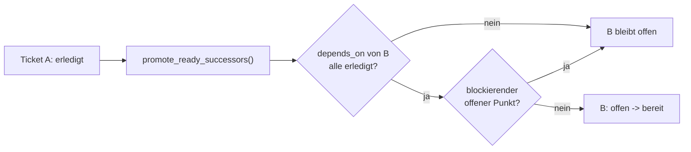

## Was

Bisher musste der Status eines Tickets (`offen` → `bereit` → `in arbeit` → `review` → `erledigt`) von
Hand nachgezogen werden. Seit diesem Ticket pflegt sich das Register selbst: `/feature` setzt beim
Start `in arbeit`, nach der Umsetzung `review`, nach bestandenem Review `erledigt` – und genau in
diesem letzten Schritt prüft eine neue Funktion automatisch, welche Nachfolger-Tickets dadurch
freigabefähig geworden sind, und schaltet sie von `offen` auf `bereit`. Der Sitzungsstart-Bericht
nennt zusätzlich liegengebliebene `in arbeit`-Tickets aus einer abgebrochenen früheren Sitzung sowie
Registerinkonsistenzen, ohne den Start jemals zu verhindern.



## Warum

Ein handgepflegtes Statusfeld läuft irgendwann auseinander – typischerweise mitten in einer längeren
Arbeitseinheit, wenn es unbequem wird, den Status noch nachzutragen. Ein Register, dem man nicht
trauen kann, ist schlechter als gar keins: `/ticket next` könnte ein Ticket vorschlagen, das in
Wirklichkeit schon läuft, oder eines, dessen Abhängigkeit nur scheinbar erledigt ist. Die Automatik
nimmt Konrad diese Buchhaltung komplett ab.

## Wie

Kern der Freischaltung ist `promote_ready_successors()` in `check-tickets.py`. Wird ein Ticket
`erledigt`, prüft die Funktion alle Tickets aus dessen `blocks`-Liste und schaltet nur die frei, deren
`depends_on` jetzt vollständig `erledigt` sind **und** die keinen blockierenden offenen Punkt haben:

```python
# .claude/specs/check-tickets.py:396-418
def promote_ready_successors(specs_dir, tickets, epics, completed_id):
    promoted = []
    for ref in tickets[completed_id].front.get("blocks", []):
        successor = tickets[ref]
        if successor.front.get("status") != "offen":
            continue
        if unmet_dependencies(successor, tickets, epics):
            continue
        if ticket_has_blocking_open_point(successor):
            continue
        set_ticket_status(successor.path, "bereit")
        promoted.append(ref)
    return promoted
```

Nur Tickets mit Status `offen` werden angefasst – ein Ticket auf `blockiert` oder `verworfen` bleibt
unverändert stehen, das ist eine bewusste Entscheidung, keine automatische.

Der zweite Teil ist die Erweiterung von `session-start.py`: Der Hook lädt `check-tickets.py` als
Python-Modul, ruft `check()` auf und listet alle Tickets mit Status `in arbeit`:

```python
# .claude/hooks/session-start.py:59-73
try:
    epics, tickets, errors = check_tickets.check(specs_dir)
    in_progress = sorted(t.id for t in tickets.values() if t.front.get("status") == "in arbeit")
    if in_progress:
        lines.append("ACHTUNG: Ticket(s) in 'in arbeit' aus frueherer Sitzung: " + ", ".join(in_progress))
    if errors:
        lines.append(f"Ticketsystem: {len(errors)} Inkonsistenz(en) - ...")
except Exception:
    pass
```

Der gesamte Block steckt in `try/except Exception: pass` – ein Fehler in der Ticketprüfung kann den
Sitzungsstart strukturell nicht verhindern, das entspricht direkt Vue-Router-Guards, die einen Fehler
im `beforeEach` abfangen statt die Navigation hart abzubrechen.

### Der eigentlich interessante Teil: fünf Erkennungslücken, die es schon vorher gab

`promote_ready_successors()` entscheidet, ob ein Nachfolger „blockierend offene Punkte" hat, über
`find_blocking_open_point()` – eine Funktion, die schon aus `T-0001` existierte und bisher nur von
`/feature`s Bereitschaftsprüfung genutzt wurde, direkt bevor ein Mensch (Konrad) den Output nochmal
gelesen hat. Als die neue Automatik anfing, dieselbe Funktion **ohne** menschlichen Blick dazwischen
auf den gesamten echten Ticketbestand loszulassen, tauchten fünf reale Fehlklassifikationen auf, die
vorher niemand bemerkt hatte:

1. **Dateiname als Abschnittsbezug fehlgedeutet** (`T-0301`): Der Satz „müsste zuerst in
   `DATENMODELL.md` nachgetragen werden" wurde als Blocker des Abschnitts „Datenmodell" gewertet,
   obwohl es sich um eine externe Spezifikationsdatei handelt, keinen offenen Punkt im eigenen
   Abschnitt.
2. **Satzübergreifende Vollständigkeits-Erklärung zerrissen** (`T-0303`, `T-0401`, `T-0501`): Ein
   Satz wie „Datenmodell, API-Vertrag und Profilregeln sind unabhängig davon vollständig" wurde durch
   einen weichen Zeilenumbruch mitten im Satz (typisch für lange Sätze in Ticket-Tabellenzellen) in
   zwei Hälften getrennt – keine der beiden Hälften trug danach noch beide nötigen Informationen
   (Abschnittsname + Vollständigkeits-Aussage), also griff die Entkräftung nicht.
3. **Verbform nicht erkannt** (`T-0203`): Die Prüfung erkannte nur „blockiert", nicht die Verbform
   „blockieren".

Alle vier Fälle wurden in `find_blocking_open_point()` behoben: Ein Regex-Grenzcheck
(`(?!\.\w+)`) schließt Dateiendungen wie `.md` als Wortgrenze aus, ein Normalisierungsschritt fasst
einzelne Zeilenumbrüche vor der Satzaufteilung zu Leerzeichen zusammen, und die Wortstamm-Suche nutzt
`"blockier"` statt der vollen Form. Ein fünfter Fall (`T-0503`) folgte keiner der beiden im Projekt
etablierten Entkräftungs-Formulierungen und wurde stattdessen redaktionell an die übrigen Tickets
angeglichen, statt die Heuristik für einen Einzelfall weiter zu verkomplizieren.

**Warum das vorher nie auffiel:** Ohne die neue Automatik wurde nie *programmatisch* geprüft, ob ein
`offen`-Ticket mit erfüllten Abhängigkeiten wirklich freigabefähig ist – dieser Pfad durch
`find_blocking_open_point()` lief zwar bei jeder `/feature`-Bereitschaftsprüfung, aber immer nur für
das eine Ticket, das gerade gestartet werden sollte, und mit einem Menschen, der das Ergebnis noch
sah. Die fünf Fehlklassifikationen lagen die ganze Zeit im Code, wurden aber nie in der Breite und nie
folgenreich genug ausgeführt, um aufzufallen – bis `promote_ready_successors()` dieselbe Funktion zum
ersten Mal automatisch und über den gesamten Ticketbestand hinweg entscheiden ließ, ohne dass jemand
zwischendrin nochmal hinsah. Ein gutes Beispiel dafür, dass neue Automatisierung oft alte Codepfade
zum ersten Mal wirklich unter Last bringt – nicht weil der Code sich geändert hätte, sondern weil ihn
plötzlich etwas beim Wort nimmt, das vorher niemand war.

## Tests

| Prüffall | Beweist |
|---|---|
| Fixture `nachfolger-freischalten-rot` (`.claude/specs/testdaten/`): Ticket A wird `erledigt`, Nachfolger B (hängt nur an A) wechselt auf `bereit` | Kriterium 4 |
| Dieselbe Fixture: Nachfolger C (hängt an A **und** D, D bleibt offen) bleibt unverändert auf `offen` | Kriterium 5 |
| `check_nachfolger_freischalten()` in `run_tests.py`, ruft `promote_ready_successors()` direkt gegen die kopierte Fixture auf, beide Assertions grün | Kriterien 4–5 |
| `T-0202` real auf `in arbeit` gesetzt, `python3 session-start.py` ausgeführt → Zeile „ACHTUNG: Ticket(s) in 'in arbeit' aus frueherer Sitzung: T-0202" erscheint, danach zurückgesetzt | Kriterium 6 |
| `check()` läuft im Sitzungsstart-Hook in `try/except Exception: pass`; Testfall mit `T-0301` temporär auf `bereit` (mit dem damals noch vorhandenen `DATENMODELL.md`-Bug) meldet „1 Inkonsistenz(en)", ohne die Sitzung zu unterbrechen | Kriterium 7 |
| Alle sechs real betroffenen Tickets (`T-0301`, `T-0303`, `T-0401`, `T-0501`, `T-0503`, `T-0203`) nach der Korrektur auf `bereit` gesetzt, `check-tickets.py --check` läuft fehlerfrei über den gesamten Ticketbestand | Realer Fund, siehe oben |

Ausführen: `python3 .claude/specs/testdaten/run_tests.py`. Vollständige Belege der Statuswechsel- und
Sitzungsstart-Kriterien: `.claude/specs/workspace/T-0005-ticket-status-automatik.md`, Abschnitt
„Ergebnisse".

## Lernpunkte

1. **Neue Automatisierung deckt alte, nie unter Last gelaufene Codepfade auf** – `find_blocking_open_point()`
   existierte schon seit `T-0001` und funktionierte in der Praxis „gut genug", solange ein Mensch das
   Ergebnis noch sah. Erst die programmatische Nutzung ohne menschlichen Zwischenschritt (`promote_ready_successors()`
   über den gesamten Ticketbestand) machte fünf Fehlklassifikationen sichtbar. Vergleichbar mit einem
   TypeScript-Utility-Type, der jahrelang nur für einen einzelnen, gutmütigen Aufrufer genutzt wurde und
   erst bricht, sobald ein zweiter, generischerer Call-Site ihn tatsächlich ausreizt.
2. **Satzweise statt abschnittsweise prüfen, wenn ein Satz gleichzeitig nennen und entkräften kann** –
   ein Text wie „Datenmodell, API-Vertrag und Akzeptanzkriterien sind unabhängig davon vollständig"
   lässt sich nicht korrekt einordnen, wenn man über den gesamten Abschnitt nach den Wörtern
   „blockiert" und „vollständig" sucht: Ein Treffer irgendwo im Text würde jeden anderen Treffer
   fälschlich neutralisieren oder bestätigen. `find_blocking_open_point()` teilt deshalb erst in
   Sätze auf, ähnlich wie man in TS eine Validierungsfunktion pro Feld statt einmal über das ganze
   Objekt schreibt, damit ein einzelnes falsches Feld nicht das Ergebnis für alle anderen verfälscht.
3. **Ein weicher Zeilenumbruch ist in Markdown-Fließtext meist kein Satzende** – lange Sätze in
   Ticket-Tabellenzellen werden beim Schreiben oft mitten im Satz umgebrochen. Die Korrektur
   normalisiert einzelne `\n` zu Leerzeichen, bevor sie in Sätze aufteilt, und behält doppelte `\n`
   (echte Absatzenden) als Trenner. Ähnliches Prinzip wie `white-space: pre-line` in CSS, das
   einzelne Zeilenumbrüche im Quelltext ignoriert, aber Leerzeilen als Absatz behandelt.
4. **Wortgrenzen-Regex reicht nicht, wenn Dateinamen wie Bezeichner aussehen** – `\bDatenmodell\b`
   trifft sowohl auf den Abschnittsnamen als auch auf `DATENMODELL.md`. Der Fix ergänzt einen
   negativen Lookahead (`(?!\.\w+)`), der eine Dateiendung direkt nach dem Treffer ausschließt.
   Entspricht demselben Muster wie ein Regex, der eine Domain von einer vollen URL unterscheiden muss.
5. **Nicht jede Inkonsistenz verdient eine allgemeine Regel** – der fünfte Fall (`T-0503`) folgte
   keiner der beiden etablierten Formulierungen und wurde stattdessen redaktionell angeglichen statt
   die Heuristik für einen Einzelfall weiter zu verkomplizieren. Vergleichbar mit der Entscheidung, einen
   einzelnen abweichenden Testfall an die Konvention der Suite anzupassen, statt die Testinfrastruktur
   um einen Sonderfall zu erweitern, der sonst nirgends gebraucht wird.
6. **Ein Guard, der nichts verändert und nie blockiert, gehört in `try/except Exception: pass`** – der
   Sitzungsstart-Bericht ruft `check()` rein informativ auf; ein Fehler darin darf die Sitzung
   strukturell nicht verhindern. Dasselbe Muster wie ein Analytics-Aufruf in einem Vue-`onMounted`-Hook,
   der in ein eigenes `try/catch` gehört, damit ein Tracking-Fehler nie das Rendern der Komponente
   verhindert.
