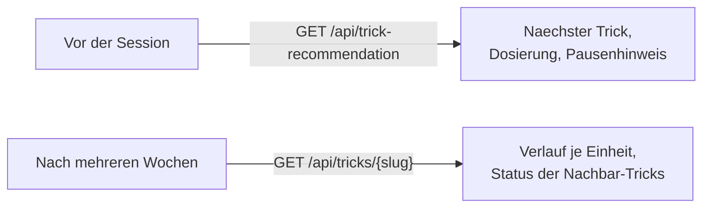

## Was

`sk8-backend` bekommt zwei neue, nur lesende Endpunkte. `GET /api/tricks/{slug}` zeigt zu einem
einzelnen Trick alles, was der Trick-Tree aus `T-0201` nicht zeigt: Beschreibung, den vollständigen
Verlauf je Einheit (bis zu 100, neueste zuerst) und den Status der direkten Voraussetzungen und
Freischaltungen. `GET /api/trick-recommendation` beantwortet die Frage vor der Session: welcher Trick
als Nächstes, wie viele Versuche und Minuten, und ob heute besser kürzergetreten oder pausiert werden
sollte. Beide Endpunkte lesen denselben Trick-Katalog-Schnappschuss wie `/api/trick-tree` und lösen
dieselbe Schreib-Nebenwirkung auf `trick_progress` aus (siehe Eintrag 0016) – kein eigener Datenpfad,
keine Migration.



## Warum

Die Empfehlung hätte ein Modellaufruf sein können – ist es bewusst nicht. `ADR-010` legt für
KI-Aufrufe „kleinstes ausreichendes Modell, cachen, batchen" fest, weil jeder Aufruf Geld kostet. Diese
Regel unterbietet das: sie kostet **nichts**, läuft in Millisekunden, offline, und jeder Vorschlag lässt
sich aus vier Zahlen (Status, `goalOrder`, `difficulty`, `recentSuccessRate`) nachvollziehen, ohne einen
Prompt oder ein Modell-Log zu lesen. Das Ticket macht diesen Tausch – begründbare Regel statt
unbegründbarer Modellausgabe – explizit zur Bedingung: „Ein externer Modellaufruf würde hier eine
begründbare Regel gegen eine nicht begründbare Ausgabe tauschen."

Die zweite Design-Entscheidung betrifft den Klassenschnitt der Empfehlungslogik. Das Ticket nennt nur
eine Klasse `TrickRecommender` für Konstanten und Text-Auswahlregeln zugleich, mit der Begründung, Text
und Regel „gehören zusammen". Umgesetzt wurde das auf drei Klassen verteilt – `RecommendationReason`,
`PauseHint`, `TrickRecommendationPolicy` – weil genau diese drei Einheiten schon durch die vom Tester
vorab benannten Testdateien (`RecommendationReasonTest`, `PauseHintTest`, `TrickRecommenderTest`)
unabhängig voneinander testbar sein mussten. `RecommendationReason` und `PauseHint` behalten trotzdem
je „Text + Auswahlregel zusammen" (Ticket-Prinzip erfüllt), nur die sechs **numerischen** Schwellenwerte
liegen separat in `TrickRecommendationPolicy`, weil mehrere Regeln dieselben Zahlen lesen
(`RecommendationReason` liest `MASTERY_RATE`, `PauseHint` liest `PAUSE_KNEE_PAIN`).

## Wie

**1. Ein gemeinsamer Einstiegspunkt für drei Endpunkte statt drei Implementierungen.**
`/api/trick-tree`, `/api/tricks/{slug}` und `/api/trick-recommendation` brauchen alle denselben ersten
Schritt: Katalog laden, Aggregate berechnen, Status auflösen, `trick_progress` fortschreiben. Bisher
steckte das komplett in `TrickTreeService::build()`. Extract Method zieht genau diesen Teil in eine
eigene Methode, die drei DTO/Response-freie Werte statt einer fertigen HTTP-Antwort liefert:

```php
// src/Service/Trick/TrickTreeService.php:65-84
public function currentSnapshot(): TrickCatalogSnapshot
{
    $tricks = $this->trickRepository->findAllOrdered();
    $aggregates = $this->trickProgressRepository->aggregatesByTrickId();
    $recentSessions = $this->trickProgressRepository->recentSessionsByTrickId(...);
    // ... Aggregate + Voraussetzungen zu $stats zusammenfuehren ...
    $statuses = $this->statusResolver->resolveAll($stats, $prerequisiteIdsByTrickId);
    // Schreibnebenwirkung: legt/aktualisiert trick_progress fuer jeden Trick
    $progressRows = $this->refresher->refresh($tricks, $statuses, $stats);

    return new TrickCatalogSnapshot($tricks, $statuses, $stats, $progressRows);
}
```

`build()` selbst ruft jetzt nur noch `currentSnapshot()` auf und baut daraus die
`/api/trick-tree`-spezifische Antwortform – byte-identisch zu vorher, reiner Refactor. Genau dasselbe
Objekt konsumieren `TrickDetailService::detail()` und `TrickRecommender::recommend()` – jeweils mit
ihrem eigenen Blick auf `tricks`/`statuses`/`stats`/`progressRows`.

**2. Eine Lücke in der Ticket-eigenen Entscheidungstabelle, gefunden durch Durchrechnen, nicht durch
Lesen.** Das Ticket beschreibt vier `reasonCode`-Zeilen; die dritte lautet „`uebe`, `recentSuccessRate`
≥ `MASTERY_RATE`, **aber weniger als `MASTERY_SESSIONS` qualifizierende Einheiten**". Ein konkretes
Zahlenbeispiel zeigt, dass diese Zeile eine Lücke lässt: drei Einheiten mit je 20 Versuchen, 16/14/16
gelandet (Raten 0,80/0,70/0,80) sind alle drei einzeln über `MASTERY_MIN_ATTEMPTS` (15) qualifiziert –
also **nicht** „weniger als drei qualifizierend" –, aber die mittlere Einheit (0,70) liegt unter
`MASTERY_RATE` (0,75), sodass `isMastered()` `false` bleibt und der Trick `uebe` bleibt. Trotzdem ist
die **gepoolte** Quote 46/60 = 0,767 ≥ 0,75. Für diesen Fall trifft laut Wortlaut keine der vier Zeilen
zu. Implementiert ist deshalb eine lückenlose Vereinfachung, die für jeden vom Ticket tatsächlich
beschriebenen Fall dasselbe Ergebnis liefert und diesen Grenzfall auf `consolidate` abbildet:

```php
// src/Service/Trick/RecommendationReason.php:42-57
public static function forCandidate(TrickStatus $status, ?float $recentSuccessRate): self
{
    if (TrickStatus::Ready === $status) {
        return new self('ready_to_start', self::READY_TO_START_TEXT);
    }
    if (null === $recentSuccessRate) {
        return new self('no_data', self::NO_DATA_TEXT);
    }
    // Die Ticket-Klausel "< MASTERY_SESSIONS qualifizierend" entfaellt hier bewusst -
    // sie liess genau den Fall oben ohne reasonCode.
    if ($recentSuccessRate >= TrickProgressPolicy::MASTERY_RATE) {
        return new self('consolidate', self::CONSOLIDATE_TEXT);
    }
    return new self('almost_landed', self::ALMOST_LANDED_TEXT);
}
```

Ein eigener Testfall (`RecommendationReasonTest::testItReturnsConsolidateForThreeIndividuallyInconsistentButPooledStrongSessions`)
rechnet genau dieses Beispiel nach, statt nur die vier „glatten" Fälle aus dem Ticket zu prüfen.

**3. Kalendertage zählen, nicht Einheiten.** `SkateSessionLoadRepository::consecutiveSessionDays()`
lädt alle unterschiedlichen `session_date`-Werte per `SELECT DISTINCT` und läuft dann in PHP rückwärts:

```php
// src/Repository/SkateSessionLoadRepository.php:60-85 (gekuerzt)
public function consecutiveSessionDays(\DateTimeImmutable $today): int
{
    $rows = $this->entityManager->createQuery(
        'SELECT DISTINCT ss.sessionDate AS sessionDate FROM App\Entity\SkateSession ss'
    )->getResult();
    // DISTINCT: zwei Einheiten am selben Tag liefern denselben Schluessel,
    // zaehlen also nur einmal - der Grenzfall aus dem Ticket.
    $sessionDays = [/* Set aus 'Y-m-d'-Schluesseln */];

    $cursor = $today;
    if (!isset($sessionDays[$cursor->format('Y-m-d')])) {
        $cursor = $cursor->modify('-1 day'); // heute noch keine Einheit -> ab gestern zaehlen
    }
    $count = 0;
    while (isset($sessionDays[$cursor->format('Y-m-d')])) {
        ++$count;
        $cursor = $cursor->modify('-1 day'); // eine Luecke von einem Tag bricht sofort ab
    }
    return $count;
}
```

Verworfen wurde eine SQL-Fensterfunktion (`ROW_NUMBER()`/`LAG()`-Gruppierungstrick für „längste
Tagesfolge"): Postgres hat keine eingebaute Funktion dafür, und bei einem Nutzer mit realistisch
weniger als 1000 Zeilen im Jahr ist eine zehnzeilige, lesbare PHP-Schleife die wartbarere Wahl als eine
schwer lesbare SQL-Konstruktion für eine Zahl, die bei `PAUSE_CONSECUTIVE_DAYS = 2` ohnehin nach
spätestens ein paar Tagen abbricht.

**4. Eine dritte Kopie derselben Berechnung vermieden.** „Gepoolte Erfolgsquote über die jüngsten
qualifizierenden Einheiten" existierte bereits zweimal privat: in `TrickStatusResolver::isMastered()`
und in `TrickTreeNode::recentSuccessRate()`. `T-0202` hätte sie ein drittes Mal gebraucht – für
`progress.recentSuccessRate` **und** für die `reasonCode`-Schwelle oben. Beide Methoden wandern jetzt
auf `TrickAggregateStats`, den Wertetyp, der `recentSessions` ohnehin schon kennt:

```php
// src/Service/Trick/TrickAggregateStats.php:37-64 (gekuerzt)
public function qualifyingSessions(): array
{
    return array_values(array_filter(
        $this->recentSessions,
        static fn (array $s): bool => $s['attempts'] >= TrickProgressPolicy::MASTERY_MIN_ATTEMPTS,
    ));
}

public function recentSuccessRate(): ?float
{
    $qualifying = $this->qualifyingSessions();
    if ([] === $qualifying) {
        return null; // "keine qualifiziert", nicht "weniger als drei" - eigene Regel, siehe Lernpunkt 3
    }
    $window = \array_slice($qualifying, 0, TrickProgressPolicy::MASTERY_SESSIONS);
    return SessionMetrics::successRate(
        (int) array_sum(array_column($window, 'attempts')),
        (int) array_sum(array_column($window, 'landed')),
    );
}
```

`TrickStatusResolver::isMastered()` und `TrickTreeNode::fromTrick()` rufen jetzt beide diese eine
Stelle auf; `/api/trick-tree`s Antwort bleibt dabei byte-identisch zu vorher – ein reiner
Extract-Method-Schnitt, keine Verhaltensänderung.

**5. `TrickProgressRefresher::refresh()` liefert jetzt eine Zeile pro Trick zurück, nicht nur `void`.**
`TrickDetailResponse.progress.updatedAt` braucht die persistierte `trick_progress`-Zeile (nicht nur die
abgeleiteten Zahlen). Ohne diese Änderung hätte `TrickCatalogSnapshot` eine zweite, identische Abfrage
direkt nach `refresh()` gebraucht, nur um dieselben Zeilen erneut zu laden:

```php
// src/Service/Trick/TrickProgressRefresher.php:46-71 (Signatur)
public function refresh(array $tricks, array $statuses, array $stats): array // vorher: void
{
    // ... wie zuvor, zusaetzlich: $existing[$trickId] = $row; vor dem return ...
    return $existing; // array<string, TrickProgress>, inkl. neu angelegter Zeilen
}
```

Vor der Änderung per `grep` über `src/` und `tests/` geprüft: genau ein Aufrufer
(`TrickTreeService::currentSnapshot()`) und ein Testaufrufer
(`tests/Functional/Service/Trick/TrickProgressRefresherTest.php`), der den Rückgabewert nirgends
auswertet – beide bleiben grün, ohne angepasst zu werden.

**Zwei defekte Testassertionen, gemeldet statt eigenmächtig entschärft.** Vier Testmethoden prüften
`assertNull($x['key'] ?? 'MISSING')` – dasselbe `??`-Muster, das schon in Eintrag 0016 einen Test
unbrauchbar machte, diesmal in vier neuen Methoden. Der Implementer hat das gemeldet statt die
Assertion selbst abzuschwächen; im Review wurde `??` durch das etablierte
`assertArrayHasKey('key', $arr); assertNull($arr['key'])`-Muster ersetzt – danach lief `make check`
vollständig grün: phpstan Level max ohne Meldungen, cs-fixer 0 von 129 Dateien, PHPUnit grün.

## Tests

| Testdatei | Beweist |
|---|---|
| `tests/Unit/Service/Trick/TrickRecommenderTest.php` | Rangfolge (Kriterien 6–9): `uebe` vor `bereit`, stabile Sortierung bei Gleichstand, Begrenzung auf `FOCUS_LIMIT`, leerer/gesperrt-oder-sitzt-Kandidatenkreis |
| `tests/Unit/Service/Trick/RecommendationReasonTest.php` | Alle vier `reasonCode`-Zweige, inklusive des oben beschriebenen Lückenfalls |
| `tests/Unit/Service/Trick/PauseHintTest.php` | Kriterien 10–12: Vorrang Knie vor Tagesfolge, Lücke bricht die Folge |
| `tests/Functional/Api/TrickDetailTest.php` | Kriterien 1–5, 13: Antwortform, Verlaufssortierung, 404 für unbekannten/ungültigen Slug, 401 |
| `tests/Functional/Api/TrickRecommendationTest.php` | Kriterien 6, 8–10, 13 am echten HTTP-Vertrag, inklusive der bestätigten `dosage`-Werte |
| `tests/Functional/Repository/SkateSessionLoadRepositoryTest.php` | `consecutiveSessionDays()` zählt Kalendertage, nicht Einheiten – zwei Einheiten an einem Tag ergeben einen Tag |

Ausführen: `make check` (phpstan Level max, cs-fixer dry-run, phpunit). Ergebnis nach Behebung der
beiden Test-Bugs: **211 Tests, 2024 Assertions, OK** – alle 157 zuvor bestehenden Tests
(`TrickStatusResolverTest`, `TrickTreeTest`, `TrickProgressRefresherTest` eingeschlossen) blieben ohne
Anpassung grün.

## Lernpunkte

1. **Extract Method über eine Read-Pfad-Grenze hinweg.** `TrickTreeService::currentSnapshot()`
   (`src/Service/Trick/TrickTreeService.php:65`) ist der Teil von `build()`, den zwei weitere Endpunkte
   brauchen, ohne `/api/trick-tree`s HTTP-Antwortform zu kennen. Kein PHP-spezifisches Feature, sondern
   dieselbe Motivation wie ein [Vue-Composable](https://vuejs.org/guide/reusability/composables.html):
   laut Vue-Doku kapselt ein Composable „stateful logic" (hier: eine Schreibnebenwirkung plus mehrere
   Ladeschritte), damit mehrere Components – hier: Endpunkte – sie ohne Kopie teilen. Der Unterschied:
   der Seiteneffekt (schreiben) reist mit der Extraktion mit, nicht nur die Berechnung.
2. **Typisierte Klassenkonstanten seit PHP 8.3.** `TrickRecommendationPolicy::FOCUS_LIMIT`
   (`src/Service/Trick/TrickRecommendationPolicy.php:24`) ist als `public const int` deklariert. Laut
   [PHP-Handbuch zu Klassenkonstanten](https://www.php.net/manual/en/language.oop5.constants.php)
   können Klassenkonstanten „seit PHP 8.3.0" einen skalaren Typ wie `int` tragen – ein Tippfehler
   (z. B. ein versehentlicher String) wird dann zum `TypeError`, nicht erst zur Laufzeit an einer
   späteren Stelle sichtbar. Vergleichbar mit einem TS-Objekt `as const` plus explizitem Typ statt
   eines untypisierten `export const FOCUS_LIMIT = 2`.
3. **Eine Entscheidungstabelle kann vollständig aussehen und trotzdem eine Lücke haben.** Die
   `reasonCode`-Lücke in `RecommendationReason::forCandidate()` (`src/Service/Trick/RecommendationReason.php:42`)
   fällt nicht beim Lesen auf, sondern erst beim Durchrechnen eines konkreten Zahlenbeispiels (drei
   individuell inkonsistente, aber gepoolt starke Einheiten). Dass ein `if`-Baum ohne `default`-Zweig
   für `mixed`-Werte überhaupt auffällt, bestätigt laut den
   [PHPStan-Regel-Levels](https://phpstan.org/user-guide/rule-levels) erst eine hohe Analyse-Stufe: Level
   9 (`level max`) verschärft die Prüfung von `mixed`-Typen zusätzlich zur Dead-Code-Erkennung ab Level
   4. Ähnlich wie eine `switch`-Anweisung über eine TS-Discriminated-Union, die der Compiler erst bei
   striktem `exhaustiveness checking` als unvollständig meldet – Lesen allein hätte auch dort die Lücke
   nicht garantiert gefunden.
4. **`SELECT DISTINCT` plus eine PHP-Schleife statt SQL-Fensterfunktion.**
   `SkateSessionLoadRepository::consecutiveSessionDays()` (`src/Repository/SkateSessionLoadRepository.php:60`)
   nutzt DQL nur, um alle unterschiedlichen Tage zu holen – laut
   [Doctrine-Doku zur DQL](https://www.doctrine-project.org/projects/doctrine-orm/en/current/reference/dql-doctrine-query-language.html)
   eliminiert `DISTINCT` doppelte Zeilen im Ergebnis, hier: zwei Einheiten am selben Tag werden zu einem
   Eintrag. Die eigentliche „aufeinanderfolgende Tage"-Logik bleibt in PHP statt in SQL, eine bewusste
   YAGNI-Entscheidung bei kleiner Datenmenge. Vergleichbar mit einer Prisma-`findMany({distinct: [...]})`-Abfrage,
   deren Ergebnis anschließend im Anwendungscode weiterverarbeitet wird statt in einer komplexeren
   SQL-Abfrage.
5. **Rückgabetyp einer bestehenden Methode sicher erweitern, statt eine Abfrage zu duplizieren.**
   `TrickProgressRefresher::refresh()` wechselt von `void` zu `array<string, TrickProgress>`
   (`src/Service/Trick/TrickProgressRefresher.php:46`). Laut
   [PHP-Handbuch zu Typdeklarationen](https://www.php.net/manual/en/language.types.declarations.php)
   ist ein Aufrufer nie gezwungen, einen Rückgabewert zu verwenden – ein bestehender Aufruf, der bisher
   nichts mit dem `void`-Ergebnis anfing, bricht durch die Erweiterung nicht. Anders als in TypeScript,
   wo der Compiler bei so einer Signaturänderung jede betroffene Aufrufstelle strukturell prüft, gibt es
   in PHP keine automatische Garantie dafür – der risikoarme Weg ist ein manuelles `grep` über den
   gesamten Aufruferkreis, wie hier über `src/` und `tests/` gemacht.

---

**Fertig, wenn erfüllt:** Beide Endpunkte sind umgesetzt, per `X-Api-Key` geschützt und in `/api/doc`
dokumentiert; die Rangfolge ist bei gleichen Eingaben wiederholbar (Kriterium 7); der Pausenhinweis
unterscheidet Kalendertage von Einheiten; alle Empfehlungsgründe und Pausentexte stammen aus `R-02` mit
Fundstellen-Kommentar; `make check` ist grün.
