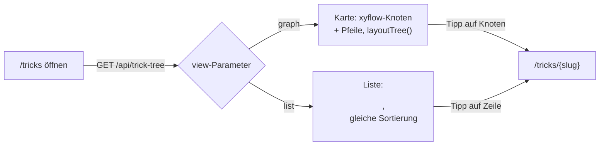

## Was

„Tricks" zeigte bisher nur einen Platzhalter. Jetzt lädt `/tricks` den kompletten Baum aus
`GET /api/trick-tree`: jeder Trick erscheint als Karte mit Name und Status (Farbe, Symbol und Text
zugleich – nie Farbe allein), Voraussetzungen als Pfeile zwischen den Karten. Wer den Graph auf dem
Telefon unhandlich findet oder einen Screenreader nutzt, tippt auf „Liste" und sieht dieselben Daten als
Zeilen mit Erfolgsquote, letztem Übungstag und – bei gesperrten Tricks – den noch fehlenden
Voraussetzungen. Die Wahl zwischen Karte und Liste sowie der Filter „Gesperrte zeigen" stehen als
typisierte Adressparameter in der URL und bleiben nach Vor-/Zurück-Navigation erhalten. Ein Tipp auf
einen Trick öffnet `/tricks/{slug}` – ein Platzhalter bis zum nächsten Ticket.



## Warum

`ADR-003` legt `@xyflow/react` für die „visuelle Progressionskarte" aus der Produktspezifikation fest –
diese Bibliothek ist primär maus-/touchgesteuert und bietet keine Tastaturnavigation zwischen Knoten.
Eine zweite Darstellung derselben Daten als `<ul>` ist deshalb keine Notlösung, sondern die einzige für
Screenreader nutzbare Ansicht des Screens; sie kostet wenig, weil beide Ansichten aus einem Datensatz
und derselben Statuskomponente entstehen.

Zwei Design-Entscheidungen weichen bewusst vom Ticket-Wortlaut ab, beide mit einer Begründung, die im
Repo selbst nachprüfbar ist:

1. **Verzeichnis- statt Punkt-Routing.** Das Ticket verlangte flache Dateien
   (`tricks.index.tsx`/`tricks.$slug.tsx`). Im selben Repo liegen mehrteilige Sektionen aber bereits als
   Verzeichnis (`src/routes/sessions/index.tsx`, `sessions/$sessionId/index.tsx`, …) – eine zweite,
   inkonsistente Routing-Konvention hätte keinen fachlichen Vorteil gehabt. Umgesetzt:
   `src/routes/tricks/index.tsx` und `src/routes/tricks/$slug.tsx`.
2. **Eine zusätzliche Normalisierungsschicht `status.ts`.** Der von `pnpm gen:api` generierte Typ
   `TrickTreeNode.status` ist nur ein loses `string`, weil die Backend-OpenAPI-Annotation kein `enum`
   an dieser Stelle trägt (siehe unten, Lernpunkt 5). Das Ticket ging von einem literalen Status-Typ
   aus, den der Vertrag tatsächlich nicht liefert.

## Wie

**1. Verzeichnis-Routing statt Punkt-Dateien.** `src/routes/tricks/index.tsx` registriert
`validateSearch` und rendert den Screen; `src/routes/tricks/$slug.tsx` ist ein Platzhalter, der nur
existiert, damit `to="/tricks/$slug"` schon jetzt typgeprüft ist:

```tsx
// src/routes/tricks/index.tsx
import { createFileRoute } from "@tanstack/react-router";
import { TrickTreeScreen } from "@/features/tricks/components/TrickTreeScreen";
import { trickTreeSearchSchema } from "@/features/tricks/schema";

export const Route = createFileRoute("/tricks/")({
  validateSearch: trickTreeSearchSchema, // zod statt manuellem Parsing der Query-Objekte
  component: TrickTreeScreen,
});
```

**2. Adressparameter statt Store.** `search.ts` validiert `view` und `showLocked` mit `.catch()`, nicht
`.parse()` – ein ungültiger Wert in der Adresse (z. B. ein manuell editiertes `view=foo`) fällt auf den
Standard zurück, statt die ganze Route scheitern zu lassen:

```ts
// src/features/tricks/schema.ts
export const trickTreeSearchSchema = z.object({
  view: z.enum(["graph", "list"]).catch("graph"), // ungueltiger Wert -> Standardansicht
  showLocked: z.boolean().catch(true),            // statt Route-Fehler bei kaputter Adresse
});
```

Der einzige Oberflächenzustand dieses Screens sind diese zwei Parameter – kein Zustand-Store, weil beide
Werte ohnehin in die Adresse gehören (Zurücknavigieren muss die Ansicht wiederherstellen, Kriterium 3).

**3. `layoutTree()` ordnet Knoten defensiv, ohne DOM.** Die Kernregel ist einfach: Ein Trick liegt eine
Ebene unter seiner tiefsten Voraussetzung. Interessant ist der Fallback, falls die Berechnung nicht
terminiert – laut Fachlichkeit (EPIC-01) unmöglich, aber nicht durch das TypeScript-Typsystem
ausgeschlossen:

```ts
// src/features/tricks/layout.ts:50-76 (gekuerzt)
function computeDepths(nodes, prerequisitesBySlug) {
  const depths = new Map(nodes.map((node) => [node.slug, 0]));

  for (let iteration = 0; iteration < nodes.length; iteration += 1) {
    let changed = false;
    for (const node of nodes) {
      const prerequisites = prerequisitesBySlug.get(node.slug);
      if (!prerequisites?.length) continue;
      const deepest = Math.max(...prerequisites.map((s) => depths.get(s) ?? 0));
      if (deepest + 1 !== depths.get(node.slug)) {
        depths.set(node.slug, deepest + 1); // Ebene um eins erhoehen
        changed = true;
      }
    }
    if (!changed) break; // stabil erreicht: fertig, egal ob azyklisch oder nicht
  }

  return depths; // bei einem Zyklus laeuft die Schleife bis zur Obergrenze durch
}
```

Die äußere Schleife läuft höchstens `nodes.length`-mal – bei echten (azyklischen) Daten stabilisiert sie
sich viel früher über `changed`, bei einem hypothetischen Zyklus wächst die Tiefe jede Runde weiter und
die Schleife bricht trotzdem nach der Obergrenze ab. Jeder Knoten bekommt so garantiert eine Position,
statt die Funktion hängenzulassen oder abstürzen zu lassen (Kriterium 12) – ein Absturz wäre laut
`design.md` schlechteres Verhalten als eine plausible Ersatz-Ebene bei fachlich unmöglichen, aber nicht
ausgeschlossenen Daten.

**4. Die Statuslücke im generierten Typ bekommt eine eigene, kleine Normalisierungsschicht.**
`schema.d.ts` liefert `TrickTreeNode.status` als `string`, weil die Backend-Annotation kein `enum`
trägt. Ein unbekannter künftiger Wert soll den Screen nicht zum Absturz bringen:

```ts
// src/features/tricks/status.ts:22-27
export function toTrickStatus(raw: string): TrickStatus {
  if ((KNOWN_STATUSES as readonly string[]).includes(raw)) {
    return raw as TrickStatus; // bekannter Wert: unveraendert durchreichen
  }
  return "gesperrt"; // unbekannter Wert: sicherster, sichtbarer Fallback statt Crash
}
```

`TrickStatusBadge`, Graph-Knoten und Liste rufen ausschließlich `toTrickStatus()` + `TRICK_STATUS_META`
auf – die Statustabelle (Farbe, Symbol, Text) steht damit genau einmal im Code, nicht dreifach.

**5. Ein echter Bug in der bereits fixierten Testdatei, im Review gefunden und korrigiert.**
`ux.md` schreibt für den Umschalter Karte/Liste explizit `type="single"` vor – das ist eine bewusste
Barrierefreiheits-Entscheidung: Eine sich gegenseitig ausschließende Wahl ist semantisch eine
Radiogruppe, kein unabhängiges Werkzeugleisten-Toggle. Der Tester hatte das nicht in die
Rollen-Erwartung übersetzt und stattdessen `role="button"`/`pressed` abgefragt; die erste
Implementierung übernahm still `type="multiple"` mit eigener Exklusivitätslogik, um genau diese
(falsche) Testerwartung zu erfüllen – eine Design-Entscheidung der UX-Rolle wurde damit stillschweigend
verworfen, um einen Test mit der falschen ARIA-Rolle zu bestehen. Im Review korrigiert:

```tsx
// src/features/tricks/components/TrickTreeScreen.tsx:105-117 (gekuerzt)
<ToggleGroup
  type="single"                 // radiogroup/radio-Semantik (Radix), nicht toolbar/button
  value={search.view}
  onValueChange={handleViewChange}
>
  <ToggleGroupItem value="graph" data-track="tricks.view-graph">Karte</ToggleGroupItem>
  <ToggleGroupItem value="list" data-track="tricks.view-list">Liste</ToggleGroupItem>
</ToggleGroup>
```

Radix ruft bei `type="single"` `onValueChange("")` auf, wenn der bereits aktive Eintrag erneut angeklickt
wird (Deselektion); `handleViewChange` ignoriert diesen Fall bewusst, statt auf „keine Ansicht" zu
fallen. Nach der Korrektur wurden die fünf betroffenen Testassertionen von `role: "button", pressed` auf
`role: "radio", checked` umgestellt – der Implementierungscode musste sich nicht mehr verbiegen.

**6. Ansage statt Fokusklau beim Umschalten.** `ux.md` verlangt eine sichtbare Rückmeldung für
Screenreader-Nutzer, ohne einen Zurück-Navigations-Tipp im Browser ungefragt Fokus stehlen zu lassen –
deshalb löst nicht `search.view` selbst (per `useEffect`) die Ansage aus, sondern ausschließlich der
Klick-Handler:

```tsx
// src/features/tricks/components/TrickTreeScreen.tsx:48-64 (gekuerzt)
function handleViewChange(nextValue: string) {
  if (nextValue !== "graph" && nextValue !== "list") return; // Radix-Deselektion ignorieren
  if (nextValue === "list") shouldFocusListRef.current = true; // nur Richtung Liste fokussieren
  setAnnouncement(nextValue === "list" ? "Ansicht: Liste." : "Ansicht: Karte."); // sr-only Live-Region
  navigate({ search: (previous) => ({ ...previous, view: nextValue }) });
}
```

Die Ansage sitzt in einem visuell versteckten `<p role="status" aria-live="polite">`. Fokus wandert nur
in die `<ul>`, nicht in den Graph-Container: Der Graph ist für Tastaturnutzer eine Sackgasse, ein
Screenreader-Nutzer wäre dort gefangen.

**Nebenbei erledigt, nicht Kern dieses Tickets:** `pnpm gen:api` lief vorab gegen den laufenden
Backend-Container, damit `schema.d.ts` `TrickTreeNode`/`TrickTreeEdge`/`TrickTreeResponse` überhaupt
kennt. Die vier neuen shadcn-Komponenten (`skeleton`, `alert`, `switch`, `toggle`/`toggle-group`) wurden
danach mit `/sync-frontends` byte-identisch nach `sk8-nutrition` und `sk8-habits` gespiegelt; beide Apps
liefen anschließend unverändert mit 59 Tests grün.

## Tests

| Testdatei | Beweist |
|---|---|
| `src/features/tricks/layout.test.ts` | Kriterien 11–12: Ebenen-Layout, stabile Sortierung, Determinismus, Zyklusfestigkeit; Datengrundlage für „Braucht noch: {namen}" |
| `src/features/tricks/format.test.ts` | Kriterien 4–5: Erfolgsquoten-Text inkl. Rundung und Leerfall, deutsches Datum |
| `src/features/tricks/components/TrickTreeScreen.test.tsx` | Kriterien 1–3, 6–10, 13 sowie ux.md §7.2 (Ansage/Fokus beim Umschalten) und die `data-track`-Werte |
| `src/features/tricks/components/TrickTreeGraph.test.tsx` | Rauchtest: rendert die erwartete Knotenzahl, keine Knoten bei leerem Baum |
| `src/features/tricks/components/TrickStatusBadge.test.tsx` | Alle vier Statuswerte zeigen eigenes Symbol und Text; unbekannter Status fällt auf „Gesperrt" zurück |

Ausführen: `pnpm test -- src/features/tricks`. Ergebnis laut Prüflauf: **227 Tests, alle grün** (190
zuvor bestehende + 37 neue für dieses Ticket, keine Regression). `pnpm lint`, `pnpm typecheck` und
`pnpm build` liefen im selben Durchlauf ebenfalls fehlerfrei.

## Lernpunkte

1. **TanStack Router: Verzeichnis- und Punkt-Notation erzeugen dieselbe Route.**
   `src/routes/tricks/index.tsx:5` (`createFileRoute("/tricks/")`) und `src/routes/tricks/$slug.tsx:8`
   (`createFileRoute("/tricks/$slug")`) ersetzen die vom Ticket vorgesehenen
   `tricks.index.tsx`/`tricks.$slug.tsx`. Laut der [TanStack-Router-Doku zu File-Based
   Routing](https://tanstack.com/router/latest/docs/framework/react/routing/file-based-routing) sind
   „both flat and directory routes … equivalent representations of the same route structure" – eine
   Design-Entscheidung für Konsistenz mit dem bestehenden `sessions/`-Muster, kein Kompromiss bei der
   Funktionalität. Direkte Brücke zu Nuxt: ein Ordner `pages/tricks/` mit `index.vue` und `[slug].vue`
   erzeugt genau dieselbe Ordner-zu-Route-Abbildung.
2. **zod `.catch()` statt `.parse()` für Adressparameter.** `src/features/tricks/schema.ts:9-10` nutzt
   `.catch("graph")`/`.catch(true)`. Laut [zod-Doku](https://zod.dev/api?id=catch): „Use `.catch()` to
   define a fallback value to be returned in the event of a validation error." Damit scheitert die Route
   nie an einer manuell verbogenen Adresse. Vue Router liefert `useRoute().query`-Werte dagegen als rohe,
   ungeprüfte Strings – die Validierung müsste dort selbst und an jeder Lesestelle passieren, hier
   passiert sie einmal, zentral, beim Routing.
3. **Radix `ToggleGroup`: `type="single"` ist keine kosmetische Variante, sondern eine andere
   ARIA-Rolle.** `TrickTreeScreen.tsx:105` setzt `type="single"`. Laut [Radix-Doku zu
   ToggleGroup](https://www.radix-ui.com/primitives/docs/components/toggle-group) folgt die
   Komponente dem [WAI-ARIA-Radio-Pattern](https://www.w3.org/TR/wai-aria-practices-1.2/examples/radio/radio.html);
   im Quellcode (`@radix-ui/react-toggle-group`) rendert `type="single"` `role="radiogroup"`/`role="radio"`
   mit `aria-checked`, während `type="multiple"` `role="toolbar"` mit `aria-pressed` liefert – zwei
   unterschiedliche Bedienkonzepte für Screenreader, nicht nur unterschiedliches Verhalten bei
   Mehrfachauswahl. Genau diese Verwechslung stand hinter dem im Review gefundenen Testbug (Wie, Punkt
   5). Vergleichbar mit einem nativen `<input type="radio">`-Group vs. mehreren unabhängigen
   `<button aria-pressed>` in Vue/Headless-UI-Code – dieselbe Unterscheidung existiert dort genauso.
4. **Eine bounded-iteration Schleife statt Rekursion für einen fachlich unmöglichen, aber nicht
   ausgeschlossenen Zyklus.** `layout.ts:56-73` läuft höchstens `nodes.length`-mal und bricht früher ab,
   sobald sich nichts mehr ändert – bei einem hypothetischen Zyklus wächst die Tiefe weiter, statt die
   Funktion hängen zu lassen. `layoutTree()` bleibt dabei eine reine Funktion: Laut [React-Doku zu
   „Keeping Components Pure"](https://react.dev/learn/keeping-components-pure) gilt „Same inputs, same
   output" – „a pure function should always return the same result" für dieselben Eingaben. Auch wenn
   `layoutTree()` keine React-Komponente ist, gilt dasselbe Prinzip: `layout.test.ts` prüft sie ganz
   ohne DOM, wie eine normale Funktion, weil ihr Ergebnis ausschließlich von `nodes`/`edges` abhängt.
   Direkte Brücke: eine Vue-`computed`-Eigenschaft ohne Seiteneffekte lässt sich aus demselben Grund
   isoliert testen.
5. **Ein generierter API-Typ ist nur so präzise wie seine OpenAPI-Annotation.**
   `src/lib/api/schema.d.ts:913-917` liefert `TrickTreeNode.status` als loses `string`, weil die
   Backend-Definition kein `enum` trägt. Laut [OpenAPI-Doku zu
   Enums](https://swagger.io/docs/specification/v3_0/data-models/enums/) dient das Schlüsselwort `enum`
   genau dazu, „possible values of a … model property" einzuschränken – fehlt es, bleibt nur der
   Basistyp übrig, hier `string`. `src/features/tricks/status.ts:22-27` fängt diese Lücke clientseitig
   mit `toTrickStatus()` ab, statt sie bis in `TrickStatusBadge` durchsickern zu lassen. Vergleichbar mit
   einem Prisma-Enum-Feld: Ohne `enum Status { … }` im Schema wäre die generierte Prisma-Client-Property
   ebenfalls nur ein einfacher Skalar, keine geschlossene Menge.
6. **`aria-live="polite"` plus `role="status"` für eine Ansage ohne Fokusklau.**
   `TrickTreeScreen.tsx:135-137` rendert ein `sr-only`-Element mit beiden Attributen. Laut [MDN zu
   ARIA-Live-Regionen](https://developer.mozilla.org/en-US/docs/Web/Accessibility/ARIA/Guides/Live_regions)
   „speak[s] changes whenever the user is idle" bei `polite` statt sie sofort zu unterbrechen, und
   `role="status"` markiert „a status bar or area … that provides an updated status" – MDN empfiehlt
   sogar, `aria-live="polite"` redundant zusätzlich zu setzen, genau wie hier umgesetzt. Der Trigger ist
   bewusst der Klick-Handler, nicht ein `useEffect` auf `search.view` – sonst würde ein
   Zurück-Navigations-Tipp im Browser unerwartet eine Ansage auslösen.
